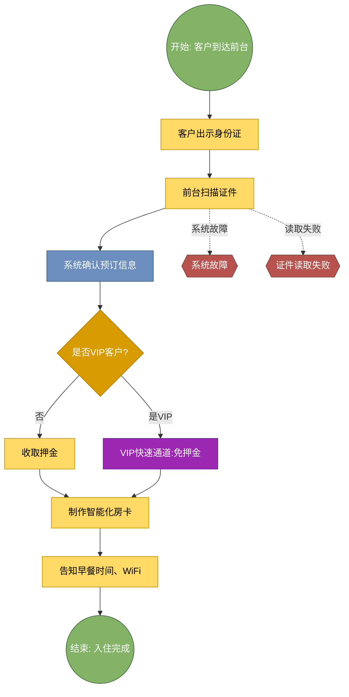
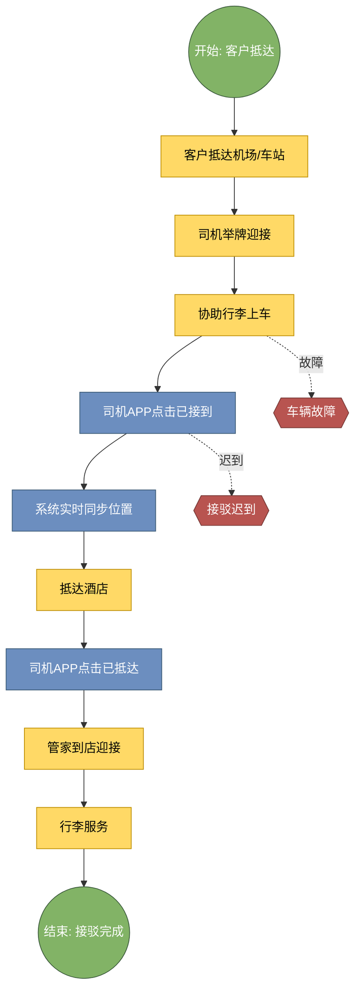
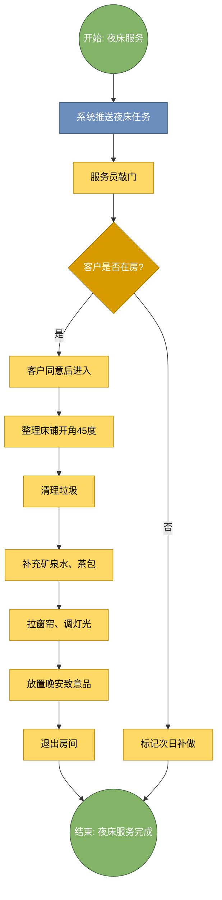
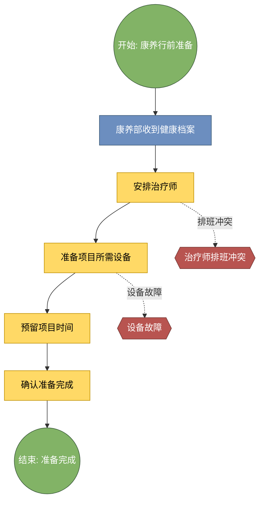
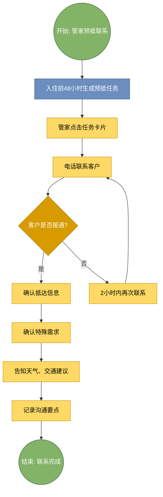

# 钻石湾康养酒店 - 核心SOP流程 Draw.io 详细提示词
**完整示例版**

**文档版本**: V2.0
**生成日期**: {datetime.now().strftime('%Y年%m月%d日')}
**流程总数**: 5个核心流程示例

---

## 📋 使用说明

本文档提供5个核心流程的详细Draw.io提示词，可直接复制到Draw.io中使用。

### 配色标准
- 🟢 开始/结束: 绿色 (#82b366)
- 🔵 系统自动: 蓝色 (#6c8ebf)
- 🟡 人工操作: 黄色 (#ffd966)
- 🟠 判断节点: 橙色 (#d79b00)
- 🔴 异常处理: 红色 (#b85450)

---

## 流程 4.2.01: 入住登记
### 基本信息
- **流程编号**: 4.2.01
- **时限要求**: 3分钟内
- **责任岗位**: 前台接待
- **适用客户**: 所有客户

### 操作步骤（7步）
1. 客户出示身份证
2. 前台扫描证件
3. 系统确认预订信息
4. 判断是否VIP客户
5. 收取押金/快速通道
6. 制作智能化房卡
7. 告知早餐时间、WiFi，### 系统操作要点
- 入住办理不超过3分钟
- VIP客户免押金快速办理
- 会员等级高亮显示
### 异常处理
- 系统故障：启动手工办理流程
- 身份证读取失败：手工录入，- 押金支付失败：提供其他支付方式
### 📊 Draw.io 提示词
**Mermaid格式**:

**简化版（手动绘制）**:
```
流程名称: 入住登记
流程编号: 4.2.01
节点列表:
1. 开始（椭圆形，绿色）
2. 客户出示身份证（矩形，黄色， 人工操作）
3. 前台扫描证件（矩形，黄色  人工操作）
4. 系统确认预订信息（矩形，蓝色  系统自动）
5. 是否VIP客户?（菱形, 橙色  判断节点）
6. 收取押金（矩形, 黄色  人工操作）
7. VIP快速通道:免押金（矩形, 紫色  VIP通道）
8. 制作智能化房卡（矩形, 黄色  人工操作）
9. 告知早餐时间、WiFi（矩形, 黄色  人工操作）
10. 结束（椭圆形, 绿色）
连接关系:
- 主流程: 1→2→3→4→5→[6或7]→8→9→10
- 异常分支: 3→[系统故障] [异常处理]
- 异常分支: 3→[读取失败] [异常处理]
```
---
## 流程 4.1.02: 接驳执行
### 基本信息
- **流程编号**: 4.1.02
- **时限要求**: 接驳等待不超过15分钟
- **责任岗位**: 司机、管家
- **适用客户**: 所有客户
### 操作步骤（9步）
1. 客户抵达机场/车站
2. 司机举牌迎接
3. 协助行李上车
4. 司机点击"已接到"
5. 系统实时同步位置
6. 抵达酒店
7. 司机点击"已抵达"
8. 管家到店迎接
9. 行李服务
### 系统操作要点
- 接驳等待不超过15分钟
- 家属可查看实时位置
- 路线偏差自动预警
### 异常处理
- 接驳迟到：管家致歉并协调
- 车辆故障：立即调派备用车辆
### 📊 Draw.io 提示词
**Mermaid格式**:

---
## 流程 4.3.01: 夜床服务
### 基本信息
- **流程编号**: 4.3.01
- **服务时间**: 17:30-21:00
- **责任岗位**: 客房服务员
- **适用客户**: 所有客户
### 操作步骤（9步）
1. 系统推送夜床任务
2. 服务员敲门
3. 客户同意后进入
4. 整理床铺开角45度
5. 清理垃圾
6. 补充矿泉水、茶包
7. 拉窗帘、调灯光
8. 放置晚安致意品
9. 退出房间
### 系统操作要点
- 客户勿扰时跳过次日补
- 记录客户临时需求
- 纪念日特殊布置
### 异常处理
- 客户勿扰：标记次日补做
- 客户有特殊需求：记录并响应
### 📊 Draw.io 提示词
**Mermaid格式**:

---
## 流程 5.3.01: 康养行前准备
### 基本信息
- **流程编号**: 5.3.01
- **时限要求**: 入住前1天完成
- **责任岗位**: 康养主管、康养服务人员
- **适用客户**: 所有客户
### 操作步骤（5步）
1. 康养部收到健康档案
2. 安排治疗师
3. 准备项目所需设备
4. 预留项目时间
5. 确认准备完成
### 系统操作要点
- 治疗师匹配要考虑专业和客户偏好
- 设备物料提前1天检查
- 预留时间与客户预约一致
### 异常处理
- 治疗师排班冲突：调整或换人
- 设备故障：启用备用设备
### 📊 Draw.io 提示词
**Mermaid格式**:

---
## 流程 3.2.02: 管家预抵联系
### 基本信息
- **流程编号**: 3.2.02
- **时限要求**: 入住前48小时
- **责任岗位**: 康养管家
- **适用客户**: 所有客户
### 操作步骤（7步）
1. 入住前48小时生成预抵任务
2. 管家点击任务卡片
3. 电话联系客户
4. 确认抵达信息
5. 确认特殊需求
6. 告知天气、交通建议
7. 记录沟通要点
### 系统操作要点
- 联系后记录沟通要点
- 客户未接电话2小时内再联系
- 联系记录永久保存
### 异常处理
- 客户未接：2小时内再次联系
- 客户变更行程：更新系统信息
### 📊 Draw.io 提示词
**Mermaid格式**:

---

## 📎 总结

本文档提供了5个核心流程的详细Draw.io提示词示例。
每个流程都包含：
- ✅ Mermaid格式提示词（可直接复制使用）
- ✅ 简化版提示词（适合手动绘制）
- ✅ 完整的步骤说明
- ✅ 异常处理分支

**使用建议**:
1. 优先使用Mermaid格式，效率更高
2. 根据实际情况调整节点数量
3. 统一配色方案确保一致性
4. 定期备份流程图文件

---

**文档生成时间**: {datetime.now().strftime('%Y年%m月%d日 %H:%M:%S')}
**示例流程数**: 5个
**END**
