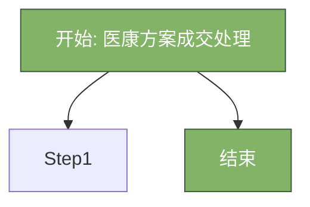
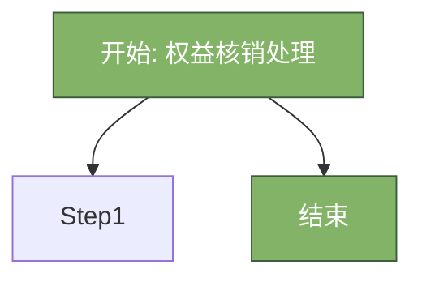
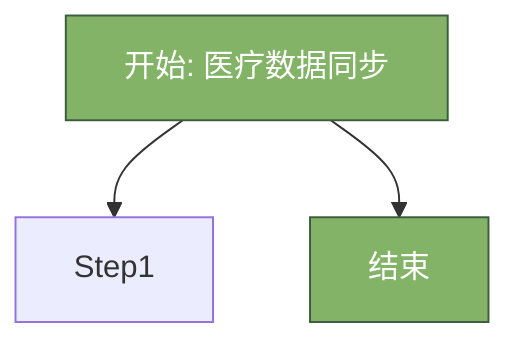
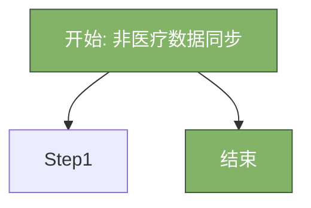
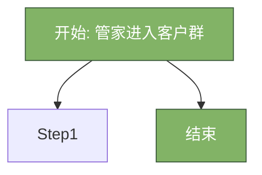
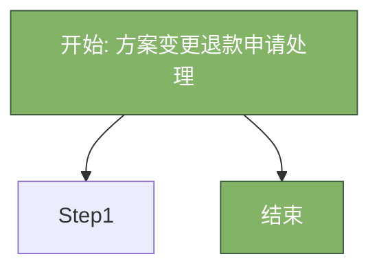
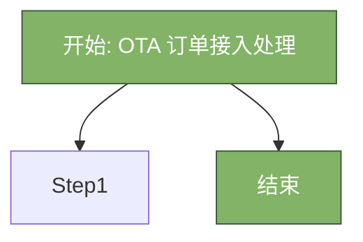

# 钻石湾康养酒店 SOP流程 - Draw.io 流程图提示词

**文档版本**: V2.0
**生成日期**: 2026年03月30日
**流程总数**: 44个

---

## 📋 使用说明

本文档为每个SOP流程提供了适合Draw.io生成的流程图提示词。

### 使用方法：

1. **复制提示词**：选择要绘制的流程，复制对应的Draw.io提示词部分
2. **在Draw.io中使用**：
   - 方法A（推荐）：使用Draw.io的「排列」→「插入」→「Mermaid」功能
   - 方法B：使用Draw.io的「插件」→「PlantUML」功能
   - 方法C：手动绘制，参考提示词中的节点和连接关系
3. **调整样式**：根据需要调整颜色、字体、布局等

### 流程图标准配色：

- 🟢 **开始/结束节点**：绿色（#82b366）
- 🔵 **系统自动操作**：蓝色（#6c8ebf）
- 🟡 **人工操作**：黄色（#ffd966）
- 🟠 **判断节点**：橙色（#d79b00）
- 🔴 **异常处理**：红色（#b85450）

---

## 第二部分：获客与成交阶段

**阶段描述**: 客户转化流程，从潜力识别到方案成交
**流程数量**: 15个

---

### 流程 1.1.01: 潜力客户智能筛选

**基本信息**:
- 流程编号: 1.1.01
- 适用客户: 
- 流程分类: 
- 发生区域: 

**系统操作要点**:
- 高价值客户置顶显示
- 销售跟进后需一键标记状态（已联系 / 意向明确 / 成交 / 暂缓）
- 如筛选规则需调整，由商务开发部提交 IT 部修改配置

#### 📊 Draw.io 流程图提示词

**提示词（Mermaid格式）**:


**简化版（适合手动绘制）**:

```
流程名称: 潜力客户智能筛选
流程编号: 1.1.01

节点列表:
1. 开始节点（椭圆形，绿色）
2. 结束节点（椭圆形，绿色）

连接关系: 顺序连接，如有异常分支用虚线标注
```

---

### 流程 1.2.01: 销售跟进管理

**基本信息**:
- 流程编号: 1.2.01
- 适用客户: 
- 流程分类: 
- 发生区域: 

**系统操作要点**:
- 未在时效内跟进，系统自动弹窗提醒（红点 + 弹窗）
- 跟进记录永久保存
- 客户拒绝：标记 “暂缓”，30 天后再次触发

#### 📊 Draw.io 流程图提示词

**提示词（Mermaid格式）**:


**简化版（适合手动绘制）**:

```
流程名称: 销售跟进管理
流程编号: 1.2.01

节点列表:
1. 开始节点（椭圆形，绿色）
2. 结束节点（椭圆形，绿色）

连接关系: 顺序连接，如有异常分支用虚线标注
```

---

### 流程 1.3.01: 医康方案成交处理

**基本信息**:
- 流程编号: 1.3.01
- 适用客户: 
- 流程分类: 
- 发生区域: 

**系统操作要点**:
- 匹配速度：3 秒内完成
- 冲突项目自动置灰并提示原因
- 医生手动调整记录需保存用于算法优化

#### 📊 Draw.io 流程图提示词

**提示词（Mermaid格式）**:



**简化版（适合手动绘制）**:

```
流程名称: 医康方案成交处理
流程编号: 1.3.01

节点列表:
1. 开始节点（椭圆形，绿色）
2. 结束节点（椭圆形，绿色）

连接关系: 顺序连接，如有异常分支用虚线标注
```

---

### 流程 1.3.02: 康养方案成交处理

**基本信息**:
- 流程编号: 1.3.02
- 适用客户: 
- 流程分类: 
- 发生区域: 

**系统操作要点**:
- 资源检测要准，不能出现超卖
- 支付前锁定资源 15 分钟
- 支付失败自动释放资源

#### 📊 Draw.io 流程图提示词

**提示词（Mermaid格式）**:


**简化版（适合手动绘制）**:

```
流程名称: 康养方案成交处理
流程编号: 1.3.02

节点列表:
1. 开始节点（椭圆形，绿色）
2. 结束节点（椭圆形，绿色）

连接关系: 顺序连接，如有异常分支用虚线标注
```

---

### 流程 1.3.03: 权益核销处理

**基本信息**:
- 流程编号: 1.3.03
- 适用客户: 
- 流程分类: 
- 发生区域: 

**系统操作要点**:
- 权益不足时自动计算补差金额
- 权益使用记录实时更新
- 权益过期前 30 天自动提醒

#### 📊 Draw.io 流程图提示词

**提示词（Mermaid格式）**:



**简化版（适合手动绘制）**:

```
流程名称: 权益核销处理
流程编号: 1.3.03

节点列表:
1. 开始节点（椭圆形，绿色）
2. 结束节点（椭圆形，绿色）

连接关系: 顺序连接，如有异常分支用虚线标注
```

---

### 流程 1.3.04: 企业团体签约处理

**基本信息**:
- 流程编号: 1.3.04
- 适用客户: 
- 流程分类: 
- 发生区域: 

**系统操作要点**:
- 权益码唯一且防伪
- 支持批量导出 / 打印
- 权益码激活状态实时可查

#### 📊 Draw.io 流程图提示词

**提示词（Mermaid格式）**:


**简化版（适合手动绘制）**:

```
流程名称: 企业团体签约处理
流程编号: 1.3.04

节点列表:
1. 开始节点（椭圆形，绿色）
2. 结束节点（椭圆形，绿色）

连接关系: 顺序连接，如有异常分支用虚线标注
```

---

### 流程 1.4.01: 在线支付处理

**基本信息**:
- 流程编号: 1.4.01
- 适用客户: 
- 流程分类: 
- 发生区域: 

**系统操作要点**:
- 支付失败自动重试 3 次
- 支付成功即时反馈
- 发票自动推送

#### 📊 Draw.io 流程图提示词

**提示词（Mermaid格式）**:


**简化版（适合手动绘制）**:

```
流程名称: 在线支付处理
流程编号: 1.4.01

节点列表:
1. 开始节点（椭圆形，绿色）
2. 结束节点（椭圆形，绿色）

连接关系: 顺序连接，如有异常分支用虚线标注
```

---

### 流程 1.4.02: 对公支付处理

**基本信息**:
- 流程编号: 1.4.02
- 适用客户: 
- 流程分类: 
- 发生区域: 

**系统操作要点**:
- 超额度自动预警
- 挂账记录自动归集
- 支持多级审批

#### 📊 Draw.io 流程图提示词

**提示词（Mermaid格式）**:


**简化版（适合手动绘制）**:

```
流程名称: 对公支付处理
流程编号: 1.4.02

节点列表:
1. 开始节点（椭圆形，绿色）
2. 结束节点（椭圆形，绿色）

连接关系: 顺序连接，如有异常分支用虚线标注
```

---

### 流程 1.5.01: 数据授权管理

**基本信息**:
- 流程编号: 1.5.01
- 适用客户: 
- 流程分类: 
- 发生区域: 

**系统操作要点**:
- 授权协议简洁易懂，3 分钟内能看完
- 授权状态实时同步
- 授权过期前 30 天自动提醒续签

#### 📊 Draw.io 流程图提示词

**提示词（Mermaid格式）**:


**简化版（适合手动绘制）**:

```
流程名称: 数据授权管理
流程编号: 1.5.01

节点列表:
1. 开始节点（椭圆形，绿色）
2. 结束节点（椭圆形，绿色）

连接关系: 顺序连接，如有异常分支用虚线标注
```

---

### 流程 1.6.01: 医疗数据同步

**基本信息**:
- 流程编号: 1.6.01
- 适用客户: 
- 流程分类: 
- 发生区域: 

**系统操作要点**:
- 同步要在 30 分钟内完成
- 同步失败自动重试 3 次
- 字段级脱敏，只传康复相关标签

#### 📊 Draw.io 流程图提示词

**提示词（Mermaid格式）**:



**简化版（适合手动绘制）**:

```
流程名称: 医疗数据同步
流程编号: 1.6.01

节点列表:
1. 开始节点（椭圆形，绿色）
2. 结束节点（椭圆形，绿色）

连接关系: 顺序连接，如有异常分支用虚线标注
```

---

### 流程 1.6.02: 非医疗数据同步

**基本信息**:
- 流程编号: 1.6.02
- 适用客户: 
- 流程分类: 
- 发生区域: 

**系统操作要点**:
- 历史偏好自动预填至问卷
- 会籍等级变化实时同步
- 重复数据自动去重合并

#### 📊 Draw.io 流程图提示词

**提示词（Mermaid格式）**:



**简化版（适合手动绘制）**:

```
流程名称: 非医疗数据同步
流程编号: 1.6.02

节点列表:
1. 开始节点（椭圆形，绿色）
2. 结束节点（椭圆形，绿色）

连接关系: 顺序连接，如有异常分支用虚线标注
```

---

### 流程 1.7.01: 康养管家预指派

**基本信息**:
- 流程编号: 1.7.01
- 适用客户: 
- 流程分类: 
- 发生区域: 

**系统操作要点**:
- 客户有指定管家偏好时优先满足

#### 📊 Draw.io 流程图提示词

**提示词（Mermaid格式）**:


**简化版（适合手动绘制）**:

```
流程名称: 康养管家预指派
流程编号: 1.7.01

节点列表:
1. 开始节点（椭圆形，绿色）
2. 结束节点（椭圆形，绿色）

连接关系: 顺序连接，如有异常分支用虚线标注
```

---

### 流程 1.7.02: 管家进入客户群

**基本信息**:
- 流程编号: 1.7.02
- 适用客户: 
- 流程分类: 
- 发生区域: 

**系统操作要点**:
- 欢迎语模板化
- 群聊记录永久保存

#### 📊 Draw.io 流程图提示词

**提示词（Mermaid格式）**:



**简化版（适合手动绘制）**:

```
流程名称: 管家进入客户群
流程编号: 1.7.02

节点列表:
1. 开始节点（椭圆形，绿色）
2. 结束节点（椭圆形，绿色）

连接关系: 顺序连接，如有异常分支用虚线标注
```

---

### 流程 1.8.01: 方案变更退款申请处理

**基本信息**:
- 流程编号: 1.8.01
- 适用客户: 
- 流程分类: 
- 发生区域: 

**系统操作要点**:
- 申请流程 3 分钟内完成
- 提交后即时反馈
- 自动告知预计审核时间

#### 📊 Draw.io 流程图提示词

**提示词（Mermaid格式）**:



**简化版（适合手动绘制）**:

```
流程名称: 方案变更退款申请处理
流程编号: 1.8.01

节点列表:
1. 开始节点（椭圆形，绿色）
2. 结束节点（椭圆形，绿色）

连接关系: 顺序连接，如有异常分支用虚线标注
```

---

### 流程 1.8.02: 方案变更退款审核

**基本信息**:
- 流程编号: 1.8.02
- 适用客户: 
- 流程分类: 
- 发生区域: 

**系统操作要点**:
- 审核 2 小时内完成
- 规则明确的自动通过
- 拒绝需填原因自动推送

#### 📊 Draw.io 流程图提示词

**提示词（Mermaid格式）**:


**简化版（适合手动绘制）**:

```
流程名称: 方案变更退款审核
流程编号: 1.8.02

节点列表:
1. 开始节点（椭圆形，绿色）
2. 结束节点（椭圆形，绿色）

连接关系: 顺序连接，如有异常分支用虚线标注
```

---

## 第三部分：客户预约阶段

**阶段描述**: 预约管理流程，包括方案客户、权益客户、OTA订单等
**流程数量**: 8个

---

### 流程 2.1.01: 方案客户预约处理

**基本信息**:
- 流程编号: 2.1.01
- 适用客户: 
- 流程分类: 
- 发生区域: 

**系统操作要点**:
- 资源实时更新，不能超卖
- 预约成功自动锁定资源
- 预约失败自动推荐 3 个备选时段

#### 📊 Draw.io 流程图提示词

**提示词（Mermaid格式）**:


**简化版（适合手动绘制）**:

```
流程名称: 方案客户预约处理
流程编号: 2.1.01

节点列表:
1. 开始节点（椭圆形，绿色）
2. 结束节点（椭圆形，绿色）

连接关系: 顺序连接，如有异常分支用虚线标注
```

---

### 流程 2.1.02: 权益客户预约处理

**基本信息**:
- 流程编号: 2.1.02
- 适用客户: 
- 流程分类: 
- 发生区域: 

**系统操作要点**:
- 权益展示清晰
- 预约时自动校验权益
- 预约成功即时推送确认信息

#### 📊 Draw.io 流程图提示词

**提示词（Mermaid格式）**:


**简化版（适合手动绘制）**:

```
流程名称: 权益客户预约处理
流程编号: 2.1.02

节点列表:
1. 开始节点（椭圆形，绿色）
2. 结束节点（椭圆形，绿色）

连接关系: 顺序连接，如有异常分支用虚线标注
```

---

### 流程 2.1.03: OTA 订单接入处理

**基本信息**:
- 流程编号: 2.1.03
- 适用客户: 
- 流程分类: 
- 发生区域: 

**系统操作要点**:
- 同步要及时，下单后 30 分钟内接入
- 新客自动建档
- 渠道来源标记准确

#### 📊 Draw.io 流程图提示词

**提示词（Mermaid格式）**:



**简化版（适合手动绘制）**:

```
流程名称: OTA 订单接入处理
流程编号: 2.1.03

节点列表:
1. 开始节点（椭圆形，绿色）
2. 结束节点（椭圆形，绿色）

连接关系: 顺序连接，如有异常分支用虚线标注
```

---

### 流程 2.1.04: 团体预约处理

**基本信息**:
- 流程编号: 2.1.04
- 适用客户: 
- 流程分类: 
- 发生区域: 

**系统操作要点**:
- 支持 Excel 批量导入
- 自动识别老客
- 家庭成员优先安排同住

#### 📊 Draw.io 流程图提示词

**提示词（Mermaid格式）**:


**简化版（适合手动绘制）**:

```
流程名称: 团体预约处理
流程编号: 2.1.04

节点列表:
1. 开始节点（椭圆形，绿色）
2. 结束节点（椭圆形，绿色）

连接关系: 顺序连接，如有异常分支用虚线标注
```

---

### 流程 2.2.01: 预约自动确认

**基本信息**:
- 流程编号: 2.2.01
- 适用客户: 
- 流程分类: 
- 发生区域: 

**系统操作要点**:
- 80% 的预约能自动通过
- 自动通过的也要发确认短信
- 自动确认规则可配置

#### 📊 Draw.io 流程图提示词

**提示词（Mermaid格式）**:


**简化版（适合手动绘制）**:

```
流程名称: 预约自动确认
流程编号: 2.2.01

节点列表:
1. 开始节点（椭圆形，绿色）
2. 结束节点（椭圆形，绿色）

连接关系: 顺序连接，如有异常分支用虚线标注
```

---

### 流程 2.2.02: 预约人工确认

**基本信息**:
- 流程编号: 2.2.02
- 适用客户: 
- 流程分类: 
- 发生区域: 

**系统操作要点**:
- 人工确认 2 小时内完成
- 拒绝需说明原因并推荐备选
- 沟通记录要保存

#### 📊 Draw.io 流程图提示词

**提示词（Mermaid格式）**:

```mermaid
graph TD
    Start[开始: 预约人工确认]:::startClass
    End[结束]:::endClass
    Start --> Step1
    Start --> End

    classDef startClass fill:#82b366,stroke:#3d5c3d,color:#fff
    classDef endClass fill:#82b366,stroke:#3d5c3d,color:#fff
    classDef systemClass fill:#6c8ebf,stroke:#3d5c78,color:#fff
    classDef manualClass fill:#ffd966,stroke:#bf8f00,color:#000
    classDef exceptionClass fill:#b85450,stroke:#783a37,color:#fff
```

**简化版（适合手动绘制）**:

```
流程名称: 预约人工确认
流程编号: 2.2.02

节点列表:
1. 开始节点（椭圆形，绿色）
2. 结束节点（椭圆形，绿色）

连接关系: 顺序连接，如有异常分支用虚线标注
```

---

### 流程 2.3.01: 预约变更申请处理

**基本信息**:
- 流程编号: 2.3.01
- 适用客户: 
- 流程分类: 
- 发生区域: 

**系统操作要点**:
- 改期时自动检测新资源
- 取消告知退款规则
- 申请后即时反馈

#### 📊 Draw.io 流程图提示词

**提示词（Mermaid格式）**:

```mermaid
graph TD
    Start[开始: 预约变更申请处理]:::startClass
    End[结束]:::endClass
    Start --> Step1
    Start --> End

    classDef startClass fill:#82b366,stroke:#3d5c3d,color:#fff
    classDef endClass fill:#82b366,stroke:#3d5c3d,color:#fff
    classDef systemClass fill:#6c8ebf,stroke:#3d5c78,color:#fff
    classDef manualClass fill:#ffd966,stroke:#bf8f00,color:#000
    classDef exceptionClass fill:#b85450,stroke:#783a37,color:#fff
```

**简化版（适合手动绘制）**:

```
流程名称: 预约变更申请处理
流程编号: 2.3.01

节点列表:
1. 开始节点（椭圆形，绿色）
2. 结束节点（椭圆形，绿色）

连接关系: 顺序连接，如有异常分支用虚线标注
```

---

### 流程 2.3.02: 预约变更审核

**基本信息**:
- 流程编号: 2.3.02
- 适用客户: 
- 流程分类: 
- 发生区域: 

**系统操作要点**:
- 自动审核即时完成
- 人工审核 2 小时内完成
- 退款自动执行

#### 📊 Draw.io 流程图提示词

**提示词（Mermaid格式）**:

```mermaid
graph TD
    Start[开始: 预约变更审核]:::startClass
    End[结束]:::endClass
    Start --> Step1
    Start --> End

    classDef startClass fill:#82b366,stroke:#3d5c3d,color:#fff
    classDef endClass fill:#82b366,stroke:#3d5c3d,color:#fff
    classDef systemClass fill:#6c8ebf,stroke:#3d5c78,color:#fff
    classDef manualClass fill:#ffd966,stroke:#bf8f00,color:#000
    classDef exceptionClass fill:#b85450,stroke:#783a37,color:#fff
```

**简化版（适合手动绘制）**:

```
流程名称: 预约变更审核
流程编号: 2.3.02

节点列表:
1. 开始节点（椭圆形，绿色）
2. 结束节点（椭圆形，绿色）

连接关系: 顺序连接，如有异常分支用虚线标注
```

---

## 第四部分：行前准备阶段

**阶段描述**: 行前准备流程，包括问卷、客房、餐饮、康养、礼宾准备
**流程数量**: 10个

---

### 流程 3.1.01: 问卷推送与回收

**基本信息**:
- 流程编号: 3.1.01
- 适用客户: 
- 流程分类: 
- 发生区域: 

**系统操作要点**:
- 问卷手机 5 分钟内填完
- 老客户数据自动预填
- 填一半退出下次续填

#### 📊 Draw.io 流程图提示词

**提示词（Mermaid格式）**:

```mermaid
graph TD
    Start[开始: 问卷推送与回收]:::startClass
    End[结束]:::endClass
    Start --> Step1
    Start --> End

    classDef startClass fill:#82b366,stroke:#3d5c3d,color:#fff
    classDef endClass fill:#82b366,stroke:#3d5c3d,color:#fff
    classDef systemClass fill:#6c8ebf,stroke:#3d5c78,color:#fff
    classDef manualClass fill:#ffd966,stroke:#bf8f00,color:#000
    classDef exceptionClass fill:#b85450,stroke:#783a37,color:#fff
```

**简化版（适合手动绘制）**:

```
流程名称: 问卷推送与回收
流程编号: 3.1.01

节点列表:
1. 开始节点（椭圆形，绿色）
2. 结束节点（椭圆形，绿色）

连接关系: 顺序连接，如有异常分支用虚线标注
```

---

### 流程 3.1.02: 问卷时效判断

**基本信息**:
- 流程编号: 3.1.02
- 适用客户: 
- 流程分类: 
- 发生区域: 

**系统操作要点**:
- 90 天阈值可配置
- 沿用历史数据时需客户确认
- 紧急情况可手动触发问卷

#### 📊 Draw.io 流程图提示词

**提示词（Mermaid格式）**:

```mermaid
graph TD
    Start[开始: 问卷时效判断]:::startClass
    End[结束]:::endClass
    Start --> Step1
    Start --> End

    classDef startClass fill:#82b366,stroke:#3d5c3d,color:#fff
    classDef endClass fill:#82b366,stroke:#3d5c3d,color:#fff
    classDef systemClass fill:#6c8ebf,stroke:#3d5c78,color:#fff
    classDef manualClass fill:#ffd966,stroke:#bf8f00,color:#000
    classDef exceptionClass fill:#b85450,stroke:#783a37,color:#fff
```

**简化版（适合手动绘制）**:

```
流程名称: 问卷时效判断
流程编号: 3.1.02

节点列表:
1. 开始节点（椭圆形，绿色）
2. 结束节点（椭圆形，绿色）

连接关系: 顺序连接，如有异常分支用虚线标注
```

---

### 流程 3.1.03: 问卷数据分发

**基本信息**:
- 流程编号: 3.1.03
- 适用客户: 
- 流程分类: 
- 发生区域: 

**系统操作要点**:
- 数据分发准确
- 过敏源等高危信息高亮显示
- 分发失败自动重试

#### 📊 Draw.io 流程图提示词

**提示词（Mermaid格式）**:

```mermaid
graph TD
    Start[开始: 问卷数据分发]:::startClass
    End[结束]:::endClass
    Start --> Step1
    Start --> End

    classDef startClass fill:#82b366,stroke:#3d5c3d,color:#fff
    classDef endClass fill:#82b366,stroke:#3d5c3d,color:#fff
    classDef systemClass fill:#6c8ebf,stroke:#3d5c78,color:#fff
    classDef manualClass fill:#ffd966,stroke:#bf8f00,color:#000
    classDef exceptionClass fill:#b85450,stroke:#783a37,color:#fff
```

**简化版（适合手动绘制）**:

```
流程名称: 问卷数据分发
流程编号: 3.1.03

节点列表:
1. 开始节点（椭圆形，绿色）
2. 结束节点（椭圆形，绿色）

连接关系: 顺序连接，如有异常分支用虚线标注
```

---

### 流程 3.2.01: 管家确认指派

**基本信息**:
- 流程编号: 3.2.01
- 适用客户: 
- 流程分类: 
- 发生区域: 

**系统操作要点**:
- 客户有指定管家偏好时优先

#### 📊 Draw.io 流程图提示词

**提示词（Mermaid格式）**:

```mermaid
graph TD
    Start[开始: 管家确认指派]:::startClass
    End[结束]:::endClass
    Start --> Step1
    Start --> End

    classDef startClass fill:#82b366,stroke:#3d5c3d,color:#fff
    classDef endClass fill:#82b366,stroke:#3d5c3d,color:#fff
    classDef systemClass fill:#6c8ebf,stroke:#3d5c78,color:#fff
    classDef manualClass fill:#ffd966,stroke:#bf8f00,color:#000
    classDef exceptionClass fill:#b85450,stroke:#783a37,color:#fff
```

**简化版（适合手动绘制）**:

```
流程名称: 管家确认指派
流程编号: 3.2.01

节点列表:
1. 开始节点（椭圆形，绿色）
2. 结束节点（椭圆形，绿色）

连接关系: 顺序连接，如有异常分支用虚线标注
```

---

### 流程 3.2.02: 管家预抵联系

**基本信息**:
- 流程编号: 3.2.02
- 适用客户: 
- 流程分类: 
- 发生区域: 

**系统操作要点**:
- 联系后记录沟通要点
- 客户未接电话 2 小时内再联系
- 联系记录永久保存

#### 📊 Draw.io 流程图提示词

**提示词（Mermaid格式）**:

```mermaid
graph TD
    Start[开始: 管家预抵联系]:::startClass
    End[结束]:::endClass
    Start --> Step1
    Start --> End

    classDef startClass fill:#82b366,stroke:#3d5c3d,color:#fff
    classDef endClass fill:#82b366,stroke:#3d5c3d,color:#fff
    classDef systemClass fill:#6c8ebf,stroke:#3d5c78,color:#fff
    classDef manualClass fill:#ffd966,stroke:#bf8f00,color:#000
    classDef exceptionClass fill:#b85450,stroke:#783a37,color:#fff
```

**简化版（适合手动绘制）**:

```
流程名称: 管家预抵联系
流程编号: 3.2.02

节点列表:
1. 开始节点（椭圆形，绿色）
2. 结束节点（椭圆形，绿色）

连接关系: 顺序连接，如有异常分支用虚线标注
```

---

### 流程 3.2.03: 问卷跟进

**基本信息**:
- 流程编号: 3.2.03
- 适用客户: 
- 流程分类: 
- 发生区域: 

**系统操作要点**:
- 最多提醒 3 次
- 入住前 24 小时仍未填，系统标黄提醒
- 客户拒绝填写：管家手动记录基本信息

#### 📊 Draw.io 流程图提示词

**提示词（Mermaid格式）**:

```mermaid
graph TD
    Start[开始: 问卷跟进]:::startClass
    End[结束]:::endClass
    Start --> Step1
    Start --> End

    classDef startClass fill:#82b366,stroke:#3d5c3d,color:#fff
    classDef endClass fill:#82b366,stroke:#3d5c3d,color:#fff
    classDef systemClass fill:#6c8ebf,stroke:#3d5c78,color:#fff
    classDef manualClass fill:#ffd966,stroke:#bf8f00,color:#000
    classDef exceptionClass fill:#b85450,stroke:#783a37,color:#fff
```

**简化版（适合手动绘制）**:

```
流程名称: 问卷跟进
流程编号: 3.2.03

节点列表:
1. 开始节点（椭圆形，绿色）
2. 结束节点（椭圆形，绿色）

连接关系: 顺序连接，如有异常分支用虚线标注
```

---

### 流程 3.3.01: 客房行前准备

**基本信息**:
- 流程编号: 3.3.01
- 适用客户: 
- 流程分类: 
- 发生区域: 

**系统操作要点**:
- 特殊需求提前 3 天准备
- 纪念日布置需管家确认
- 未完成项入住前 2 小时自动预警

#### 📊 Draw.io 流程图提示词

**提示词（Mermaid格式）**:

```mermaid
graph TD
    Start[开始: 客房行前准备]:::startClass
    End[结束]:::endClass
    Start --> Step1
    Start --> End

    classDef startClass fill:#82b366,stroke:#3d5c3d,color:#fff
    classDef endClass fill:#82b366,stroke:#3d5c3d,color:#fff
    classDef systemClass fill:#6c8ebf,stroke:#3d5c78,color:#fff
    classDef manualClass fill:#ffd966,stroke:#bf8f00,color:#000
    classDef exceptionClass fill:#b85450,stroke:#783a37,color:#fff
```

**简化版（适合手动绘制）**:

```
流程名称: 客房行前准备
流程编号: 3.3.01

节点列表:
1. 开始节点（椭圆形，绿色）
2. 结束节点（椭圆形，绿色）

连接关系: 顺序连接，如有异常分支用虚线标注
```

---

### 流程 3.4.01: 餐饮行前准备

**基本信息**:
- 流程编号: 3.4.01
- 适用客户: 
- 流程分类: 
- 发生区域: 

**系统操作要点**:
- 过敏源必须零差错
- 特殊餐食提前 24 小时准备
- 多天入住可调整菜单

#### 📊 Draw.io 流程图提示词

**提示词（Mermaid格式）**:

```mermaid
graph TD
    Start[开始: 餐饮行前准备]:::startClass
    End[结束]:::endClass
    Start --> Step1
    Start --> End

    classDef startClass fill:#82b366,stroke:#3d5c3d,color:#fff
    classDef endClass fill:#82b366,stroke:#3d5c3d,color:#fff
    classDef systemClass fill:#6c8ebf,stroke:#3d5c78,color:#fff
    classDef manualClass fill:#ffd966,stroke:#bf8f00,color:#000
    classDef exceptionClass fill:#b85450,stroke:#783a37,color:#fff
```

**简化版（适合手动绘制）**:

```
流程名称: 餐饮行前准备
流程编号: 3.4.01

节点列表:
1. 开始节点（椭圆形，绿色）
2. 结束节点（椭圆形，绿色）

连接关系: 顺序连接，如有异常分支用虚线标注
```

---

### 流程 3.5.01: 康养行前准备

**基本信息**:
- 流程编号: 3.5.01
- 适用客户: 
- 流程分类: 
- 发生区域: 

**系统操作要点**:
- 治疗师匹配要考虑专业和客户偏好
- 设备物料提前 1 天检查
- 预留时间与客户预约一致

#### 📊 Draw.io 流程图提示词

**提示词（Mermaid格式）**:

```mermaid
graph TD
    Start[开始: 康养行前准备]:::startClass
    End[结束]:::endClass
    Start --> Step1
    Start --> End

    classDef startClass fill:#82b366,stroke:#3d5c3d,color:#fff
    classDef endClass fill:#82b366,stroke:#3d5c3d,color:#fff
    classDef systemClass fill:#6c8ebf,stroke:#3d5c78,color:#fff
    classDef manualClass fill:#ffd966,stroke:#bf8f00,color:#000
    classDef exceptionClass fill:#b85450,stroke:#783a37,color:#fff
```

**简化版（适合手动绘制）**:

```
流程名称: 康养行前准备
流程编号: 3.5.01

节点列表:
1. 开始节点（椭圆形，绿色）
2. 结束节点（椭圆形，绿色）

连接关系: 顺序连接，如有异常分支用虚线标注
```

---

### 流程 3.6.01: 礼宾行前准备

**基本信息**:
- 流程编号: 3.6.01
- 适用客户: 
- 流程分类: 
- 发生区域: 

**系统操作要点**:
- 接驳安排提前 24 小时确认
- 团体客户需协调多辆车
- 接驳信息提前推送客户

#### 📊 Draw.io 流程图提示词

**提示词（Mermaid格式）**:

```mermaid
graph TD
    Start[开始: 礼宾行前准备]:::startClass
    End[结束]:::endClass
    Start --> Step1
    Start --> End

    classDef startClass fill:#82b366,stroke:#3d5c3d,color:#fff
    classDef endClass fill:#82b366,stroke:#3d5c3d,color:#fff
    classDef systemClass fill:#6c8ebf,stroke:#3d5c78,color:#fff
    classDef manualClass fill:#ffd966,stroke:#bf8f00,color:#000
    classDef exceptionClass fill:#b85450,stroke:#783a37,color:#fff
```

**简化版（适合手动绘制）**:

```
流程名称: 礼宾行前准备
流程编号: 3.6.01

节点列表:
1. 开始节点（椭圆形，绿色）
2. 结束节点（椭圆形，绿色）

连接关系: 顺序连接，如有异常分支用虚线标注
```

---

## 第五部分：酒店标准服务阶段

**阶段描述**: 酒店标准服务流程，包括接驳、入住、客房服务等
**流程数量**: 11个

---

### 流程 4.1.01: 接驳提前联系

**基本信息**:
- 流程编号: 4.1.01
- 适用客户: 
- 流程分类: 
- 发生区域: 

**系统操作要点**:
- 提前联系避免当天出错
- 客户行程变化及时调整
- 团体客户与领队单线对接

#### 📊 Draw.io 流程图提示词

**提示词（Mermaid格式）**:

```mermaid
graph TD
    Start[开始: 接驳提前联系]:::startClass
    End[结束]:::endClass
    Start --> Step1
    Start --> End

    classDef startClass fill:#82b366,stroke:#3d5c3d,color:#fff
    classDef endClass fill:#82b366,stroke:#3d5c3d,color:#fff
    classDef systemClass fill:#6c8ebf,stroke:#3d5c78,color:#fff
    classDef manualClass fill:#ffd966,stroke:#bf8f00,color:#000
    classDef exceptionClass fill:#b85450,stroke:#783a37,color:#fff
```

**简化版（适合手动绘制）**:

```
流程名称: 接驳提前联系
流程编号: 4.1.01

节点列表:
1. 开始节点（椭圆形，绿色）
2. 结束节点（椭圆形，绿色）

连接关系: 顺序连接，如有异常分支用虚线标注
```

---

### 流程 4.1.02: 接驳执行

**基本信息**:
- 流程编号: 4.1.02
- 适用客户: 
- 流程分类: 
- 发生区域: 

**系统操作要点**:
- 接驳等待不超过 15 分钟
- 家属可查看实时位置
- 路线偏差自动预警

#### 📊 Draw.io 流程图提示词

**提示词（Mermaid格式）**:

```mermaid
graph TD
    Start[开始: 接驳执行]:::startClass
    End[结束]:::endClass
    Start --> Step1
    Start --> End

    classDef startClass fill:#82b366,stroke:#3d5c3d,color:#fff
    classDef endClass fill:#82b366,stroke:#3d5c3d,color:#fff
    classDef systemClass fill:#6c8ebf,stroke:#3d5c78,color:#fff
    classDef manualClass fill:#ffd966,stroke:#bf8f00,color:#000
    classDef exceptionClass fill:#b85450,stroke:#783a37,color:#fff
```

**简化版（适合手动绘制）**:

```
流程名称: 接驳执行
流程编号: 4.1.02

节点列表:
1. 开始节点（椭圆形，绿色）
2. 结束节点（椭圆形，绿色）

连接关系: 顺序连接，如有异常分支用虚线标注
```

---

### 流程 4.1.03: 行李服务

**基本信息**:
- 流程编号: 4.1.03
- 适用客户: 
- 流程分类: 
- 发生区域: 

**系统操作要点**:
- 行李牌唯一防丢失
- 送房不超过 30 分钟
- 寄存超 72 小时提醒

**异常处理**:
- 普通洗衣当日 18:00 前送回

#### 📊 Draw.io 流程图提示词

**提示词（Mermaid格式）**:

```mermaid
graph TD
    Start[开始: 行李服务]:::startClass
    End[结束]:::endClass
    Start --> Step1
    Start --> End
    Exception{异常处理}:::exceptionClass
    Step1 -.->|异常| Exception

    classDef startClass fill:#82b366,stroke:#3d5c3d,color:#fff
    classDef endClass fill:#82b366,stroke:#3d5c3d,color:#fff
    classDef systemClass fill:#6c8ebf,stroke:#3d5c78,color:#fff
    classDef manualClass fill:#ffd966,stroke:#bf8f00,color:#000
    classDef exceptionClass fill:#b85450,stroke:#783a37,color:#fff
```

**简化版（适合手动绘制）**:

```
流程名称: 行李服务
流程编号: 4.1.03

节点列表:
1. 开始节点（椭圆形，绿色）
2. 结束节点（椭圆形，绿色）

连接关系: 顺序连接，如有异常分支用虚线标注
```

---

### 流程 4.2.01: 入住登记

**基本信息**:
- 流程编号: 4.2.01
- 适用客户: 
- 流程分类: 
- 发生区域: 

**系统操作要点**:
- 入住办理不超过 3 分钟
- VIP 客户免押金快速办理
- 会员等级高亮显示

**异常处理**:
- 普通洗衣当日 18:00 前送回

#### 📊 Draw.io 流程图提示词

**提示词（Mermaid格式）**:

```mermaid
graph TD
    Start[开始: 入住登记]:::startClass
    End[结束]:::endClass
    Start --> Step1
    Start --> End
    Exception{异常处理}:::exceptionClass
    Step1 -.->|异常| Exception

    classDef startClass fill:#82b366,stroke:#3d5c3d,color:#fff
    classDef endClass fill:#82b366,stroke:#3d5c3d,color:#fff
    classDef systemClass fill:#6c8ebf,stroke:#3d5c78,color:#fff
    classDef manualClass fill:#ffd966,stroke:#bf8f00,color:#000
    classDef exceptionClass fill:#b85450,stroke:#783a37,color:#fff
```

**简化版（适合手动绘制）**:

```
流程名称: 入住登记
流程编号: 4.2.01

节点列表:
1. 开始节点（椭圆形，绿色）
2. 结束节点（椭圆形，绿色）

连接关系: 顺序连接，如有异常分支用虚线标注
```

---

### 流程 4.2.02: 房间介绍

**基本信息**:
- 流程编号: 4.2.02
- 适用客户: 
- 流程分类: 
- 发生区域: 

**系统操作要点**:
- 介绍简洁不超过 5 分钟
- 一键呼叫位置重点强调
- 客户有疑问可随时问

**异常处理**:
- 普通洗衣当日 18:00 前送回

#### 📊 Draw.io 流程图提示词

**提示词（Mermaid格式）**:

```mermaid
graph TD
    Start[开始: 房间介绍]:::startClass
    End[结束]:::endClass
    Start --> Step1
    Start --> End
    Exception{异常处理}:::exceptionClass
    Step1 -.->|异常| Exception

    classDef startClass fill:#82b366,stroke:#3d5c3d,color:#fff
    classDef endClass fill:#82b366,stroke:#3d5c3d,color:#fff
    classDef systemClass fill:#6c8ebf,stroke:#3d5c78,color:#fff
    classDef manualClass fill:#ffd966,stroke:#bf8f00,color:#000
    classDef exceptionClass fill:#b85450,stroke:#783a37,color:#fff
```

**简化版（适合手动绘制）**:

```
流程名称: 房间介绍
流程编号: 4.2.02

节点列表:
1. 开始节点（椭圆形，绿色）
2. 结束节点（椭圆形，绿色）

连接关系: 顺序连接，如有异常分支用虚线标注
```

---

### 流程 4.3.01: 夜床服务

**基本信息**:
- 流程编号: 4.3.01
- 适用客户: 
- 流程分类: 
- 发生区域: 

**系统操作要点**:
- 客户勿扰时跳过次日补
- 记录客户临时需求
- 纪念日特殊布置

**异常处理**:
- 普通洗衣当日 18:00 前送回

#### 📊 Draw.io 流程图提示词

**提示词（Mermaid格式）**:

```mermaid
graph TD
    Start[开始: 夜床服务]:::startClass
    End[结束]:::endClass
    Start --> Step1
    Start --> End
    Exception{异常处理}:::exceptionClass
    Step1 -.->|异常| Exception

    classDef startClass fill:#82b366,stroke:#3d5c3d,color:#fff
    classDef endClass fill:#82b366,stroke:#3d5c3d,color:#fff
    classDef systemClass fill:#6c8ebf,stroke:#3d5c78,color:#fff
    classDef manualClass fill:#ffd966,stroke:#bf8f00,color:#000
    classDef exceptionClass fill:#b85450,stroke:#783a37,color:#fff
```

**简化版（适合手动绘制）**:

```
流程名称: 夜床服务
流程编号: 4.3.01

节点列表:
1. 开始节点（椭圆形，绿色）
2. 结束节点（椭圆形，绿色）

连接关系: 顺序连接，如有异常分支用虚线标注
```

---

### 流程 4.3.02: 洗衣服务

**基本信息**:
- 流程编号: 4.3.02
- 适用客户: 
- 流程分类: 
- 发生区域: 

**系统操作要点**:
- 普通洗衣当日 18:00 前送回
- 快洗 4 小时
- 衣物损坏赔偿标准明确

#### 📊 Draw.io 流程图提示词

**提示词（Mermaid格式）**:

```mermaid
graph TD
    Start[开始: 洗衣服务]:::startClass
    End[结束]:::endClass
    Start --> Step1
    Start --> End

    classDef startClass fill:#82b366,stroke:#3d5c3d,color:#fff
    classDef endClass fill:#82b366,stroke:#3d5c3d,color:#fff
    classDef systemClass fill:#6c8ebf,stroke:#3d5c78,color:#fff
    classDef manualClass fill:#ffd966,stroke:#bf8f00,color:#000
    classDef exceptionClass fill:#b85450,stroke:#783a37,color:#fff
```

**简化版（适合手动绘制）**:

```
流程名称: 洗衣服务
流程编号: 4.3.02

节点列表:
1. 开始节点（椭圆形，绿色）
2. 结束节点（椭圆形，绿色）

连接关系: 顺序连接，如有异常分支用虚线标注
```

---

### 流程 4.3.03: 客房送餐

**基本信息**:
- 流程编号: 4.3.03
- 适用客户: 
- 流程分类: 
- 发生区域: 

**系统操作要点**:
- 送餐不超过 30 分钟
- 特殊饮食需求确认
- 餐具 1 小时内回收

#### 📊 Draw.io 流程图提示词

**提示词（Mermaid格式）**:

```mermaid
graph TD
    Start[开始: 客房送餐]:::startClass
    End[结束]:::endClass
    Start --> Step1
    Start --> End

    classDef startClass fill:#82b366,stroke:#3d5c3d,color:#fff
    classDef endClass fill:#82b366,stroke:#3d5c3d,color:#fff
    classDef systemClass fill:#6c8ebf,stroke:#3d5c78,color:#fff
    classDef manualClass fill:#ffd966,stroke:#bf8f00,color:#000
    classDef exceptionClass fill:#b85450,stroke:#783a37,color:#fff
```

**简化版（适合手动绘制）**:

```
流程名称: 客房送餐
流程编号: 4.3.03

节点列表:
1. 开始节点（椭圆形，绿色）
2. 结束节点（椭圆形，绿色）

连接关系: 顺序连接，如有异常分支用虚线标注
```

---

### 流程 4.4.01: 一键下单处理

**基本信息**:
- 流程编号: 4.4.01
- 适用客户: 
- 流程分类: 
- 发生区域: 

**系统操作要点**:
- 下单流程不超过 30 秒
- 商品库存实时更新
- 支持扫码购和线上购

#### 📊 Draw.io 流程图提示词

**提示词（Mermaid格式）**:

```mermaid
graph TD
    Start[开始: 一键下单处理]:::startClass
    End[结束]:::endClass
    Start --> Step1
    Start --> End

    classDef startClass fill:#82b366,stroke:#3d5c3d,color:#fff
    classDef endClass fill:#82b366,stroke:#3d5c3d,color:#fff
    classDef systemClass fill:#6c8ebf,stroke:#3d5c78,color:#fff
    classDef manualClass fill:#ffd966,stroke:#bf8f00,color:#000
    classDef exceptionClass fill:#b85450,stroke:#783a37,color:#fff
```

**简化版（适合手动绘制）**:

```
流程名称: 一键下单处理
流程编号: 4.4.01

节点列表:
1. 开始节点（椭圆形，绿色）
2. 结束节点（椭圆形，绿色）

连接关系: 顺序连接，如有异常分支用虚线标注
```

---

### 流程 4.5.01: 日常服务派单

**基本信息**:
- 流程编号: 4.5.01
- 适用客户: M1、M3、I1、W1
- 流程分类: 通用流程
- 发生区域: 系统后台

**操作步骤** (4步):
1. 系统自动运行筛选算法
   - 系统自动
2. 生成潜力客户名单
   - 系统自动
3. 销售查看工作台
   - 市场销售
4. 筛选准确率校验
   - 商务开发部负责人

**系统操作要点**:
- 5 分钟内响应
- 超时自动升级主管
- 客户可查看服务进度

#### 📊 Draw.io 流程图提示词

**提示词（Mermaid格式）**:

```mermaid
graph TD
    Start[开始: 日常服务派单]:::startClass
    Step1[1. 系统自动运行筛选算法]:::systemClass
    Step2[2. 生成潜力客户名单]:::systemClass
    Step3[3. 销售查看工作台]:::manualClass
    Step4[4. 筛选准确率校验]:::manualClass
    End[结束]:::endClass
    Start --> Step1
    Step1 --> Step2
    Step2 --> Step3
    Step3 --> Step4
    Step4 --> End

    classDef startClass fill:#82b366,stroke:#3d5c3d,color:#fff
    classDef endClass fill:#82b366,stroke:#3d5c3d,color:#fff
    classDef systemClass fill:#6c8ebf,stroke:#3d5c78,color:#fff
    classDef manualClass fill:#ffd966,stroke:#bf8f00,color:#000
    classDef exceptionClass fill:#b85450,stroke:#783a37,color:#fff
```

**简化版（适合手动绘制）**:

```
流程名称: 日常服务派单
流程编号: 4.5.01

节点列表:
1. 开始节点（椭圆形，绿色）
2. 系统自动运行筛选算法（矩形，蓝色，系统自动）
3. 生成潜力客户名单（矩形，黄色，人工操作）
4. 销售查看工作台（矩形，黄色，人工操作）
5. 筛选准确率校验（矩形，黄色，人工操作）
6. 结束节点（椭圆形，绿色）

连接关系: 顺序连接，如有异常分支用虚线标注
```

---

### 流程 4.5.02: 远程咨询处理

**基本信息**:
- 流程编号: 4.5.02
- 适用客户: M1、M2、M3、I1、W1、W2
- 流程分类: 分类流程
- 发生区域: 线上 / 电话

**操作步骤** (9步):
1. 系统自动运行筛选算法
   - 系统自动
2. 生成潜力客户名单
   - 系统自动
3. 销售查看工作台
   - 市场销售
4. 筛选准确率校验
   - 商务开发部负责人
1. 系统分配客户
   - 系统自动

#### 📊 Draw.io 流程图提示词

**提示词（Mermaid格式）**:

```mermaid
graph TD
    Start[开始: 远程咨询处理]:::startClass
    Step1[1. 系统自动运行筛选算法]:::systemClass
    Step2[2. 生成潜力客户名单]:::systemClass
    Step3[3. 销售查看工作台]:::manualClass
    Step4[4. 筛选准确率校验]:::manualClass
    Step5[5. 系统分配客户]:::systemClass
    Step6[6. 销售点击客户卡片]:::manualClass
    Step7[7. 电话 / 微信联系客户]:::manualClass
    Step8[8. 记录沟通内容]:::manualClass
    End[结束]:::endClass
    Start --> Step1
    Step1 --> Step2
    Step2 --> Step3
    Step3 --> Step4
    Step4 --> Step5
    Step5 --> Step6
    Step6 --> Step7
    Step7 --> Step8
    Step8 --> End

    classDef startClass fill:#82b366,stroke:#3d5c3d,color:#fff
    classDef endClass fill:#82b366,stroke:#3d5c3d,color:#fff
    classDef systemClass fill:#6c8ebf,stroke:#3d5c78,color:#fff
    classDef manualClass fill:#ffd966,stroke:#bf8f00,color:#000
    classDef exceptionClass fill:#b85450,stroke:#783a37,color:#fff
```

**简化版（适合手动绘制）**:

```
流程名称: 远程咨询处理
流程编号: 4.5.02

节点列表:
1. 开始节点（椭圆形，绿色）
2. 系统自动运行筛选算法（矩形，蓝色，系统自动）
3. 生成潜力客户名单（矩形，黄色，人工操作）
4. 销售查看工作台（矩形，黄色，人工操作）
5. 筛选准确率校验（矩形，黄色，人工操作）
6. 系统分配客户（矩形，蓝色，系统自动）
7. 销售点击客户卡片（矩形，黄色，人工操作）
8. 电话 / 微信联系客户（矩形，黄色，人工操作）
9. 记录沟通内容（矩形，黄色，人工操作）
10. 结束节点（椭圆形，绿色）

连接关系: 顺序连接，如有异常分支用虚线标注
```

---

## 📎 附录

### A. 流程索引表

| 流程编号 | 流程名称 | 所属阶段 |
|---------|---------|---------|
| 1.1.01 | 潜力客户智能筛选 | 第二部分：获客与成交阶段 |
| 1.2.01 | 销售跟进管理 | 第二部分：获客与成交阶段 |
| 1.3.01 | 医康方案成交处理 | 第二部分：获客与成交阶段 |
| 1.3.02 | 康养方案成交处理 | 第二部分：获客与成交阶段 |
| 1.3.03 | 权益核销处理 | 第二部分：获客与成交阶段 |
| 1.3.04 | 企业团体签约处理 | 第二部分：获客与成交阶段 |
| 1.4.01 | 在线支付处理 | 第二部分：获客与成交阶段 |
| 1.4.02 | 对公支付处理 | 第二部分：获客与成交阶段 |
| 1.5.01 | 数据授权管理 | 第二部分：获客与成交阶段 |
| 1.6.01 | 医疗数据同步 | 第二部分：获客与成交阶段 |
| 1.6.02 | 非医疗数据同步 | 第二部分：获客与成交阶段 |
| 1.7.01 | 康养管家预指派 | 第二部分：获客与成交阶段 |
| 1.7.02 | 管家进入客户群 | 第二部分：获客与成交阶段 |
| 1.8.01 | 方案变更退款申请处理 | 第二部分：获客与成交阶段 |
| 1.8.02 | 方案变更退款审核 | 第二部分：获客与成交阶段 |
| 2.1.01 | 方案客户预约处理 | 第三部分：客户预约阶段 |
| 2.1.02 | 权益客户预约处理 | 第三部分：客户预约阶段 |
| 2.1.03 | OTA 订单接入处理 | 第三部分：客户预约阶段 |
| 2.1.04 | 团体预约处理 | 第三部分：客户预约阶段 |
| 2.2.01 | 预约自动确认 | 第三部分：客户预约阶段 |
| 2.2.02 | 预约人工确认 | 第三部分：客户预约阶段 |
| 2.3.01 | 预约变更申请处理 | 第三部分：客户预约阶段 |
| 2.3.02 | 预约变更审核 | 第三部分：客户预约阶段 |
| 3.1.01 | 问卷推送与回收 | 第四部分：行前准备阶段 |
| 3.1.02 | 问卷时效判断 | 第四部分：行前准备阶段 |
| 3.1.03 | 问卷数据分发 | 第四部分：行前准备阶段 |
| 3.2.01 | 管家确认指派 | 第四部分：行前准备阶段 |
| 3.2.02 | 管家预抵联系 | 第四部分：行前准备阶段 |
| 3.2.03 | 问卷跟进 | 第四部分：行前准备阶段 |
| 3.3.01 | 客房行前准备 | 第四部分：行前准备阶段 |
| 3.4.01 | 餐饮行前准备 | 第四部分：行前准备阶段 |
| 3.5.01 | 康养行前准备 | 第四部分：行前准备阶段 |
| 3.6.01 | 礼宾行前准备 | 第四部分：行前准备阶段 |
| 4.1.01 | 接驳提前联系 | 第五部分：酒店标准服务阶段 |
| 4.1.02 | 接驳执行 | 第五部分：酒店标准服务阶段 |
| 4.1.03 | 行李服务 | 第五部分：酒店标准服务阶段 |
| 4.2.01 | 入住登记 | 第五部分：酒店标准服务阶段 |
| 4.2.02 | 房间介绍 | 第五部分：酒店标准服务阶段 |
| 4.3.01 | 夜床服务 | 第五部分：酒店标准服务阶段 |
| 4.3.02 | 洗衣服务 | 第五部分：酒店标准服务阶段 |
| 4.3.03 | 客房送餐 | 第五部分：酒店标准服务阶段 |
| 4.4.01 | 一键下单处理 | 第五部分：酒店标准服务阶段 |
| 4.5.01 | 日常服务派单 | 第五部分：酒店标准服务阶段 |
| 4.5.02 | 远程咨询处理 | 第五部分：酒店标准服务阶段 |


### B. Draw.io 使用技巧

1. **快速复制样式**：选中节点后，使用「编辑」→「复制样式」和「粘贴样式」
2. **批量对齐**：选中多个节点后，使用「排列」→「对齐」功能
3. **调整间距**：使用「排列」→「分布」→「垂直/水平分布」
4. **导出高清图**：「文件」→「导出为」→「PNG/SVG」，选择「缩放：200%」

### C. 配色方案（十六进制代码）

- 开始/结束: #82b366（绿色）
- 系统操作: #6c8ebf（蓝色）
- 人工操作: #ffd966（黄色）
- 判断节点: #d79b00（橙色）
- 异常处理: #b85450（红色）