# 钻石湾康养酒店 SOP流程 - Draw.io 完整详细提示词

**文档版本**: V3.0 完整详细版
**生成日期**: 2026年03月30日 13:49
**流程总数**: 44个
**总步骤数**: 266步

---

## 📋 文档说明

本文档为钻石湾康养酒店所有44个SOP流程提供完整的Draw.io生成提示词。

### ✨ 特点

- ✅ **完整性**: 包含所有44个流程的完整步骤
- ✅ **详细性**: 每个步骤都有责任岗位、操作说明、话术
- ✅ **可用性**: 提供Mermaid格式提示词，可直接在Draw.io中使用
- ✅ **标准化**: 统一配色方案，确保视觉一致性

### 🎨 配色方案

| 节点类型 | 颜色 | 十六进制代码 | 说明 |
|---------|------|------------|------|
| 开始/结束 | 绿色 | #82b366 | 椭圆形，流程起止 |
| 系统自动 | 蓝色 | #6c8ebf | 矩形，系统执行操作 |
| 人工操作 | 黄色 | #ffd966 | 矩形，人工执行操作 |
| 判断节点 | 橙色 | #d79b00 | 菱形，需要判断 |
| 异常处理 | 红色 | #b85450 | 矩形，异常情况 |

### 📌 使用方法

#### 方法1: Mermaid格式（推荐）

1. 在Draw.io中，选择「排列」→「插入」→「高级」→「Mermaid」
2. 复制下方的Mermaid代码块
3. 粘贴到编辑器中
4. 点击「插入」按钮
5. 根据需要调整样式

#### 方法2: 手动绘制

参考「简化版」部分的节点列表和连接关系，在Draw.io中手动绘制。

---

## 第二部分：获客与成交阶段

**阶段描述**: 客户转化流程，从潜力识别到方案成交
**流程数量**: 14个

---

### 流程 1.1.01: 潜力客户智能筛选

#### 📋 基本信息

- **流程编号**: 1.1.01
- **流程名称**: 潜力客户智能筛选
- **适用客户**: M1、M3、I1、W1
- **流程分类**: 通用流程
- **发生区域**: 系统后台

#### 📝 操作步骤（4步）

| 步骤 | 动作 | 责任岗位 | 操作说明 | 话术 | 协同部门 |
|------|------|---------|---------|------|---------|
| 1 | 系统自动运行筛选算法 | 系统自动 | 每周一凌晨 2:00 自动运行；筛选规则：近 3 个月有就诊 / 入住记录、有术后 / 慢... | — | IT 部 |
| 2 | 生成潜力客户名单 | 系统自动 | 按成交概率排序，推送至销售工作台 | — | — |
| 3 | 销售查看工作台 | 市场销售 | 每日登录工作台查看 “今日需跟进” 列表，点击客户查看详情 | — | — |
| 4 | 筛选准确率校验 | 商务开发部负责人 | 每周统计筛选准确率，目标 > 85% | — | — |

#### ⚙️ 系统操作要点

- 高价值客户置顶显示
- 销售跟进后需一键标记状态（已联系 / 意向明确 / 成交 / 暂缓）
- 如筛选规则需调整，由商务开发部提交 IT 部修改配置
- 未在时效内跟进，系统自动弹窗提醒（红点 + 弹窗）

#### ⚠️ 异常处理

- 客户拒绝：标记 “暂缓”，30 天后再次触发
- 客户有意向但未成交：设置下次跟进时间
- 客户对方案有异议：医生耐心解释，可调整方案内容

#### 📊 Draw.io 流程图提示词

**Mermaid格式（推荐）**:

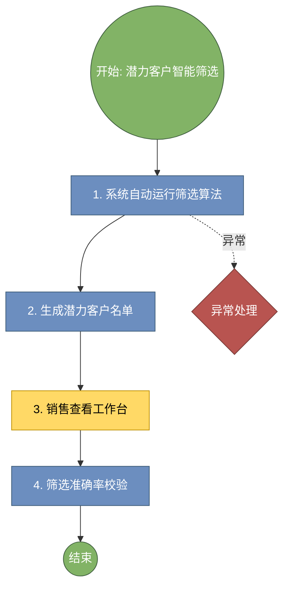

**简化版（手动绘制）**:

```
流程名称: 潜力客户智能筛选
流程编号: 1.1.01

节点列表:
1. 开始节点（椭圆形，绿色）
2. 系统自动运行筛选算法（矩形，蓝色，系统自动）
3. 生成潜力客户名单（矩形，黄色，人工操作）
4. 销售查看工作台（矩形，黄色，人工操作）
5. 筛选准确率校验（矩形，黄色，人工操作）
6. 结束节点（椭圆形，绿色）

连接关系: 顺序连接，如有异常分支用虚线标注
```

---

### 流程 1.2.01: 销售跟进管理

#### 📋 基本信息

- **流程编号**: 1.2.01
- **流程名称**: 销售跟进管理
- **适用客户**: M1、M2、M3、I1、W1、W2
- **流程分类**: 分类流程
- **发生区域**: 线上 / 电话

#### 📝 操作步骤（5步）

| 步骤 | 动作 | 责任岗位 | 操作说明 | 话术 | 协同部门 |
|------|------|---------|---------|------|---------|
| 1 | 系统分配客户 | 系统自动 | 客户分配至销售后开始计时，规定时效内跟进 | — | — |
| 2 | 销售点击客户卡片 | 市场销售 | 在工作台点击客户卡片，直接拨号或发送微信 | — | — |
| 3 | 电话 / 微信联系客户 | 市场销售 | 自我介绍，说明来意，介绍康养服务 | 王先生您好，我是钻石湾康养酒店的康养顾问 XX，了... | — |
| 4 | 记录沟通内容 | 市场销售 | 系统记录：客户意向、意向方案类型、预计成交时间、下次跟进时间 | — | — |
| 5 | 更新跟进状态 | 市场销售 | 选择状态：待联系→已联系→意向明确→成交 / 暂缓 | — | — |

#### ⚙️ 系统操作要点

- 未在时效内跟进，系统自动弹窗提醒（红点 + 弹窗）
- 跟进记录永久保存
- 客户拒绝：标记 “暂缓”，30 天后再次触发
- 匹配速度：3 秒内完成

#### ⚠️ 异常处理

- 客户拒绝：标记 “暂缓”，30 天后再次触发
- 客户有意向但未成交：设置下次跟进时间
- 客户对方案有异议：医生耐心解释，可调整方案内容

#### 📊 Draw.io 流程图提示词

**Mermaid格式（推荐）**:

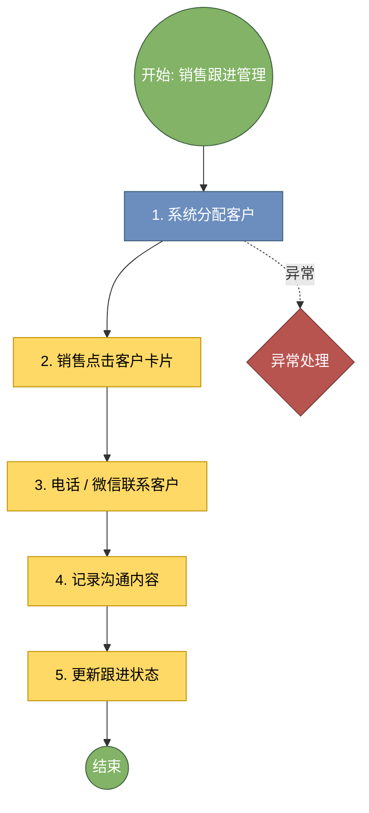

**简化版（手动绘制）**:

```
流程名称: 销售跟进管理
流程编号: 1.2.01

节点列表:
1. 开始节点（椭圆形，绿色）
2. 系统分配客户（矩形，蓝色，系统自动）
3. 销售点击客户卡片（矩形，黄色，人工操作）
4. 电话 / 微信联系客户（矩形，黄色，人工操作）
5. 记录沟通内容（矩形，黄色，人工操作）
6. 更新跟进状态（矩形，黄色，人工操作）
7. 结束节点（椭圆形，绿色）

连接关系: 顺序连接，如有异常分支用虚线标注
```

---

### 流程 1.3.01: 医康方案成交处理

#### 📋 基本信息

- **流程编号**: 1.3.01
- **流程名称**: 医康方案成交处理
- **适用客户**: M1、M2-H、I1-I、R2-H
- **流程分类**: 分类流程
- **发生区域**: 实体医院见诊室

#### 📝 操作步骤（8步）

| 步骤 | 动作 | 责任岗位 | 操作说明 | 话术 | 协同部门 |
|------|------|---------|---------|------|---------|
| 1 | 医生调取医疗档案 | 医生 | 在 HIS 系统查看客户诊断、用药、康复目标 | 王先生，我先看一下您上次的检查报告 | — |
| 2 | 医生勾选医疗项目 | 医生 | 根据诊断在系统中勾选推荐医疗项目（检查、治疗等） | 根据您的情况，我建议增加一项心脏彩超 | — |
| 3 | 系统自动匹配康养项目 | 系统自动 | 基于诊断标签，3 秒内自动匹配关联康养套餐 | — | — |
| 4 | 医生手动调整（如需） | 医生 | 可手动调整匹配结果，调整记录保存用于优化 | — | — |
| 5 | 生成医康融合方案 | 系统自动 | 生成包含医疗项目 + 康养项目的完整方案 | — | — |
| 6 | 向客户讲解方案 | 医生 | 逐项解释方案内容、预期效果 | 王先生，这是为您定制的医康融合方案，包含心脏彩超检... | — |
| 7 | 客户签字确认 | 客户 | 客户确认后电子签名 | — | — |
| 8 | 生成方案订单 | 系统自动 | 订单生成，进入支付流程 | — | — |

#### ⚙️ 系统操作要点

- 匹配速度：3 秒内完成
- 冲突项目自动置灰并提示原因
- 医生手动调整记录需保存用于算法优化
- 资源检测要准，不能出现超卖

#### ⚠️ 异常处理

- 客户对方案有异议：医生耐心解释，可调整方案内容
- 客户需考虑：标记 “意向保留”，设置跟进提醒
- 资源不可用：销售推荐其他时段或房型

#### 📊 Draw.io 流程图提示词

**Mermaid格式（推荐）**:

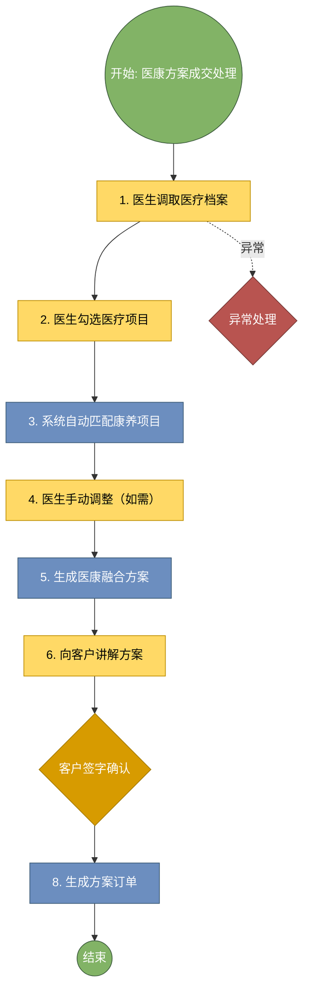

**简化版（手动绘制）**:

```
流程名称: 医康方案成交处理
流程编号: 1.3.01

节点列表:
1. 开始节点（椭圆形，绿色）
2. 医生调取医疗档案（矩形，黄色，人工操作）
3. 医生勾选医疗项目（矩形，黄色，人工操作）
4. 系统自动匹配康养项目（矩形，蓝色，系统自动）
5. 医生手动调整（如需）（矩形，黄色，人工操作）
6. 生成医康融合方案（矩形，黄色，人工操作）
7. 向客户讲解方案（矩形，黄色，人工操作）
8. 客户签字确认（矩形，黄色，人工操作）
9. 生成方案订单（矩形，黄色，人工操作）
10. 结束节点（椭圆形，绿色）

连接关系: 顺序连接，如有异常分支用虚线标注
```

---

### 流程 1.3.02: 康养方案成交处理

#### 📋 基本信息

- **流程编号**: 1.3.02
- **流程名称**: 康养方案成交处理
- **适用客户**: M2-W、I1-W、W1、W2、W3、W4
- **流程分类**: 分类流程
- **发生区域**: 康养酒店 / 线上

#### 📝 操作步骤（6步）

| 步骤 | 动作 | 责任岗位 | 操作说明 | 话术 | 协同部门 |
|------|------|---------|---------|------|---------|
| 1 | 销售了解客户需求 | 市场销售 / 康养销 | 询问客户康养目的、时间、预算、偏好 | 王先生，请问您这次主要想解决什么问题？大概想住几天... | — |
| 2 | 销售选择套餐 | 市场销售 / 康养销 | 在系统中根据客户需求选择对应套餐 | 根据您的情况，我推荐 3 天 2 晚的深眠引颂套餐... | — |
| 3 | 系统检测资源可用性 | 系统自动 | 实时检测房间、项目时段是否可用 | — | PMS |
| 4 | 资源可用确认 | 市场销售 / 康养销 | 确认资源可用后引导客户确认 | 这个时段刚好有房，您看可以吗？ | — |
| 5 | 客户确认 | 客户 | 客户确认套餐内容 | — | — |
| 6 | 生成订单 | 系统自动 | 订单生成，进入支付流程 | — | — |

#### ⚙️ 系统操作要点

- 资源检测要准，不能出现超卖
- 支付前锁定资源 15 分钟
- 支付失败自动释放资源
- 权益不足时自动计算补差金额

#### ⚠️ 异常处理

- 资源不可用：销售推荐其他时段或房型
- 客户犹豫：先记录意向，设置跟进提醒
- 权益不足：提示补差金额，引导支付

#### 📊 Draw.io 流程图提示词

**Mermaid格式（推荐）**:

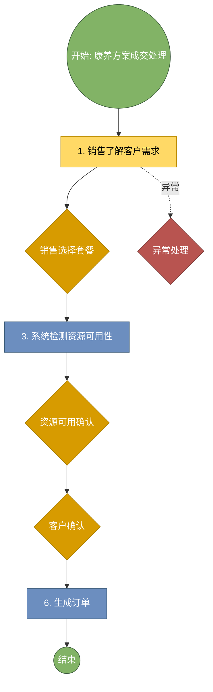

**简化版（手动绘制）**:

```
流程名称: 康养方案成交处理
流程编号: 1.3.02

节点列表:
1. 开始节点（椭圆形，绿色）
2. 销售了解客户需求（矩形，黄色，人工操作）
3. 销售选择套餐（矩形，黄色，人工操作）
4. 系统检测资源可用性（矩形，蓝色，系统自动）
5. 资源可用确认（矩形，黄色，人工操作）
6. 客户确认（矩形，黄色，人工操作）
7. 生成订单（矩形，黄色，人工操作）
8. 结束节点（椭圆形，绿色）

连接关系: 顺序连接，如有异常分支用虚线标注
```

---

### 流程 1.3.03: 权益核销处理

#### 📋 基本信息

- **流程编号**: 1.3.03
- **流程名称**: 权益核销处理
- **适用客户**: R1、R2
- **流程分类**: 个性流程
- **发生区域**: 线上

#### 📝 操作步骤（6步）

| 步骤 | 动作 | 责任岗位 | 操作说明 | 话术 | 协同部门 |
|------|------|---------|---------|------|---------|
| 1 | 客户登录小程序 | 客户 | 使用手机号 / 会员号登录 | — | — |
| 2 | 系统展示可用权益 | 系统自动 | 展示权益类型、剩余额度、有效期 | — | 权益平台 |
| 3 | 客户选择服务 | 客户 | 浏览可用服务，选择心仪项目 / 套餐 | — | — |
| 4 | 系统校验权益 | 系统自动 | 实时校验权益是否可用、额度是否充足 | — | 权益平台 |
| 5 | 客户勾选要使用的权益 | 客户 | 确认使用权益抵扣 | — | — |
| 6 | 系统抵扣生成 0 元订单 | 系统自动 | 生成 0 元订单，进入预约流程 | — | — |

#### ⚙️ 系统操作要点

- 权益不足时自动计算补差金额
- 权益使用记录实时更新
- 权益过期前 30 天自动提醒
- 权益码唯一且防伪

#### ⚠️ 异常处理

- 权益不足：提示补差金额，引导支付
- 权益已过期：提示续费或升级
- 合同解析错误：商务经理手动修正后重新提交

#### 📊 Draw.io 流程图提示词

**Mermaid格式（推荐）**:

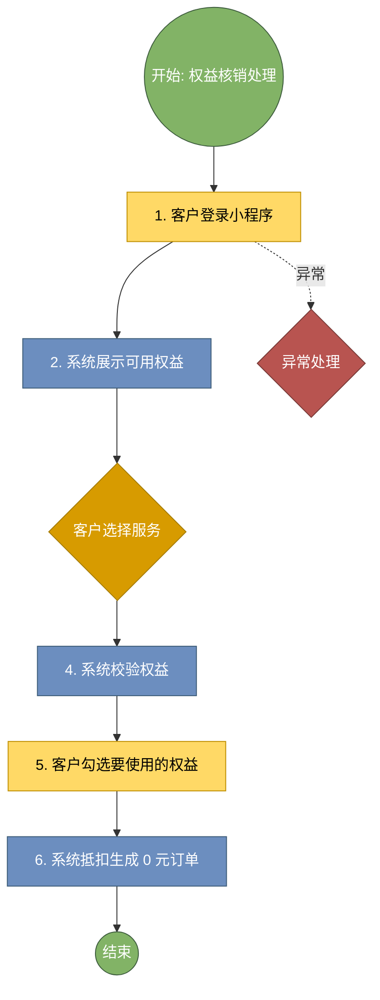

**简化版（手动绘制）**:

```
流程名称: 权益核销处理
流程编号: 1.3.03

节点列表:
1. 开始节点（椭圆形，绿色）
2. 客户登录小程序（矩形，黄色，人工操作）
3. 系统展示可用权益（矩形，蓝色，系统自动）
4. 客户选择服务（矩形，黄色，人工操作）
5. 系统校验权益（矩形，蓝色，系统自动）
6. 客户勾选要使用的权益（矩形，黄色，人工操作）
7. 系统抵扣生成 0 元订单（矩形，蓝色，系统自动）
8. 结束节点（椭圆形，绿色）

连接关系: 顺序连接，如有异常分支用虚线标注
```

---

### 流程 1.3.04: 企业团体签约处理

#### 📋 基本信息

- **流程编号**: 1.3.04
- **流程名称**: 企业团体签约处理
- **适用客户**: M2
- **流程分类**: 个性流程
- **发生区域**: 商务洽谈室

#### 📝 操作步骤（8步）

| 步骤 | 动作 | 责任岗位 | 操作说明 | 话术 | 协同部门 |
|------|------|---------|---------|------|---------|
| 1 | 商务经理洽谈合作 | 商务经理 | 与企业对接人洽谈合作方案、人数、套餐、价格 | 王经理，根据贵公司 300 人规模，我们可以提供专... | — |
| 2 | 签订合作协议 | 商务经理 | 双方确认合作条款，签署电子合同 | — | 法务部 |
| 3 | 上传合同至系统 | 商务经理 | 上传签约合同扫描件至系统 | — | — |
| 4 | 系统解析关键信息 | 系统自动 | 自动解析人数、套餐、有效期 | — | — |
| 5 | 商务经理核对解析结果 | 商务经理 | 核对系统解析信息是否正确 | — | — |
| 6 | 批量生成权益码 | 系统自动 | 按人数生成唯一权益码（每人一个） | — | 权益平台 |
| 7 | 权益码关联团体订单 | 系统自动 | 权益码关联团体订单号及有效期 | — | — |
| 8 | 导出权益码 | 商务经理 | 批量导出权益码 Excel，交付企业对接人 | 王经理，这是 300 个权益码，员工凭此码兑换康养... | — |

#### ⚙️ 系统操作要点

- 权益码唯一且防伪
- 支持批量导出 / 打印
- 权益码激活状态实时可查
- 支付失败自动重试 3 次

#### ⚠️ 异常处理

- 合同解析错误：商务经理手动修正后重新提交
- 权益码生成失败：重新执行生成任务
- 支付失败：提示客户重试或更换支付方式

#### 📊 Draw.io 流程图提示词

**Mermaid格式（推荐）**:

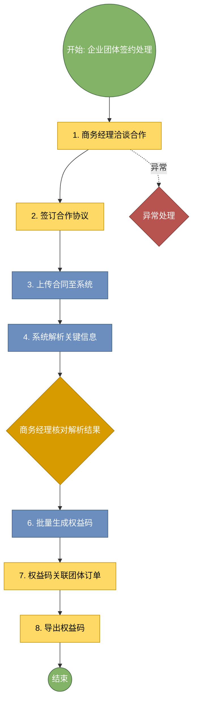

**简化版（手动绘制）**:

```
流程名称: 企业团体签约处理
流程编号: 1.3.04

节点列表:
1. 开始节点（椭圆形，绿色）
2. 商务经理洽谈合作（矩形，黄色，人工操作）
3. 签订合作协议（矩形，黄色，人工操作）
4. 上传合同至系统（矩形，蓝色，系统自动）
5. 系统解析关键信息（矩形，蓝色，系统自动）
6. 商务经理核对解析结果（矩形，黄色，人工操作）
7. 批量生成权益码（矩形，黄色，人工操作）
8. 权益码关联团体订单（矩形，黄色，人工操作）
9. 导出权益码（矩形，黄色，人工操作）
10. 结束节点（椭圆形，绿色）

连接关系: 顺序连接，如有异常分支用虚线标注
```

---

### 流程 1.4.01: 在线支付处理

#### 📋 基本信息

- **流程编号**: 1.4.01
- **流程名称**: 在线支付处理
- **适用客户**: 所有客户
- **流程分类**: 通用流程
- **发生区域**: 线上

#### 📝 操作步骤（6步）

| 步骤 | 动作 | 责任岗位 | 操作说明 | 话术 | 协同部门 |
|------|------|---------|---------|------|---------|
| 1 | 客户选择支付方式 | 客户 | 微信 / 支付宝 / 银行卡 | — | — |
| 2 | 系统调用支付接口 | 系统自动 | 发起支付请求 | — | 支付中台 |
| 3 | 客户完成支付 | 客户 | 输入密码 / 指纹确认 | — | — |
| 4 | 系统更新订单状态 | 系统自动 | 支付成功后 10 秒内更新订单状态 | — | — |
| 5 | 生成电子凭证 | 系统自动 | 生成电子凭证推送至客户小程序 | — | — |
| 6 | 推送电子发票 | 系统自动 | 支付完成后自动推送发票至客户账户 | — | 财务部 |

#### ⚙️ 系统操作要点

- 支付失败自动重试 3 次
- 支付成功即时反馈
- 发票自动推送
- 超额度自动预警

#### ⚠️ 异常处理

- 支付失败：提示客户重试或更换支付方式
- 支付超时：自动取消订单，释放资源
- 超额度：提示企业先支付或申请提额

#### 📊 Draw.io 流程图提示词

**Mermaid格式（推荐）**:

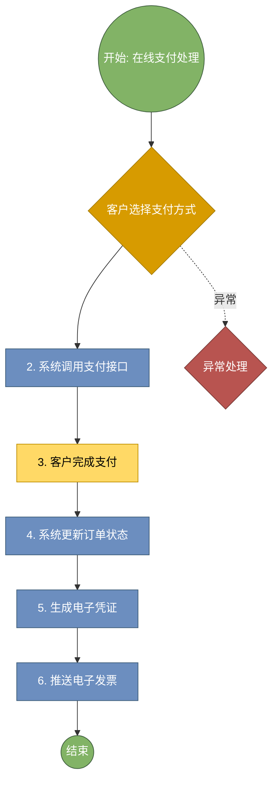

**简化版（手动绘制）**:

```
流程名称: 在线支付处理
流程编号: 1.4.01

节点列表:
1. 开始节点（椭圆形，绿色）
2. 客户选择支付方式（矩形，黄色，人工操作）
3. 系统调用支付接口（矩形，蓝色，系统自动）
4. 客户完成支付（矩形，黄色，人工操作）
5. 系统更新订单状态（矩形，蓝色，系统自动）
6. 生成电子凭证（矩形，黄色，人工操作）
7. 推送电子发票（矩形，蓝色，系统自动）
8. 结束节点（椭圆形，绿色）

连接关系: 顺序连接，如有异常分支用虚线标注
```

---

### 流程 1.4.02: 对公支付处理

#### 📋 基本信息

- **流程编号**: 1.4.02
- **流程名称**: 对公支付处理
- **适用客户**: M2
- **流程分类**: 个性流程
- **发生区域**: 财务部

#### 📝 操作步骤（6步）

| 步骤 | 动作 | 责任岗位 | 操作说明 | 话术 | 协同部门 |
|------|------|---------|---------|------|---------|
| 1 | 企业对接人选择挂账 | 企业对接人 | 选择企业挂账账户 | — | — |
| 2 | 系统校验信用额度 | 系统自动 | 实时计算剩余信用额度 | — | 财务部 |
| 3 | 生成挂账凭证 | 系统自动 | 生成挂账凭证，状态标记 “待支付” | — | — |
| 4 | 财务后台审核 | 财务人员 | 审核挂账申请是否符合协议 | — | — |
| 5 | 对公支付 / 月结 | 企业财务 | 企业对公转账或月结 | — | — |
| 6 | 财务确认收款 | 财务人员 | 确认收款后更新订单状态 | — | — |

#### ⚙️ 系统操作要点

- 超额度自动预警
- 挂账记录自动归集
- 支持多级审批
- 授权协议简洁易懂，3 分钟内能看完

#### ⚠️ 异常处理

- 超额度：提示企业先支付或申请提额
- 逾期未付：财务跟进催款
- 客户拒绝授权：影响后续医疗数据同步，但康养服务仍可进行

#### 📊 Draw.io 流程图提示词

**Mermaid格式（推荐）**:

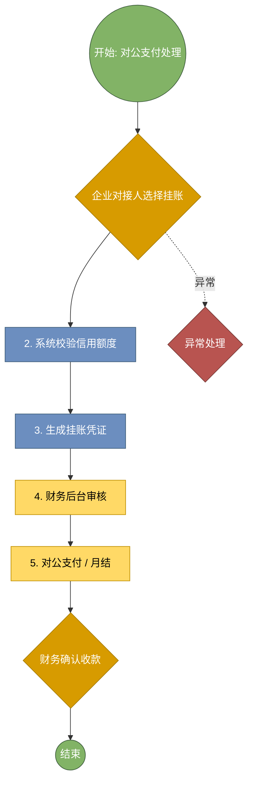

**简化版（手动绘制）**:

```
流程名称: 对公支付处理
流程编号: 1.4.02

节点列表:
1. 开始节点（椭圆形，绿色）
2. 企业对接人选择挂账（矩形，黄色，人工操作）
3. 系统校验信用额度（矩形，蓝色，系统自动）
4. 生成挂账凭证（矩形，黄色，人工操作）
5. 财务后台审核（矩形，黄色，人工操作）
6. 对公支付 / 月结（矩形，黄色，人工操作）
7. 财务确认收款（矩形，黄色，人工操作）
8. 结束节点（椭圆形，绿色）

连接关系: 顺序连接，如有异常分支用虚线标注
```

---

### 流程 1.5.01: 数据授权管理

#### 📋 基本信息

- **流程编号**: 1.5.01
- **流程名称**: 数据授权管理
- **适用客户**: 所有客户
- **流程分类**: 通用流程
- **发生区域**: 线上

#### 📝 操作步骤（6步）

| 步骤 | 动作 | 责任岗位 | 操作说明 | 话术 | 协同部门 |
|------|------|---------|---------|------|---------|
| 1 | 支付成功后自动弹出协议 | 系统自动 | 支付成功后 30 秒内弹出授权协议 | — | — |
| 2 | 客户阅读协议 | 客户 | 阅读数据授权协议内容 | — | — |
| 3 | 客户勾选同意 | 客户 | 勾选 “我已阅读并同意” | — | — |
| 4 | 客户电子签名 | 客户 | 手写签名 / 点击确认 | — | — |
| 5 | 系统记录授权信息 | 系统自动 | 记录授权时间、IP、设备信息 | — | 法务部 |
| 6 | 生成授权书 PDF | 系统自动 | 加密存储至客户档案 | — | — |

#### ⚙️ 系统操作要点

- 授权协议简洁易懂，3 分钟内能看完
- 授权状态实时同步
- 授权过期前 30 天自动提醒续签
- 同步要在 30 分钟内完成

#### ⚠️ 异常处理

- 客户拒绝授权：影响后续医疗数据同步，但康养服务仍可进行
- 授权失败：重新推送协议
- 同步失败：自动重试，连续失败 3 次后标记异常，人工介入

#### 📊 Draw.io 流程图提示词

**Mermaid格式（推荐）**:

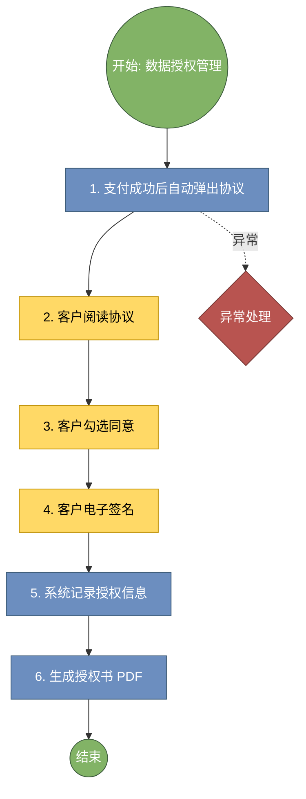

**简化版（手动绘制）**:

```
流程名称: 数据授权管理
流程编号: 1.5.01

节点列表:
1. 开始节点（椭圆形，绿色）
2. 支付成功后自动弹出协议（矩形，蓝色，系统自动）
3. 客户阅读协议（矩形，黄色，人工操作）
4. 客户勾选同意（矩形，黄色，人工操作）
5. 客户电子签名（矩形，黄色，人工操作）
6. 系统记录授权信息（矩形，蓝色，系统自动）
7. 生成授权书 PDF（矩形，黄色，人工操作）
8. 结束节点（椭圆形，绿色）

连接关系: 顺序连接，如有异常分支用虚线标注
```

---

### 流程 1.6.02: 医疗数据同步

#### 📋 基本信息

- **流程编号**: 1.6.02
- **流程名称**: 医疗数据同步
- **适用客户**: M1、M2、M3、I1、R2
- **流程分类**: 分类流程
- **发生区域**: 系统后台

#### 📝 操作步骤（5步）

| 步骤 | 动作 | 责任岗位 | 操作说明 | 话术 | 协同部门 |
|------|------|---------|---------|------|---------|
| 1 | 授权成功触发同步 | 系统自动 | 授权成功后 5 分钟内启动同步 | — | — |
| 2 | HIS 打包脱敏数据 | 系统自动 | 打包诊断、用药、康复目标、禁忌 | — | HIS |
| 3 | 通过安全网关加密传输 | 系统自动 | 数据加密传输 | — | IT 部 |
| 4 | 康养系统解析存储 | 系统自动 | 解析数据并存储至客户档案 | — | — |
| 5 | 同步日志记录 | 系统自动 | 记录同步状态，异常可追溯 | — | — |

#### ⚙️ 系统操作要点

- 同步要在 30 分钟内完成
- 同步失败自动重试 3 次
- 字段级脱敏，只传康复相关标签
- 历史偏好自动预填至问卷

#### ⚠️ 异常处理

- 同步失败：自动重试，连续失败 3 次后标记异常，人工介入
- 同步失败：自动重试，连续失败 3 次后标记异常

#### 📊 Draw.io 流程图提示词

**Mermaid格式（推荐）**:

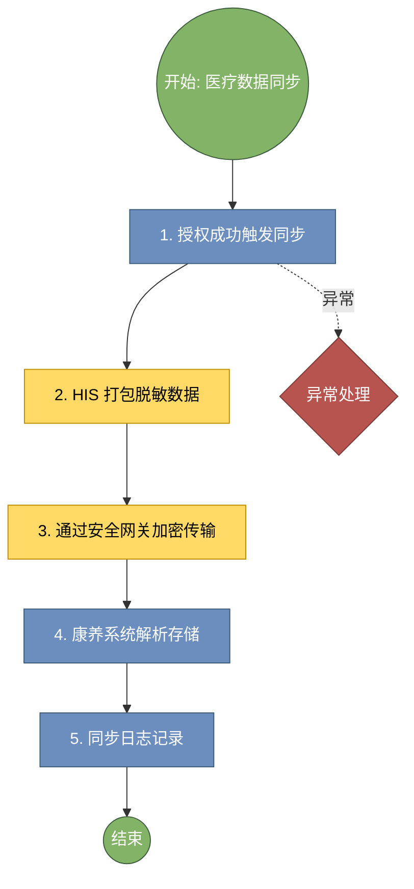

**简化版（手动绘制）**:

```
流程名称: 医疗数据同步
流程编号: 1.6.02

节点列表:
1. 开始节点（椭圆形，绿色）
2. 授权成功触发同步（矩形，黄色，人工操作）
3. HIS 打包脱敏数据（矩形，黄色，人工操作）
4. 通过安全网关加密传输（矩形，黄色，人工操作）
5. 康养系统解析存储（矩形，蓝色，系统自动）
6. 同步日志记录（矩形，黄色，人工操作）
7. 结束节点（椭圆形，绿色）

连接关系: 顺序连接，如有异常分支用虚线标注
```

---

## 其他

**阶段描述**: 
**流程数量**: 44个

---

### 流程 : 非医疗数据同步

#### 📋 基本信息

- **流程编号**: 
- **流程名称**: 非医疗数据同步
- **适用客户**: 所有客户
- **流程分类**: 通用流程
- **发生区域**: 系统后台

#### 📝 操作步骤（4步）

| 步骤 | 动作 | 责任岗位 | 操作说明 | 话术 | 协同部门 |
|------|------|---------|---------|------|---------|
| 1 | 授权成功触发同步 | 系统自动 | 授权成功后 10 分钟内启动同步 | — | — |
| 2 | 从 CRM 同步客户信息 | 系统自动 | 同步会籍等级、消费偏好、入住偏好、历史投诉 | — | CRM |
| 3 | 数据合并至康养档案 | 系统自动 | 合并至客户 360 视图 | — | — |
| 4 | 更新客户画像 | 系统自动 | 更新客户标签和偏好 | — | — |

#### ⚙️ 系统操作要点

- 历史偏好自动预填至问卷
- 会籍等级变化实时同步
- 重复数据自动去重合并
- 客户有指定管家偏好时优先满足

#### ⚠️ 异常处理

- 同步失败：自动重试，连续失败 3 次后标记异常
- 匹配失败：自动按轮询规则分配，通知康养总监确认
- 建群失败：管家手动添加客户微信并建群

#### 📊 Draw.io 流程图提示词

**Mermaid格式（推荐）**:

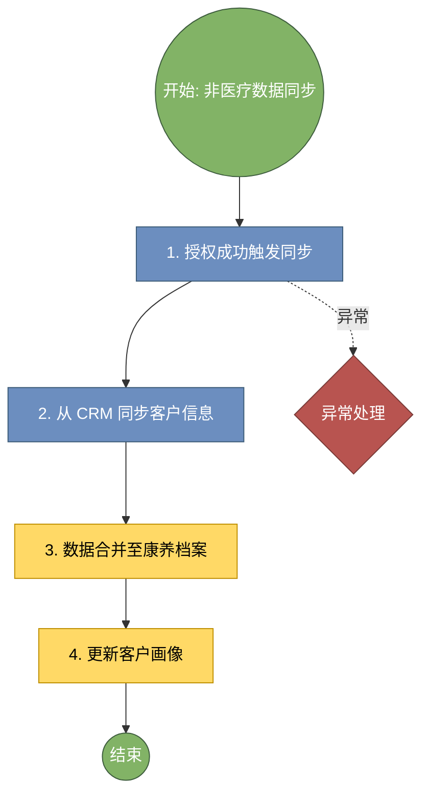

**简化版（手动绘制）**:

```
流程名称: 非医疗数据同步
流程编号: 

节点列表:
1. 开始节点（椭圆形，绿色）
2. 授权成功触发同步（矩形，黄色，人工操作）
3. 从 CRM 同步客户信息（矩形，黄色，人工操作）
4. 数据合并至康养档案（矩形，黄色，人工操作）
5. 更新客户画像（矩形，黄色，人工操作）
6. 结束节点（椭圆形，绿色）

连接关系: 顺序连接，如有异常分支用虚线标注
```

---

## 第二部分：获客与成交阶段

**阶段描述**: 客户转化流程，从潜力识别到方案成交
**流程数量**: 14个

---

### 流程 1.7.01: 康养管家预指派

#### 📋 基本信息

- **流程编号**: 1.7.01
- **流程名称**: 康养管家预指派
- **适用客户**: 所有客户
- **流程分类**: 通用流程
- **发生区域**: 系统后台

#### 📝 操作步骤（4步）

| 步骤 | 动作 | 责任岗位 | 操作说明 | 话术 | 协同部门 |
|------|------|---------|---------|------|---------|
| 1 | 数据同步完成触发匹配 | 系统自动 | 数据同步完成后 10 分钟内启动匹配 | — | — |
| 2 | 系统按规则匹配管家 | 系统自动 | 匹配规则：优先原管家、按客户标签匹配（医疗需求、语言偏好、性别偏好）、负载均衡（每人≤20... | — | — |
| 3 | 管家信息同步至小程序 | 系统自动 | 客户可在小程序查看管家信息 | — | — |
| 4 | 康养总监调整（如需） | 康养总监 | 可在后台手动调整匹配结果 | — | — |

#### ⚙️ 系统操作要点

- 客户有指定管家偏好时优先满足
- 欢迎语模板化
- 群聊记录永久保存
- 提交后即时反馈

#### ⚠️ 异常处理

- 匹配失败：自动按轮询规则分配，通知康养总监确认
- 建群失败：管家手动添加客户微信并建群
- 客户未通过好友：短信联系告知

#### 📊 Draw.io 流程图提示词

**Mermaid格式（推荐）**:

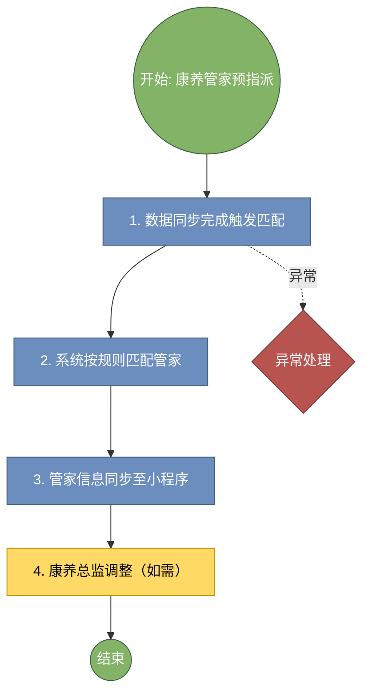

**简化版（手动绘制）**:

```
流程名称: 康养管家预指派
流程编号: 1.7.01

节点列表:
1. 开始节点（椭圆形，绿色）
2. 数据同步完成触发匹配（矩形，黄色，人工操作）
3. 系统按规则匹配管家（矩形，蓝色，系统自动）
4. 管家信息同步至小程序（矩形，黄色，人工操作）
5. 康养总监调整（如需）（矩形，黄色，人工操作）
6. 结束节点（椭圆形，绿色）

连接关系: 顺序连接，如有异常分支用虚线标注
```

---

### 流程 1.7.02: 管家进入客户群

#### 📋 基本信息

- **流程编号**: 1.7.02
- **流程名称**: 管家进入客户群
- **适用客户**: 有微信的客户
- **流程分类**: 分类流程
- **发生区域**: 企业微信

#### 📝 操作步骤（3步）

| 步骤 | 动作 | 责任岗位 | 操作说明 | 话术 | 协同部门 |
|------|------|---------|---------|------|---------|
| 1 | 管家指派后自动建群 | 系统自动 | 2 小时内自动创建客户专属企微群 | — | — |
| 2 | 管家发送欢迎语 | 康养管家 | 自我介绍，告知服务内容 | 王先生您好，我是您的专属康养管家 XX，后续您在酒... | — |
| 3 | 群聊记录自动同步 | 系统自动 | 群聊记录自动同步至客户档案 | — | — |

#### ⚙️ 系统操作要点

- 欢迎语模板化
- 群聊记录永久保存
- 提交后即时反馈
- 自动告知预计审核时间

#### ⚠️ 异常处理

- 建群失败：管家手动添加客户微信并建群
- 客户未通过好友：短信联系告知
- 提交失败：提示重试或联系客服

#### 📊 Draw.io 流程图提示词

**Mermaid格式（推荐）**:

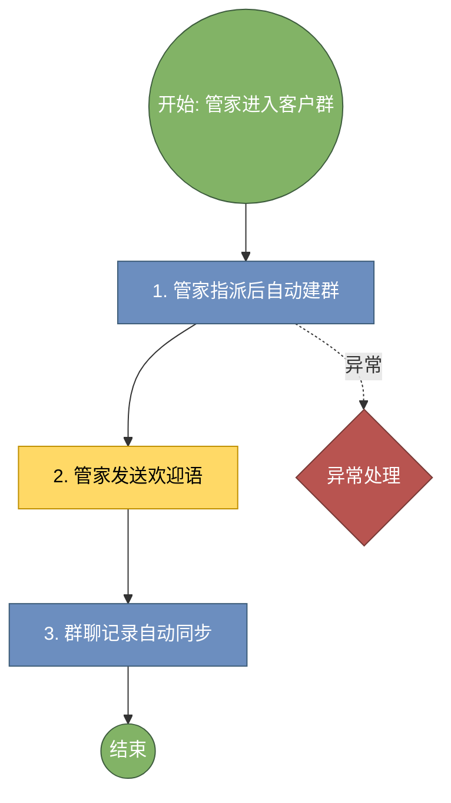

**简化版（手动绘制）**:

```
流程名称: 管家进入客户群
流程编号: 1.7.02

节点列表:
1. 开始节点（椭圆形，绿色）
2. 管家指派后自动建群（矩形，蓝色，系统自动）
3. 管家发送欢迎语（矩形，黄色，人工操作）
4. 群聊记录自动同步（矩形，蓝色，系统自动）
5. 结束节点（椭圆形，绿色）

连接关系: 顺序连接，如有异常分支用虚线标注
```

---

### 流程 1.8.01: 方案变更退款申请处理

#### 📋 基本信息

- **流程编号**: 1.8.01
- **流程名称**: 方案变更退款申请处理
- **适用客户**: 所有客户
- **流程分类**: 通用流程
- **发生区域**: 线上

#### 📝 操作步骤（6步）

| 步骤 | 动作 | 责任岗位 | 操作说明 | 话术 | 协同部门 |
|------|------|---------|---------|------|---------|
| 1 | 客户进入小程序选择变更 / 退款 | 客户 | 在订单页面点击 “方案变更 / 退款” | — | — |
| 2 | 选择变更类型 | 客户 | 升级 / 降级 / 更换 / 退款 | — | — |
| 3 | 填写变更原因 | 客户 | 填写原因，上传凭证（如需） | — | — |
| 4 | 提交申请 | 客户 | 提交后系统记录申请时间 | — | — |
| 5 | 系统自动暂停原方案权益 | 系统自动 | 提交后即时暂停原方案 | — | — |
| 6 | 告知预计审核时间 | 系统自动 | 推送消息：“您的申请已提交，预计 2 小时内审核完成” | — | — |

#### ⚙️ 系统操作要点

- 提交后即时反馈
- 自动告知预计审核时间
- 审核 2 小时内完成
- 规则明确的自动通过

#### ⚠️ 异常处理

- 提交失败：提示重试或联系客服
- 退款失败：人工介入处理

#### 📊 Draw.io 流程图提示词

**Mermaid格式（推荐）**:

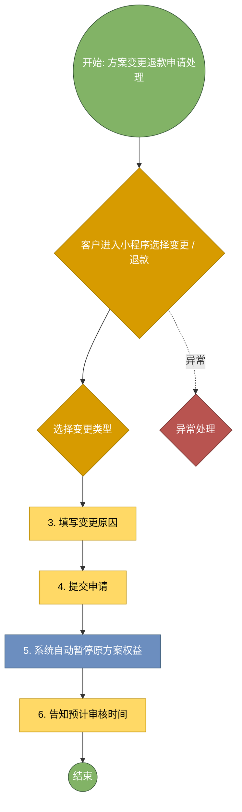

**简化版（手动绘制）**:

```
流程名称: 方案变更退款申请处理
流程编号: 1.8.01

节点列表:
1. 开始节点（椭圆形，绿色）
2. 客户进入小程序选择变更 / 退款（矩形，黄色，人工操作）
3. 选择变更类型（矩形，黄色，人工操作）
4. 填写变更原因（矩形，黄色，人工操作）
5. 提交申请（矩形，黄色，人工操作）
6. 系统自动暂停原方案权益（矩形，蓝色，系统自动）
7. 告知预计审核时间（矩形，黄色，人工操作）
8. 结束节点（椭圆形，绿色）

连接关系: 顺序连接，如有异常分支用虚线标注
```

---

### 流程 1.8.02: 方案变更退款审核

#### 📋 基本信息

- **流程编号**: 1.8.02
- **流程名称**: 方案变更退款审核
- **适用客户**: 所有客户
- **流程分类**: 通用流程
- **发生区域**: 后台

#### 📝 操作步骤（6步）

| 步骤 | 动作 | 责任岗位 | 操作说明 | 话术 | 协同部门 |
|------|------|---------|---------|------|---------|
| 1 | 销售查看变更申请 | 市场销售 | 在工作台查看待审核申请 | — | — |
| 2 | 核对变更条件 | 市场销售 | 核对：是否在可退期内、是否已使用权益、是否已锁定资源 | — | — |
| 3 | 系统自动计算退款金额 | 系统自动 | 按规则计算：实付 - 已用价值 - 手续费 | — | 财务部 |
| 4 | 标出异常项 | 系统自动 | 如有异常，系统高亮提示 | — | — |
| 5 | 销售点击同意 / 拒绝 | 市场销售 | 确认后系统自动执行退款 / 变更 | — | — |
| 6 | 退款自动执行 | 系统自动 | 退款至原支付账户 | — | 支付中台 |

#### ⚙️ 系统操作要点

- 审核 2 小时内完成
- 规则明确的自动通过
- 拒绝需填原因自动推送
- 资源实时更新，不能超卖

#### ⚠️ 异常处理

- 退款失败：人工介入处理
- 预约冲突：提示客户调整

#### 📊 Draw.io 流程图提示词

**Mermaid格式（推荐）**:

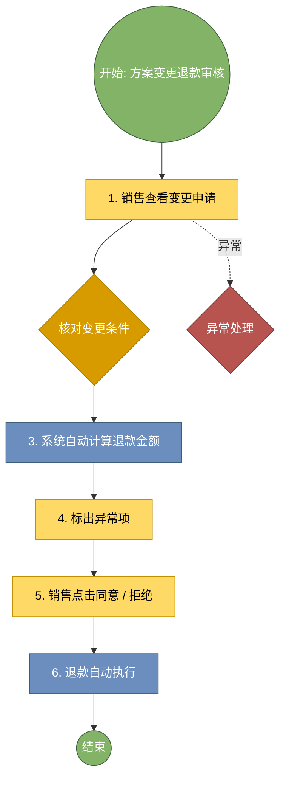

**简化版（手动绘制）**:

```
流程名称: 方案变更退款审核
流程编号: 1.8.02

节点列表:
1. 开始节点（椭圆形，绿色）
2. 销售查看变更申请（矩形，黄色，人工操作）
3. 核对变更条件（矩形，黄色，人工操作）
4. 系统自动计算退款金额（矩形，蓝色，系统自动）
5. 标出异常项（矩形，黄色，人工操作）
6. 销售点击同意 / 拒绝（矩形，黄色，人工操作）
7. 退款自动执行（矩形，蓝色，系统自动）
8. 结束节点（椭圆形，绿色）

连接关系: 顺序连接，如有异常分支用虚线标注
```

---

## 第三部分：客户预约阶段

**阶段描述**: 预约管理流程，包括方案客户、权益客户、OTA订单等
**流程数量**: 8个

---

### 流程 2.1.01: 方案客户预约处理

#### 📋 基本信息

- **流程编号**: 2.1.01
- **流程名称**: 方案客户预约处理
- **适用客户**: M1、M2、M3、I1、W1、W2、W3
- **流程分类**: 分类流程
- **发生区域**: 线上

#### 📝 操作步骤（8步）

| 步骤 | 动作 | 责任岗位 | 操作说明 | 话术 | 协同部门 |
|------|------|---------|---------|------|---------|
| 1 | 客户登录小程序 | 客户 | 使用手机号登录 | — | — |
| 2 | 选择入住 / 离店日期 | 客户 | 在日历上选择日期 | — | — |
| 3 | 系统检测资源可用性 | 系统自动 | 实时检测房型、项目时段 | — | PMS |
| 4 | 系统展示可选房型 | 系统自动 | 根据方案权益自动匹配可选房型 | — | — |
| 5 | 客户选择房型 | 客户 | 选择心仪房型 | — | — |
| 6 | 选择康养项目时段 | 客户 | 选择具体项目时间 | — | — |
| 7 | 提交预约 | 客户 | 确认后提交 | — | — |
| 8 | 系统反馈预约结果 | 系统自动 | 30 秒内反馈成功 / 失败 | — | — |

#### ⚙️ 系统操作要点

- 资源实时更新，不能超卖
- 预约成功自动锁定资源
- 预约失败自动推荐 3 个备选时段
- 权益展示清晰

#### ⚠️ 异常处理

- 预约冲突：提示客户调整
- 权益不足：提示补差或升级
- 预约失败：提示原因

#### 📊 Draw.io 流程图提示词

**Mermaid格式（推荐）**:

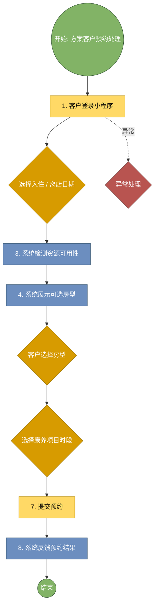

**简化版（手动绘制）**:

```
流程名称: 方案客户预约处理
流程编号: 2.1.01

节点列表:
1. 开始节点（椭圆形，绿色）
2. 客户登录小程序（矩形，黄色，人工操作）
3. 选择入住 / 离店日期（矩形，黄色，人工操作）
4. 系统检测资源可用性（矩形，蓝色，系统自动）
5. 系统展示可选房型（矩形，蓝色，系统自动）
6. 客户选择房型（矩形，黄色，人工操作）
7. 选择康养项目时段（矩形，黄色，人工操作）
8. 提交预约（矩形，黄色，人工操作）
9. 系统反馈预约结果（矩形，蓝色，系统自动）
10. 结束节点（椭圆形，绿色）

连接关系: 顺序连接，如有异常分支用虚线标注
```

---

### 流程 2.1.02: 权益客户预约处理

#### 📋 基本信息

- **流程编号**: 2.1.02
- **流程名称**: 权益客户预约处理
- **适用客户**: R1、R2
- **流程分类**: 个性流程
- **发生区域**: 线上

#### 📝 操作步骤（8步）

| 步骤 | 动作 | 责任岗位 | 操作说明 | 话术 | 协同部门 |
|------|------|---------|---------|------|---------|
| 1 | 客户登录小程序 | 客户 | 使用手机号登录 | — | — |
| 2 | 系统自动识别权益身份 | 系统自动 | 登录后 3 秒内完成权益识别 | — | 权益平台 |
| 3 | 展示可用权益 | 系统自动 | 展示可预约项目及剩余次数 | — | — |
| 4 | 客户选择日期 | 客户 | 选择入住日期 | — | — |
| 5 | 客户选择项目 | 客户 | 选择要使用的权益项目 | — | — |
| 6 | 系统自动核销权益 | 系统自动 | 提交后自动核销权益 | — | 权益平台 |
| 7 | 生成预约订单 | 系统自动 | 生成 0 元订单 | — | — |
| 8 | 推送确认信息 | 系统自动 | 推送预约成功确认 | — | — |

#### ⚙️ 系统操作要点

- 权益展示清晰
- 预约时自动校验权益
- 预约成功即时推送确认信息
- 同步要及时，下单后 30 分钟内接入

#### ⚠️ 异常处理

- 权益不足：提示补差或升级
- 预约失败：提示原因
- 订单信息不全：联系平台获取

#### 📊 Draw.io 流程图提示词

**Mermaid格式（推荐）**:

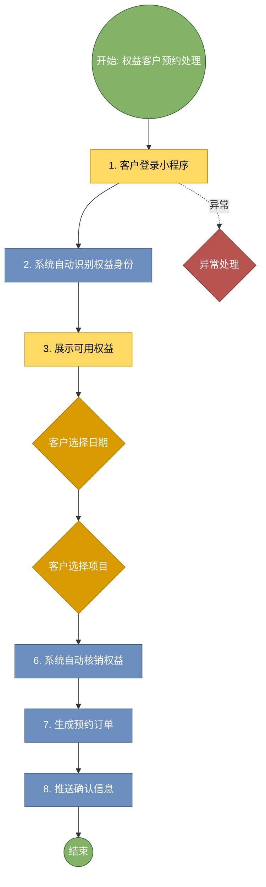

**简化版（手动绘制）**:

```
流程名称: 权益客户预约处理
流程编号: 2.1.02

节点列表:
1. 开始节点（椭圆形，绿色）
2. 客户登录小程序（矩形，黄色，人工操作）
3. 系统自动识别权益身份（矩形，蓝色，系统自动）
4. 展示可用权益（矩形，黄色，人工操作）
5. 客户选择日期（矩形，黄色，人工操作）
6. 客户选择项目（矩形，黄色，人工操作）
7. 系统自动核销权益（矩形，蓝色，系统自动）
8. 生成预约订单（矩形，黄色，人工操作）
9. 推送确认信息（矩形，蓝色，系统自动）
10. 结束节点（椭圆形，绿色）

连接关系: 顺序连接，如有异常分支用虚线标注
```

---

### 流程 2.1.03: OTA 订单接入处理

#### 📋 基本信息

- **流程编号**: 2.1.03
- **流程名称**: OTA 订单接入处理
- **适用客户**: W4
- **流程分类**: 个性流程
- **发生区域**: 系统后台

#### 📝 操作步骤（7步）

| 步骤 | 动作 | 责任岗位 | 操作说明 | 话术 | 协同部门 |
|------|------|---------|---------|------|---------|
| 1 | OTA 平台推送订单 | 系统自动 | 客户下单后通过 API 实时同步 | — | — |
| 2 | 系统每 15 分钟同步一次 | 系统自动 | 定时同步订单数据 | — | — |
| 3 | 系统自动创建客户档案 | 系统自动 | 新客自动建档，老客自动匹配 | — | — |
| 4 | 系统自动匹配房型 | 系统自动 | 根据订单信息匹配对应房型 | — | PMS |
| 5 | 生成内部预约单 | 系统自动 | 生成内部预约订单 | — | — |
| 6 | 标记渠道来源 | 系统自动 | 标记为 “OTA” 渠道 | — | — |
| 7 | OTA 运营专员查看同步日志 | OTA 运营专员 | 每日查看同步状态，异常时手动补录 | — | — |

#### ⚙️ 系统操作要点

- 同步要及时，下单后 30 分钟内接入
- 新客自动建档
- 渠道来源标记准确
- 支持 Excel 批量导入

#### ⚠️ 异常处理

- 订单信息不全：联系平台获取
- 导入失败：检查格式，重新上传
- 分配不合理：人工调整后重新分配

#### 📊 Draw.io 流程图提示词

**Mermaid格式（推荐）**:

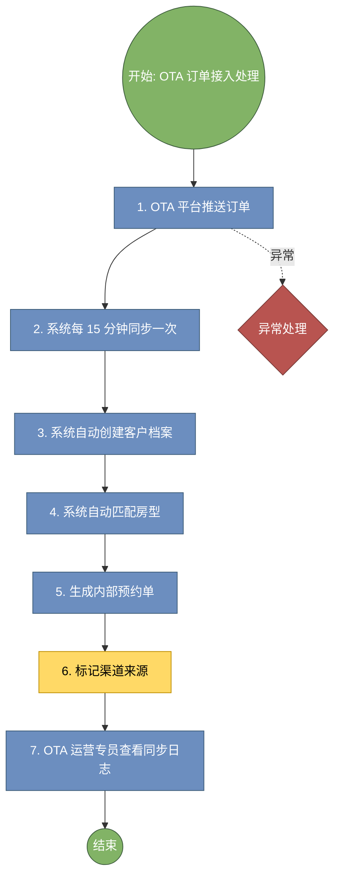

**简化版（手动绘制）**:

```
流程名称: OTA 订单接入处理
流程编号: 2.1.03

节点列表:
1. 开始节点（椭圆形，绿色）
2. OTA 平台推送订单（矩形，蓝色，系统自动）
3. 系统每 15 分钟同步一次（矩形，蓝色，系统自动）
4. 系统自动创建客户档案（矩形，蓝色，系统自动）
5. 系统自动匹配房型（矩形，蓝色，系统自动）
6. 生成内部预约单（矩形，黄色，人工操作）
7. 标记渠道来源（矩形，黄色，人工操作）
8. OTA 运营专员查看同步日志（矩形，黄色，人工操作）
9. 结束节点（椭圆形，绿色）

连接关系: 顺序连接，如有异常分支用虚线标注
```

---

### 流程 2.1.04: 团体预约处理

#### 📋 基本信息

- **流程编号**: 2.1.04
- **流程名称**: 团体预约处理
- **适用客户**: M2
- **流程分类**: 个性流程
- **发生区域**: 后台

#### 📝 操作步骤（6步）

| 步骤 | 动作 | 责任岗位 | 操作说明 | 话术 | 协同部门 |
|------|------|---------|---------|------|---------|
| 1 | 领队 / 销售上传成员名单 | 商务经理 / 领队 | 上传 Excel 名单（姓名、手机号、性别、偏好等） | — | — |
| 2 | 系统批量创建客户档案 | 系统自动 | 10 分钟内完成批量处理，新客建档，老客匹配 | — | — |
| 3 | 系统自动分配房间 | 系统自动 | 自动分配房间，家庭成员优先同住 | — | PMS |
| 4 | 生成团体预约单 | 系统自动 | 生成团体预约单，关联所有成员 | — | — |
| 5 | 领队核对分配结果 | 领队 | 确认房间分配是否合理 | — | — |
| 6 | 系统发送预约确认 | 系统自动 | 向每个成员推送预约确认 | — | — |

#### ⚙️ 系统操作要点

- 支持 Excel 批量导入
- 自动识别老客
- 家庭成员优先安排同住
- 80% 的预约能自动通过

#### ⚠️ 异常处理

- 导入失败：检查格式，重新上传
- 分配不合理：人工调整后重新分配
- 自动确认失败：转人工处理

#### 📊 Draw.io 流程图提示词

**Mermaid格式（推荐）**:

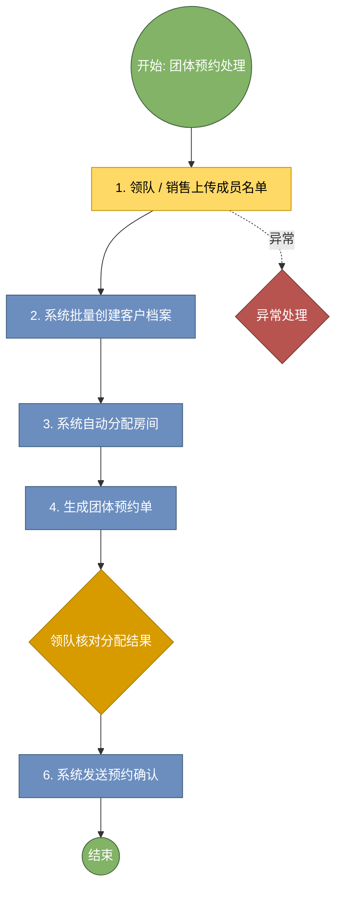

**简化版（手动绘制）**:

```
流程名称: 团体预约处理
流程编号: 2.1.04

节点列表:
1. 开始节点（椭圆形，绿色）
2. 领队 / 销售上传成员名单（矩形，黄色，人工操作）
3. 系统批量创建客户档案（矩形，蓝色，系统自动）
4. 系统自动分配房间（矩形，蓝色，系统自动）
5. 生成团体预约单（矩形，黄色，人工操作）
6. 领队核对分配结果（矩形，黄色，人工操作）
7. 系统发送预约确认（矩形，蓝色，系统自动）
8. 结束节点（椭圆形，绿色）

连接关系: 顺序连接，如有异常分支用虚线标注
```

---

### 流程 2.2.01: 预约自动确认

#### 📋 基本信息

- **流程编号**: 2.2.01
- **流程名称**: 预约自动确认
- **适用客户**: 所有客户
- **流程分类**: 通用流程
- **发生区域**: 系统后台

#### 📝 操作步骤（5步）

| 步骤 | 动作 | 责任岗位 | 操作说明 | 话术 | 协同部门 |
|------|------|---------|---------|------|---------|
| 1 | 客户提交预约 | 客户 | 提交后 30 秒内系统自动判断 | — | — |
| 2 | 系统判断自动确认条件 | 系统自动 | 条件：权益充足、资源可用、无冲突、无需人工审核 | — | — |
| 3 | 符合条件自动确认 | 系统自动 | 生成确认单，推送客户 | — | — |
| 4 | 不符合条件进入人工队列 | 系统自动 | 标记 “待人工确认” | — | — |
| 5 | 预约部查看待人工列表 | 预约部 | 处理需人工确认的预约 | — | — |

#### ⚙️ 系统操作要点

- 80% 的预约能自动通过
- 自动通过的也要发确认短信
- 自动确认规则可配置
- 人工确认 2 小时内完成

#### ⚠️ 异常处理

- 自动确认失败：转人工处理
- 客户不接受备选：标记 “待确认”，后续跟进
- 改期资源不足：推荐备选时段

#### 📊 Draw.io 流程图提示词

**Mermaid格式（推荐）**:

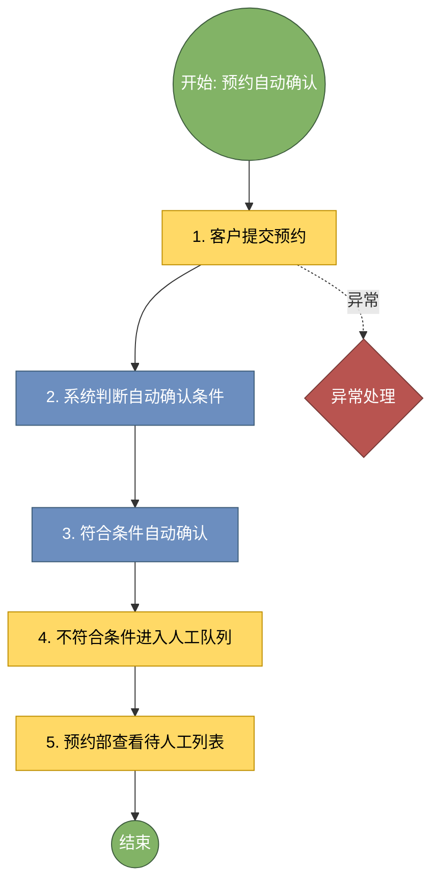

**简化版（手动绘制）**:

```
流程名称: 预约自动确认
流程编号: 2.2.01

节点列表:
1. 开始节点（椭圆形，绿色）
2. 客户提交预约（矩形，黄色，人工操作）
3. 系统判断自动确认条件（矩形，蓝色，系统自动）
4. 符合条件自动确认（矩形，蓝色，系统自动）
5. 不符合条件进入人工队列（矩形，黄色，人工操作）
6. 预约部查看待人工列表（矩形，黄色，人工操作）
7. 结束节点（椭圆形，绿色）

连接关系: 顺序连接，如有异常分支用虚线标注
```

---

### 流程 2.2.02: 预约人工确认

#### 📋 基本信息

- **流程编号**: 2.2.02
- **流程名称**: 预约人工确认
- **适用客户**: 所有客户
- **流程分类**: 通用流程
- **发生区域**: 后台

#### 📝 操作步骤（5步）

| 步骤 | 动作 | 责任岗位 | 操作说明 | 话术 | 协同部门 |
|------|------|---------|---------|------|---------|
| 1 | 预约部查看待人工列表 | 预约部 | 查看 “需人工确认” 列表 | — | — |
| 2 | 核对异常原因 | 预约部 | 查看系统标出的异常项（权益不足、资源冲突、特殊需求） | — | — |
| 3 | 联系客户沟通调整 | 预约部 | 电话 / 微信联系客户说明情况 | 王先生您好，您预约的 XX 时段房间已满，我们为您... | — |
| 4 | 确认或拒绝预约 | 预约部 | 确认后系统执行；拒绝需填写原因 | — | — |
| 5 | 推送处理结果 | 系统自动 | 向客户推送确认 / 拒绝通知 | — | — |

#### ⚙️ 系统操作要点

- 人工确认 2 小时内完成
- 拒绝需说明原因并推荐备选
- 沟通记录要保存
- 改期时自动检测新资源

#### ⚠️ 异常处理

- 客户不接受备选：标记 “待确认”，后续跟进
- 改期资源不足：推荐备选时段

#### 📊 Draw.io 流程图提示词

**Mermaid格式（推荐）**:

```mermaid
graph TD
    Start((开始: 预约人工确认)):::startClass
    Step1[1. 预约部查看待人工列表]:::manualClass
    Step2{核对异常原因}:::decisionClass
    Step3[3. 联系客户沟通调整]:::manualClass
    Step4{确认或拒绝预约}:::decisionClass
    Step5[5. 推送处理结果]:::systemClass
    End((结束)):::endClass
    Exception{异常处理}:::exceptionClass
    Start --> Step1
    Step1 --> Step2
    Step2 --> Step3
    Step3 --> Step4
    Step4 --> Step5
    Step5 --> End
    Step1 -.->|异常| Exception

    classDef startClass fill:#82b366,stroke:#3d5c3d,color:#fff
    classDef endClass fill:#82b366,stroke:#3d5c3d,color:#fff
    classDef systemClass fill:#6c8ebf,stroke:#3d5c78,color:#fff
    classDef manualClass fill:#ffd966,stroke:#bf8f00,color:#000
    classDef decisionClass fill:#d79b00,stroke:#a67c00,color:#fff
    classDef exceptionClass fill:#b85450,stroke:#783a37,color:#fff
```

**简化版（手动绘制）**:

```
流程名称: 预约人工确认
流程编号: 2.2.02

节点列表:
1. 开始节点（椭圆形，绿色）
2. 预约部查看待人工列表（矩形，黄色，人工操作）
3. 核对异常原因（矩形，黄色，人工操作）
4. 联系客户沟通调整（矩形，黄色，人工操作）
5. 确认或拒绝预约（矩形，黄色，人工操作）
6. 推送处理结果（矩形，蓝色，系统自动）
7. 结束节点（椭圆形，绿色）

连接关系: 顺序连接，如有异常分支用虚线标注
```

---

### 流程 2.3.01: 预约变更申请处理

#### 📋 基本信息

- **流程编号**: 2.3.01
- **流程名称**: 预约变更申请处理
- **适用客户**: 所有客户
- **流程分类**: 通用流程
- **发生区域**: 线上

#### 📝 操作步骤（7步）

| 步骤 | 动作 | 责任岗位 | 操作说明 | 话术 | 协同部门 |
|------|------|---------|---------|------|---------|
| 1 | 客户进入小程序选择变更 / 取消 | 客户 | 在预约页面点击 “变更 / 取消” | — | — |
| 2 | 选择变更类型 | 客户 | 改期 / 取消 | — | — |
| 3 | 填写原因 | 客户 | 填写变更原因 | — | — |
| 4 | 提交申请 | 客户 | 提交后系统实时处理 | — | — |
| 5 | 取消：系统实时释放资源 | 系统自动 | 取消后即时释放房间和项目资源 | — | PMS |
| 6 | 改期：系统检测新资源 | 系统自动 | 检测新时段资源是否可用 | — | PMS |
| 7 | 告知退款规则 | 系统自动 | 取消时告知退款金额 | — | — |

#### ⚙️ 系统操作要点

- 改期时自动检测新资源
- 取消告知退款规则
- 申请后即时反馈
- 自动审核即时完成

#### ⚠️ 异常处理

- 改期资源不足：推荐备选时段

#### 📊 Draw.io 流程图提示词

**Mermaid格式（推荐）**:

```mermaid
graph TD
    Start((开始: 预约变更申请处理)):::startClass
    Step1{客户进入小程序选择变更 / 取消}:::decisionClass
    Step2{选择变更类型}:::decisionClass
    Step3[3. 填写原因]:::manualClass
    Step4[4. 提交申请]:::manualClass
    Step5[5. 取消：系统实时释放资源]:::systemClass
    Step6[6. 改期：系统检测新资源]:::systemClass
    Step7[7. 告知退款规则]:::manualClass
    End((结束)):::endClass
    Exception{异常处理}:::exceptionClass
    Start --> Step1
    Step1 --> Step2
    Step2 --> Step3
    Step3 --> Step4
    Step4 --> Step5
    Step5 --> Step6
    Step6 --> Step7
    Step7 --> End
    Step1 -.->|异常| Exception

    classDef startClass fill:#82b366,stroke:#3d5c3d,color:#fff
    classDef endClass fill:#82b366,stroke:#3d5c3d,color:#fff
    classDef systemClass fill:#6c8ebf,stroke:#3d5c78,color:#fff
    classDef manualClass fill:#ffd966,stroke:#bf8f00,color:#000
    classDef decisionClass fill:#d79b00,stroke:#a67c00,color:#fff
    classDef exceptionClass fill:#b85450,stroke:#783a37,color:#fff
```

**简化版（手动绘制）**:

```
流程名称: 预约变更申请处理
流程编号: 2.3.01

节点列表:
1. 开始节点（椭圆形，绿色）
2. 客户进入小程序选择变更 / 取消（矩形，黄色，人工操作）
3. 选择变更类型（矩形，黄色，人工操作）
4. 填写原因（矩形，黄色，人工操作）
5. 提交申请（矩形，黄色，人工操作）
6. 取消：系统实时释放资源（矩形，蓝色，系统自动）
7. 改期：系统检测新资源（矩形，蓝色，系统自动）
8. 告知退款规则（矩形，黄色，人工操作）
9. 结束节点（椭圆形，绿色）

连接关系: 顺序连接，如有异常分支用虚线标注
```

---

### 流程 2.3.02: 预约变更审核

#### 📋 基本信息

- **流程编号**: 2.3.02
- **流程名称**: 预约变更审核
- **适用客户**: 所有客户
- **流程分类**: 通用流程
- **发生区域**: 后台

#### 📝 操作步骤（5步）

| 步骤 | 动作 | 责任岗位 | 操作说明 | 话术 | 协同部门 |
|------|------|---------|---------|------|---------|
| 1 | 系统自动审核（规则明确） | 系统自动 | 符合免费取消规则的自动通过 | — | — |
| 2 | 人工审核异常情况 | 预约部 | 查看不符合自动规则的申请 | — | — |
| 3 | 核对取消政策 | 预约部 | 是否在免费取消期内 | — | — |
| 4 | 计算退款金额 | 系统自动 | 按规则自动计算 | — | 财务部 |
| 5 | 确认执行变更 | 预约部 | 确认后系统执行退款 / 改期 | — | — |

#### ⚙️ 系统操作要点

- 自动审核即时完成
- 人工审核 2 小时内完成
- 退款自动执行
- 问卷手机 5 分钟内填完

#### ⚠️ 异常处理

- 问卷未填：管家跟进提醒
- 填写异常：管家联系确认

#### 📊 Draw.io 流程图提示词

**Mermaid格式（推荐）**:

```mermaid
graph TD
    Start((开始: 预约变更审核)):::startClass
    Step1[1. 系统自动审核（规则明确）]:::systemClass
    Step2[2. 人工审核异常情况]:::manualClass
    Step3{核对取消政策}:::decisionClass
    Step4[4. 计算退款金额]:::manualClass
    Step5{确认执行变更}:::decisionClass
    End((结束)):::endClass
    Exception{异常处理}:::exceptionClass
    Start --> Step1
    Step1 --> Step2
    Step2 --> Step3
    Step3 --> Step4
    Step4 --> Step5
    Step5 --> End
    Step1 -.->|异常| Exception

    classDef startClass fill:#82b366,stroke:#3d5c3d,color:#fff
    classDef endClass fill:#82b366,stroke:#3d5c3d,color:#fff
    classDef systemClass fill:#6c8ebf,stroke:#3d5c78,color:#fff
    classDef manualClass fill:#ffd966,stroke:#bf8f00,color:#000
    classDef decisionClass fill:#d79b00,stroke:#a67c00,color:#fff
    classDef exceptionClass fill:#b85450,stroke:#783a37,color:#fff
```

**简化版（手动绘制）**:

```
流程名称: 预约变更审核
流程编号: 2.3.02

节点列表:
1. 开始节点（椭圆形，绿色）
2. 系统自动审核（规则明确）（矩形，蓝色，系统自动）
3. 人工审核异常情况（矩形，黄色，人工操作）
4. 核对取消政策（矩形，黄色，人工操作）
5. 计算退款金额（矩形，黄色，人工操作）
6. 确认执行变更（矩形，黄色，人工操作）
7. 结束节点（椭圆形，绿色）

连接关系: 顺序连接，如有异常分支用虚线标注
```

---

## 第四部分：行前准备阶段

**阶段描述**: 行前准备流程，包括问卷、管家、客房、餐饮、康养准备
**流程数量**: 10个

---

### 流程 3.1.01: 问卷推送与回收

#### 📋 基本信息

- **流程编号**: 3.1.01
- **流程名称**: 问卷推送与回收
- **适用客户**: 所有客户
- **流程分类**: 通用流程
- **发生区域**: 线上

#### 📝 操作步骤（7步）

| 步骤 | 动作 | 责任岗位 | 操作说明 | 话术 | 协同部门 |
|------|------|---------|---------|------|---------|
| 1 | 预约成功后 24 小时内推送 | 系统自动 | 系统自动推送问卷链接 | — | — |
| 2 | 客户点开链接 | 客户 | 可中途保存，下次续填 | — | — |
| 3 | 填写健康状况 | 客户 | 填写：基础疾病、用药情况、过敏源 | — | — |
| 4 | 填写饮食禁忌 | 客户 | 填写：忌口、过敏食物 | — | — |
| 5 | 填写入住偏好 | 客户 | 填写：楼层偏好、无烟房、河景房、近电梯、指定房号等 | — | — |
| 6 | 填写额外需求 | 客户 | 填写：加床、婴儿床、宠物等 | — | — |
| 7 | 提交问卷 | 客户 | 提交后系统自动解析数据 | — | — |

#### ⚙️ 系统操作要点

- 问卷手机 5 分钟内填完
- 老客户数据自动预填
- 填一半退出下次续填
- 90 天阈值可配置

#### ⚠️ 异常处理

- 问卷未填：管家跟进提醒
- 填写异常：管家联系确认
- 客户对历史数据有更新：可手动修改

#### 📊 Draw.io 流程图提示词

**Mermaid格式（推荐）**:

```mermaid
graph TD
    Start((开始: 问卷推送与回收)):::startClass
    Step1[1. 预约成功后 24 小时内推送]:::systemClass
    Step2[2. 客户点开链接]:::manualClass
    Step3[3. 填写健康状况]:::manualClass
    Step4[4. 填写饮食禁忌]:::manualClass
    Step5[5. 填写入住偏好]:::manualClass
    Step6[6. 填写额外需求]:::manualClass
    Step7[7. 提交问卷]:::manualClass
    End((结束)):::endClass
    Exception{异常处理}:::exceptionClass
    Start --> Step1
    Step1 --> Step2
    Step2 --> Step3
    Step3 --> Step4
    Step4 --> Step5
    Step5 --> Step6
    Step6 --> Step7
    Step7 --> End
    Step1 -.->|异常| Exception

    classDef startClass fill:#82b366,stroke:#3d5c3d,color:#fff
    classDef endClass fill:#82b366,stroke:#3d5c3d,color:#fff
    classDef systemClass fill:#6c8ebf,stroke:#3d5c78,color:#fff
    classDef manualClass fill:#ffd966,stroke:#bf8f00,color:#000
    classDef decisionClass fill:#d79b00,stroke:#a67c00,color:#fff
    classDef exceptionClass fill:#b85450,stroke:#783a37,color:#fff
```

**简化版（手动绘制）**:

```
流程名称: 问卷推送与回收
流程编号: 3.1.01

节点列表:
1. 开始节点（椭圆形，绿色）
2. 预约成功后 24 小时内推送（矩形，蓝色，系统自动）
3. 客户点开链接（矩形，黄色，人工操作）
4. 填写健康状况（矩形，黄色，人工操作）
5. 填写饮食禁忌（矩形，黄色，人工操作）
6. 填写入住偏好（矩形，黄色，人工操作）
7. 填写额外需求（矩形，黄色，人工操作）
8. 提交问卷（矩形，黄色，人工操作）
9. 结束节点（椭圆形，绿色）

连接关系: 顺序连接，如有异常分支用虚线标注
```

---

### 流程 3.1.02: 问卷时效判断

#### 📋 基本信息

- **流程编号**: 3.1.02
- **流程名称**: 问卷时效判断
- **适用客户**: 所有客户
- **流程分类**: 通用流程
- **发生区域**: 系统后台

#### 📝 操作步骤（5步）

| 步骤 | 动作 | 责任岗位 | 操作说明 | 话术 | 协同部门 |
|------|------|---------|---------|------|---------|
| 1 | 客户预约时系统自动查询 | 系统自动 | 查询上次问卷时间 | — | — |
| 2 | 计算距离上次是否超过 90 天 | 系统自动 | 计算间隔天数 | — | — |
| 3 | 超过 90 天触发新问卷 | 系统自动 | 自动推送新问卷 | — | — |
| 4 | 未超过 90 天沿用历史数据 | 系统自动 | 沿用历史数据，需客户确认 | — | — |
| 5 | 管家查看问卷状态 | 康养管家 | 可在工作台查看问卷完成状态 | — | — |

#### ⚙️ 系统操作要点

- 90 天阈值可配置
- 沿用历史数据时需客户确认
- 紧急情况可手动触发问卷
- 数据分发准确

#### ⚠️ 异常处理

- 客户对历史数据有更新：可手动修改
- 分发失败：自动重试，连续失败后人工介入
- 原管家休假：重配新管家

#### 📊 Draw.io 流程图提示词

**Mermaid格式（推荐）**:

```mermaid
graph TD
    Start((开始: 问卷时效判断)):::startClass
    Step1[1. 客户预约时系统自动查询]:::systemClass
    Step2{计算距离上次是否超过 90 天}:::decisionClass
    Step3[3. 超过 90 天触发新问卷]:::manualClass
    Step4[4. 未超过 90 天沿用历史数据]:::manualClass
    Step5[5. 管家查看问卷状态]:::manualClass
    End((结束)):::endClass
    Exception{异常处理}:::exceptionClass
    Start --> Step1
    Step1 --> Step2
    Step2 --> Step3
    Step3 --> Step4
    Step4 --> Step5
    Step5 --> End
    Step1 -.->|异常| Exception

    classDef startClass fill:#82b366,stroke:#3d5c3d,color:#fff
    classDef endClass fill:#82b366,stroke:#3d5c3d,color:#fff
    classDef systemClass fill:#6c8ebf,stroke:#3d5c78,color:#fff
    classDef manualClass fill:#ffd966,stroke:#bf8f00,color:#000
    classDef decisionClass fill:#d79b00,stroke:#a67c00,color:#fff
    classDef exceptionClass fill:#b85450,stroke:#783a37,color:#fff
```

**简化版（手动绘制）**:

```
流程名称: 问卷时效判断
流程编号: 3.1.02

节点列表:
1. 开始节点（椭圆形，绿色）
2. 客户预约时系统自动查询（矩形，蓝色，系统自动）
3. 计算距离上次是否超过 90 天（矩形，黄色，人工操作）
4. 超过 90 天触发新问卷（矩形，黄色，人工操作）
5. 未超过 90 天沿用历史数据（矩形，黄色，人工操作）
6. 管家查看问卷状态（矩形，黄色，人工操作）
7. 结束节点（椭圆形，绿色）

连接关系: 顺序连接，如有异常分支用虚线标注
```

---

### 流程 3.1.03: 问卷数据分发

#### 📋 基本信息

- **流程编号**: 3.1.03
- **流程名称**: 问卷数据分发
- **适用客户**: 所有客户
- **流程分类**: 通用流程
- **发生区域**: 系统后台

#### 📝 操作步骤（7步）

| 步骤 | 动作 | 责任岗位 | 操作说明 | 话术 | 协同部门 |
|------|------|---------|---------|------|---------|
| 1 | 客户提交问卷后触发分发 | 系统自动 | 提交后 5 分钟内完成数据分发 | — | — |
| 2 | 系统提取关键字段 | 系统自动 | 提取：过敏源、饮食禁忌、偏好、额外用品 | — | — |
| 3 | 推送到客房系统 | 系统自动 | 推送入住偏好、额外用品需求 | — | 客房部 |
| 4 | 推送到餐饮系统 | 系统自动 | 推送饮食禁忌、过敏源 | — | 餐饮部 |
| 5 | 推送到康养系统 | 系统自动 | 推送健康状况、康养需求 | — | 康疗部 |
| 6 | 推送到礼宾系统 | 系统自动 | 推送抵达信息、接驳需求 | — | 客务部 |
| 7 | 更新客户档案 | 系统自动 | 更新客户 360 视图 | — | — |

#### ⚙️ 系统操作要点

- 数据分发准确
- 过敏源等高危信息高亮显示
- 分发失败自动重试
- 客户有指定管家偏好时优先

#### ⚠️ 异常处理

- 分发失败：自动重试，连续失败后人工介入
- 原管家休假：重配新管家
- 所有管家满负荷：通知康养总监协调

#### 📊 Draw.io 流程图提示词

**Mermaid格式（推荐）**:

```mermaid
graph TD
    Start((开始: 问卷数据分发)):::startClass
    Step1[1. 客户提交问卷后触发分发]:::manualClass
    Step2[2. 系统提取关键字段]:::systemClass
    Step3[3. 推送到客房系统]:::systemClass
    Step4[4. 推送到餐饮系统]:::systemClass
    Step5[5. 推送到康养系统]:::systemClass
    Step6[6. 推送到礼宾系统]:::systemClass
    Step7[7. 更新客户档案]:::manualClass
    End((结束)):::endClass
    Exception{异常处理}:::exceptionClass
    Start --> Step1
    Step1 --> Step2
    Step2 --> Step3
    Step3 --> Step4
    Step4 --> Step5
    Step5 --> Step6
    Step6 --> Step7
    Step7 --> End
    Step1 -.->|异常| Exception

    classDef startClass fill:#82b366,stroke:#3d5c3d,color:#fff
    classDef endClass fill:#82b366,stroke:#3d5c3d,color:#fff
    classDef systemClass fill:#6c8ebf,stroke:#3d5c78,color:#fff
    classDef manualClass fill:#ffd966,stroke:#bf8f00,color:#000
    classDef decisionClass fill:#d79b00,stroke:#a67c00,color:#fff
    classDef exceptionClass fill:#b85450,stroke:#783a37,color:#fff
```

**简化版（手动绘制）**:

```
流程名称: 问卷数据分发
流程编号: 3.1.03

节点列表:
1. 开始节点（椭圆形，绿色）
2. 客户提交问卷后触发分发（矩形，黄色，人工操作）
3. 系统提取关键字段（矩形，蓝色，系统自动）
4. 推送到客房系统（矩形，蓝色，系统自动）
5. 推送到餐饮系统（矩形，蓝色，系统自动）
6. 推送到康养系统（矩形，蓝色，系统自动）
7. 推送到礼宾系统（矩形，蓝色，系统自动）
8. 更新客户档案（矩形，黄色，人工操作）
9. 结束节点（椭圆形，绿色）

连接关系: 顺序连接，如有异常分支用虚线标注
```

---

### 流程 3.2.01: 管家确认指派

#### 📋 基本信息

- **流程编号**: 3.2.01
- **流程名称**: 管家确认指派
- **适用客户**: 所有客户
- **流程分类**: 通用流程
- **发生区域**: 系统后台

#### 📝 操作步骤（5步）

| 步骤 | 动作 | 责任岗位 | 操作说明 | 话术 | 协同部门 |
|------|------|---------|---------|------|---------|
| 1 | 入住前 3 天系统确认指派 | 系统自动 | 检测预指派管家当日是否在岗 | — | — |
| 2 | 在岗则确认指派 | 系统自动 | 确认后锁定管家 | — | — |
| 3 | 不在岗则自动重配 | 系统自动 | 按规则重新匹配管家 | — | — |
| 4 | 管家信息同步至小程序 | 系统自动 | 客户可查看管家信息 | — | — |
| 5 | 康养总监手动调整（如需） | 康养总监 | 可在后台调整指派结果 | — | — |

#### ⚙️ 系统操作要点

- 客户有指定管家偏好时优先
- 联系后记录沟通要点
- 客户未接电话 2 小时内再联系
- 联系记录永久保存

#### ⚠️ 异常处理

- 原管家休假：重配新管家
- 所有管家满负荷：通知康养总监协调
- 客户未接：2 小时内再次联系，同步微信群留言

#### 📊 Draw.io 流程图提示词

**Mermaid格式（推荐）**:

```mermaid
graph TD
    Start((开始: 管家确认指派)):::startClass
    Step1[1. 入住前 3 天系统确认指派]:::systemClass
    Step2{在岗则确认指派}:::decisionClass
    Step3[3. 不在岗则自动重配]:::systemClass
    Step4[4. 管家信息同步至小程序]:::systemClass
    Step5[5. 康养总监手动调整（如需）]:::manualClass
    End((结束)):::endClass
    Exception{异常处理}:::exceptionClass
    Start --> Step1
    Step1 --> Step2
    Step2 --> Step3
    Step3 --> Step4
    Step4 --> Step5
    Step5 --> End
    Step1 -.->|异常| Exception

    classDef startClass fill:#82b366,stroke:#3d5c3d,color:#fff
    classDef endClass fill:#82b366,stroke:#3d5c3d,color:#fff
    classDef systemClass fill:#6c8ebf,stroke:#3d5c78,color:#fff
    classDef manualClass fill:#ffd966,stroke:#bf8f00,color:#000
    classDef decisionClass fill:#d79b00,stroke:#a67c00,color:#fff
    classDef exceptionClass fill:#b85450,stroke:#783a37,color:#fff
```

**简化版（手动绘制）**:

```
流程名称: 管家确认指派
流程编号: 3.2.01

节点列表:
1. 开始节点（椭圆形，绿色）
2. 入住前 3 天系统确认指派（矩形，蓝色，系统自动）
3. 在岗则确认指派（矩形，黄色，人工操作）
4. 不在岗则自动重配（矩形，蓝色，系统自动）
5. 管家信息同步至小程序（矩形，黄色，人工操作）
6. 康养总监手动调整（如需）（矩形，黄色，人工操作）
7. 结束节点（椭圆形，绿色）

连接关系: 顺序连接，如有异常分支用虚线标注
```

---

### 流程 3.2.02: 管家预抵联系

#### 📋 基本信息

- **流程编号**: 3.2.02
- **流程名称**: 管家预抵联系
- **适用客户**: 所有客户
- **流程分类**: 通用流程
- **发生区域**: 电话 / 微信

#### 📝 操作步骤（7步）

| 步骤 | 动作 | 责任岗位 | 操作说明 | 话术 | 协同部门 |
|------|------|---------|---------|------|---------|
| 1 | 入住前 48 小时生成预抵任务 | 系统自动 | 在管家工作台生成任务 | — | — |
| 2 | 管家点击任务卡片 | 康养管家 | 查看客户档案 | — | — |
| 3 | 电话联系客户 | 康养管家 | 拨打客户电话 | 王先生您好，我是您的康养管家 XX，您入住钻石湾的... | — |
| 4 | 确认抵达信息 | 康养管家 | 确认时间、人数、接驳需求 | — | — |
| 5 | 确认特殊需求 | 康养管家 | 二次确认问卷中的需求 | 您填写的无烟房已为您安排，还有其他需求吗？ | — |
| 6 | 告知天气、交通建议 | 康养管家 | 提供当地天气和交通信息 | 明天天津气温 15-25 度，天气晴朗，建议穿薄外... | — |
| 7 | 记录沟通要点 | 康养管家 | 在系统记录沟通内容 | — | — |

#### ⚙️ 系统操作要点

- 联系后记录沟通要点
- 客户未接电话 2 小时内再联系
- 联系记录永久保存
- 最多提醒 3 次

#### ⚠️ 异常处理

- 客户未接：2 小时内再次联系，同步微信群留言
- 客户拒绝填写：管家手动记录基本信息
- 特殊用品不足：通知采购紧急补货

#### 📊 Draw.io 流程图提示词

**Mermaid格式（推荐）**:

```mermaid
graph TD
    Start((开始: 管家预抵联系)):::startClass
    Step1[1. 入住前 48 小时生成预抵任务]:::systemClass
    Step2[2. 管家点击任务卡片]:::manualClass
    Step3[3. 电话联系客户]:::manualClass
    Step4{确认抵达信息}:::decisionClass
    Step5{确认特殊需求}:::decisionClass
    Step6[6. 告知天气、交通建议]:::manualClass
    Step7[7. 记录沟通要点]:::manualClass
    End((结束)):::endClass
    Exception{异常处理}:::exceptionClass
    Start --> Step1
    Step1 --> Step2
    Step2 --> Step3
    Step3 --> Step4
    Step4 --> Step5
    Step5 --> Step6
    Step6 --> Step7
    Step7 --> End
    Step1 -.->|异常| Exception

    classDef startClass fill:#82b366,stroke:#3d5c3d,color:#fff
    classDef endClass fill:#82b366,stroke:#3d5c3d,color:#fff
    classDef systemClass fill:#6c8ebf,stroke:#3d5c78,color:#fff
    classDef manualClass fill:#ffd966,stroke:#bf8f00,color:#000
    classDef decisionClass fill:#d79b00,stroke:#a67c00,color:#fff
    classDef exceptionClass fill:#b85450,stroke:#783a37,color:#fff
```

**简化版（手动绘制）**:

```
流程名称: 管家预抵联系
流程编号: 3.2.02

节点列表:
1. 开始节点（椭圆形，绿色）
2. 入住前 48 小时生成预抵任务（矩形，黄色，人工操作）
3. 管家点击任务卡片（矩形，黄色，人工操作）
4. 电话联系客户（矩形，黄色，人工操作）
5. 确认抵达信息（矩形，黄色，人工操作）
6. 确认特殊需求（矩形，黄色，人工操作）
7. 告知天气、交通建议（矩形，黄色，人工操作）
8. 记录沟通要点（矩形，黄色，人工操作）
9. 结束节点（椭圆形，绿色）

连接关系: 顺序连接，如有异常分支用虚线标注
```

---

### 流程 3.2.03: 问卷跟进

#### 📋 基本信息

- **流程编号**: 3.2.03
- **流程名称**: 问卷跟进
- **适用客户**: 所有客户
- **流程分类**: 通用流程
- **发生区域**: 系统后台

#### 📝 操作步骤（5步）

| 步骤 | 动作 | 责任岗位 | 操作说明 | 话术 | 协同部门 |
|------|------|---------|---------|------|---------|
| 1 | 管家发现问卷未完成 | 康养管家 | 联系时查看问卷状态 | — | — |
| 2 | 提醒客户填写 | 康养管家 | 口头提醒 | 您方便时填写一下健康问卷，方便我们提前为您准备 | — |
| 3 | 系统再次推送问卷 | 系统自动 | 管家标记后 30 分钟内再次推送 | — | — |
| 4 | 最多提醒 3 次 | 系统自动 | 3 次后停止推送 | — | — |
| 5 | 入住前 24 小时仍未填 | 系统自动 | 系统标黄提醒管家重点关注 | — | — |

#### ⚙️ 系统操作要点

- 最多提醒 3 次
- 入住前 24 小时仍未填，系统标黄提醒
- 客户拒绝填写：管家手动记录基本信息
- 特殊需求提前 3 天准备

#### ⚠️ 异常处理

- 客户拒绝填写：管家手动记录基本信息
- 特殊用品不足：通知采购紧急补货
- 布置未完成：主管协调加派人手

#### 📊 Draw.io 流程图提示词

**Mermaid格式（推荐）**:

```mermaid
graph TD
    Start((开始: 问卷跟进)):::startClass
    Step1[1. 管家发现问卷未完成]:::manualClass
    Step2[2. 提醒客户填写]:::manualClass
    Step3[3. 系统再次推送问卷]:::systemClass
    Step4[4. 最多提醒 3 次]:::manualClass
    Step5[5. 入住前 24 小时仍未填]:::manualClass
    End((结束)):::endClass
    Exception{异常处理}:::exceptionClass
    Start --> Step1
    Step1 --> Step2
    Step2 --> Step3
    Step3 --> Step4
    Step4 --> Step5
    Step5 --> End
    Step1 -.->|异常| Exception

    classDef startClass fill:#82b366,stroke:#3d5c3d,color:#fff
    classDef endClass fill:#82b366,stroke:#3d5c3d,color:#fff
    classDef systemClass fill:#6c8ebf,stroke:#3d5c78,color:#fff
    classDef manualClass fill:#ffd966,stroke:#bf8f00,color:#000
    classDef decisionClass fill:#d79b00,stroke:#a67c00,color:#fff
    classDef exceptionClass fill:#b85450,stroke:#783a37,color:#fff
```

**简化版（手动绘制）**:

```
流程名称: 问卷跟进
流程编号: 3.2.03

节点列表:
1. 开始节点（椭圆形，绿色）
2. 管家发现问卷未完成（矩形，黄色，人工操作）
3. 提醒客户填写（矩形，黄色，人工操作）
4. 系统再次推送问卷（矩形，蓝色，系统自动）
5. 最多提醒 3 次（矩形，黄色，人工操作）
6. 入住前 24 小时仍未填（矩形，黄色，人工操作）
7. 结束节点（椭圆形，绿色）

连接关系: 顺序连接，如有异常分支用虚线标注
```

---

### 流程 3.3.01: 客房行前准备

#### 📋 基本信息

- **流程编号**: 3.3.01
- **流程名称**: 客房行前准备
- **适用客户**: 所有客户
- **流程分类**: 通用流程
- **发生区域**: 客房部

#### 📝 操作步骤（7步）

| 步骤 | 动作 | 责任岗位 | 操作说明 | 话术 | 协同部门 |
|------|------|---------|---------|------|---------|
| 1 | 问卷数据同步至客房工作台 | 系统自动 | 实时同步，生成任务清单 | — | — |
| 2 | 客房服务员查看任务清单 | 客房服务员 | 查看本部门任务 | — | — |
| 3 | 根据偏好安排房型 | 客房部主管 | 安排对应楼层、朝向 | — | — |
| 4 | 准备额外用品 | 客房服务员 | 加床、婴儿床、宠物用品、枕头类型等 | — | — |
| 5 | 纪念日布置（如需） | 客房服务员 | 生日 / 纪念日准备布置物品 | — | — |
| 6 | 逐项确认完成 | 客房服务员 | 点击 “已完成” | — | — |
| 7 | 入住前 2 小时自动预警 | 系统自动 | 未完成项自动预警 | — | — |

#### ⚙️ 系统操作要点

- 特殊需求提前 3 天准备
- 纪念日布置需管家确认
- 未完成项入住前 2 小时自动预警
- 过敏源必须零差错

#### ⚠️ 异常处理

- 特殊用品不足：通知采购紧急补货
- 布置未完成：主管协调加派人手
- 特殊食材缺货：及时采购或调整菜单

#### 📊 Draw.io 流程图提示词

**Mermaid格式（推荐）**:

```mermaid
graph TD
    Start((开始: 客房行前准备)):::startClass
    Step1[1. 问卷数据同步至客房工作台]:::systemClass
    Step2[2. 客房服务员查看任务清单]:::manualClass
    Step3[3. 根据偏好安排房型]:::manualClass
    Step4[4. 准备额外用品]:::manualClass
    Step5[5. 纪念日布置（如需）]:::manualClass
    Step6{逐项确认完成}:::decisionClass
    Step7[7. 入住前 2 小时自动预警]:::systemClass
    End((结束)):::endClass
    Exception{异常处理}:::exceptionClass
    Start --> Step1
    Step1 --> Step2
    Step2 --> Step3
    Step3 --> Step4
    Step4 --> Step5
    Step5 --> Step6
    Step6 --> Step7
    Step7 --> End
    Step1 -.->|异常| Exception

    classDef startClass fill:#82b366,stroke:#3d5c3d,color:#fff
    classDef endClass fill:#82b366,stroke:#3d5c3d,color:#fff
    classDef systemClass fill:#6c8ebf,stroke:#3d5c78,color:#fff
    classDef manualClass fill:#ffd966,stroke:#bf8f00,color:#000
    classDef decisionClass fill:#d79b00,stroke:#a67c00,color:#fff
    classDef exceptionClass fill:#b85450,stroke:#783a37,color:#fff
```

**简化版（手动绘制）**:

```
流程名称: 客房行前准备
流程编号: 3.3.01

节点列表:
1. 开始节点（椭圆形，绿色）
2. 问卷数据同步至客房工作台（矩形，黄色，人工操作）
3. 客房服务员查看任务清单（矩形，黄色，人工操作）
4. 根据偏好安排房型（矩形，黄色，人工操作）
5. 准备额外用品（矩形，黄色，人工操作）
6. 纪念日布置（如需）（矩形，黄色，人工操作）
7. 逐项确认完成（矩形，黄色，人工操作）
8. 入住前 2 小时自动预警（矩形，蓝色，系统自动）
9. 结束节点（椭圆形，绿色）

连接关系: 顺序连接，如有异常分支用虚线标注
```

---

### 流程 3.4.01: 餐饮行前准备

#### 📋 基本信息

- **流程编号**: 3.4.01
- **流程名称**: 餐饮行前准备
- **适用客户**: 所有客户
- **流程分类**: 通用流程
- **发生区域**: 餐饮部

#### 📝 操作步骤（4步）

| 步骤 | 动作 | 责任岗位 | 操作说明 | 话术 | 协同部门 |
|------|------|---------|---------|------|---------|
| 1 | 餐饮部收到饮食禁忌、过敏源 | 系统自动 | 高亮显示在餐饮工作台 | — | — |
| 2 | 打印特殊需求单 | 餐饮部主管 | 打印需求单标注过敏源 | — | — |
| 3 | 准备特殊餐食食材 | 厨师 | 根据禁忌准备替代食材 | — | — |
| 4 | 厨师确认准备完成 | 厨师 | 点击 “已完成” | — | — |

#### ⚙️ 系统操作要点

- 过敏源必须零差错
- 特殊餐食提前 24 小时准备
- 多天入住可调整菜单
- 治疗师匹配要考虑专业和客户偏好

#### ⚠️ 异常处理

- 特殊食材缺货：及时采购或调整菜单
- 过敏源标记错误：立即更正并确认
- 治疗师排班冲突：调整或换人

#### 📊 Draw.io 流程图提示词

**Mermaid格式（推荐）**:

```mermaid
graph TD
    Start((开始: 餐饮行前准备)):::startClass
    Step1[1. 餐饮部收到饮食禁忌、过敏源]:::manualClass
    Step2[2. 打印特殊需求单]:::manualClass
    Step3[3. 准备特殊餐食食材]:::manualClass
    Step4{厨师确认准备完成}:::decisionClass
    End((结束)):::endClass
    Exception{异常处理}:::exceptionClass
    Start --> Step1
    Step1 --> Step2
    Step2 --> Step3
    Step3 --> Step4
    Step4 --> End
    Step1 -.->|异常| Exception

    classDef startClass fill:#82b366,stroke:#3d5c3d,color:#fff
    classDef endClass fill:#82b366,stroke:#3d5c3d,color:#fff
    classDef systemClass fill:#6c8ebf,stroke:#3d5c78,color:#fff
    classDef manualClass fill:#ffd966,stroke:#bf8f00,color:#000
    classDef decisionClass fill:#d79b00,stroke:#a67c00,color:#fff
    classDef exceptionClass fill:#b85450,stroke:#783a37,color:#fff
```

**简化版（手动绘制）**:

```
流程名称: 餐饮行前准备
流程编号: 3.4.01

节点列表:
1. 开始节点（椭圆形，绿色）
2. 餐饮部收到饮食禁忌、过敏源（矩形，黄色，人工操作）
3. 打印特殊需求单（矩形，黄色，人工操作）
4. 准备特殊餐食食材（矩形，黄色，人工操作）
5. 厨师确认准备完成（矩形，黄色，人工操作）
6. 结束节点（椭圆形，绿色）

连接关系: 顺序连接，如有异常分支用虚线标注
```

---

### 流程 3.5.01: 康养行前准备

#### 📋 基本信息

- **流程编号**: 3.5.01
- **流程名称**: 康养行前准备
- **适用客户**: 所有客户
- **流程分类**: 通用流程
- **发生区域**: 康疗部

#### 📝 操作步骤（5步）

| 步骤 | 动作 | 责任岗位 | 操作说明 | 话术 | 协同部门 |
|------|------|---------|---------|------|---------|
| 1 | 康养部收到健康档案 | 系统自动 | 同步至康养系统 | — | — |
| 2 | 安排治疗师 | 康养主管 | 根据性别偏好、专业匹配 | — | — |
| 3 | 准备项目所需设备 | 康养服务人员 | 检查设备、物料 | — | — |
| 4 | 预留项目时间 | 康养主管 | 锁定治疗师日程 | — | — |
| 5 | 确认准备完成 | 康养主管 | 点击 “已完成” | — | — |

#### ⚙️ 系统操作要点

- 治疗师匹配要考虑专业和客户偏好
- 设备物料提前 1 天检查
- 预留时间与客户预约一致
- 接驳安排提前 24 小时确认

#### ⚠️ 异常处理

- 治疗师排班冲突：调整或换人
- 设备故障：启用备用设备
- 车辆不足：协调备用车辆

#### 📊 Draw.io 流程图提示词

**Mermaid格式（推荐）**:

```mermaid
graph TD
    Start((开始: 康养行前准备)):::startClass
    Step1[1. 康养部收到健康档案]:::manualClass
    Step2[2. 安排治疗师]:::manualClass
    Step3[3. 准备项目所需设备]:::manualClass
    Step4[4. 预留项目时间]:::manualClass
    Step5{确认准备完成}:::decisionClass
    End((结束)):::endClass
    Exception{异常处理}:::exceptionClass
    Start --> Step1
    Step1 --> Step2
    Step2 --> Step3
    Step3 --> Step4
    Step4 --> Step5
    Step5 --> End
    Step1 -.->|异常| Exception

    classDef startClass fill:#82b366,stroke:#3d5c3d,color:#fff
    classDef endClass fill:#82b366,stroke:#3d5c3d,color:#fff
    classDef systemClass fill:#6c8ebf,stroke:#3d5c78,color:#fff
    classDef manualClass fill:#ffd966,stroke:#bf8f00,color:#000
    classDef decisionClass fill:#d79b00,stroke:#a67c00,color:#fff
    classDef exceptionClass fill:#b85450,stroke:#783a37,color:#fff
```

**简化版（手动绘制）**:

```
流程名称: 康养行前准备
流程编号: 3.5.01

节点列表:
1. 开始节点（椭圆形，绿色）
2. 康养部收到健康档案（矩形，黄色，人工操作）
3. 安排治疗师（矩形，黄色，人工操作）
4. 准备项目所需设备（矩形，黄色，人工操作）
5. 预留项目时间（矩形，黄色，人工操作）
6. 确认准备完成（矩形，黄色，人工操作）
7. 结束节点（椭圆形，绿色）

连接关系: 顺序连接，如有异常分支用虚线标注
```

---

### 流程 3.6.01: 礼宾行前准备

#### 📋 基本信息

- **流程编号**: 3.6.01
- **流程名称**: 礼宾行前准备
- **适用客户**: 所有客户
- **流程分类**: 通用流程
- **发生区域**: 礼宾部

#### 📝 操作步骤（5步）

| 步骤 | 动作 | 责任岗位 | 操作说明 | 话术 | 协同部门 |
|------|------|---------|---------|------|---------|
| 1 | 礼宾部收到抵达信息 | 系统自动 | 时间、人数、行李数量 | — | — |
| 2 | 安排接驳车辆 | 礼宾主管 | 安排车辆、司机 | — | 车辆调度 |
| 3 | 准备行李牌 | 礼宾员 | 准备足够行李牌 | — | — |
| 4 | 录入车辆信息 | 礼宾主管 | 录入车牌、司机信息 | — | — |
| 5 | 确认准备完成 | 礼宾主管 | 点击 “已完成” | — | — |

#### ⚙️ 系统操作要点

- 接驳安排提前 24 小时确认
- 团体客户需协调多辆车
- 接驳信息提前推送客户
- 提前联系避免当天出错

#### ⚠️ 异常处理

- 车辆不足：协调备用车辆
- 司机临时请假：安排替补
- 客户未接：2 小时内再次联系

#### 📊 Draw.io 流程图提示词

**Mermaid格式（推荐）**:

```mermaid
graph TD
    Start((开始: 礼宾行前准备)):::startClass
    Step1[1. 礼宾部收到抵达信息]:::manualClass
    Step2[2. 安排接驳车辆]:::manualClass
    Step3[3. 准备行李牌]:::manualClass
    Step4[4. 录入车辆信息]:::manualClass
    Step5{确认准备完成}:::decisionClass
    End((结束)):::endClass
    Exception{异常处理}:::exceptionClass
    Start --> Step1
    Step1 --> Step2
    Step2 --> Step3
    Step3 --> Step4
    Step4 --> Step5
    Step5 --> End
    Step1 -.->|异常| Exception

    classDef startClass fill:#82b366,stroke:#3d5c3d,color:#fff
    classDef endClass fill:#82b366,stroke:#3d5c3d,color:#fff
    classDef systemClass fill:#6c8ebf,stroke:#3d5c78,color:#fff
    classDef manualClass fill:#ffd966,stroke:#bf8f00,color:#000
    classDef decisionClass fill:#d79b00,stroke:#a67c00,color:#fff
    classDef exceptionClass fill:#b85450,stroke:#783a37,color:#fff
```

**简化版（手动绘制）**:

```
流程名称: 礼宾行前准备
流程编号: 3.6.01

节点列表:
1. 开始节点（椭圆形，绿色）
2. 礼宾部收到抵达信息（矩形，黄色，人工操作）
3. 安排接驳车辆（矩形，黄色，人工操作）
4. 准备行李牌（矩形，黄色，人工操作）
5. 录入车辆信息（矩形，黄色，人工操作）
6. 确认准备完成（矩形，黄色，人工操作）
7. 结束节点（椭圆形，绿色）

连接关系: 顺序连接，如有异常分支用虚线标注
```

---

## 第五部分：酒店标准服务阶段

**阶段描述**: 酒店标准服务流程，包括接驳、入住、客房服务等
**流程数量**: 11个

---

### 流程 4.1.01: 接驳提前联系

#### 📋 基本信息

- **流程编号**: 4.1.01
- **流程名称**: 接驳提前联系
- **适用客户**: 所有客户
- **流程分类**: 通用流程
- **发生区域**: 电话 / 微信

#### 📝 操作步骤（6步）

| 步骤 | 动作 | 责任岗位 | 操作说明 | 话术 | 协同部门 |
|------|------|---------|---------|------|---------|
| 1 | 入住前 24 小时生成联系任务 | 系统自动 | 在礼宾 / 管家工作台生成任务 | — | — |
| 2 | 工作人员联系客户 | 礼宾员 / 管家 | 确认接驳信息 | 王先生您好，和您确认一下明天的接驳安排，您预计几点... | — |
| 3 | 确认抵达时间、地点 | 礼宾员 / 管家 | 记录具体信息 | — | — |
| 4 | 确认人数、行李件数 | 礼宾员 / 管家 | 记录行李数量 | — | — |
| 5 | 告知接驳车辆信息 | 礼宾员 / 管家 | 告知车牌、司机电话 | 您的接驳车辆是京 A12345，司机张师傅，电话 ... | — |
| 6 | 更新接驳信息 | 礼宾员 / 管家 | 系统录入确认信息 | — | — |

#### ⚙️ 系统操作要点

- 提前联系避免当天出错
- 客户行程变化及时调整
- 团体客户与领队单线对接
- 接驳等待不超过 15 分钟

#### ⚠️ 异常处理

- 客户未接：2 小时内再次联系
- 接驳迟到：管家致歉并协调
- 车辆故障：立即调派备用车辆

#### 📊 Draw.io 流程图提示词

**Mermaid格式（推荐）**:

```mermaid
graph TD
    Start((开始: 接驳提前联系)):::startClass
    Step1[1. 入住前 24 小时生成联系任务]:::systemClass
    Step2[2. 工作人员联系客户]:::manualClass
    Step3{确认抵达时间、地点}:::decisionClass
    Step4{确认人数、行李件数}:::decisionClass
    Step5[5. 告知接驳车辆信息]:::manualClass
    Step6[6. 更新接驳信息]:::manualClass
    End((结束)):::endClass
    Exception{异常处理}:::exceptionClass
    Start --> Step1
    Step1 --> Step2
    Step2 --> Step3
    Step3 --> Step4
    Step4 --> Step5
    Step5 --> Step6
    Step6 --> End
    Step1 -.->|异常| Exception

    classDef startClass fill:#82b366,stroke:#3d5c3d,color:#fff
    classDef endClass fill:#82b366,stroke:#3d5c3d,color:#fff
    classDef systemClass fill:#6c8ebf,stroke:#3d5c78,color:#fff
    classDef manualClass fill:#ffd966,stroke:#bf8f00,color:#000
    classDef decisionClass fill:#d79b00,stroke:#a67c00,color:#fff
    classDef exceptionClass fill:#b85450,stroke:#783a37,color:#fff
```

**简化版（手动绘制）**:

```
流程名称: 接驳提前联系
流程编号: 4.1.01

节点列表:
1. 开始节点（椭圆形，绿色）
2. 入住前 24 小时生成联系任务（矩形，黄色，人工操作）
3. 工作人员联系客户（矩形，黄色，人工操作）
4. 确认抵达时间、地点（矩形，黄色，人工操作）
5. 确认人数、行李件数（矩形，黄色，人工操作）
6. 告知接驳车辆信息（矩形，黄色，人工操作）
7. 更新接驳信息（矩形，黄色，人工操作）
8. 结束节点（椭圆形，绿色）

连接关系: 顺序连接，如有异常分支用虚线标注
```

---

### 流程 4.1.02: 接驳执行

#### 📋 基本信息

- **流程编号**: 4.1.02
- **流程名称**: 接驳执行
- **适用客户**: 所有客户
- **流程分类**: 通用流程
- **发生区域**: 机场 / 车站 / 酒店

#### 📝 操作步骤（7步）

| 步骤 | 动作 | 责任岗位 | 操作说明 | 话术 | 协同部门 |
|------|------|---------|---------|------|---------|
| 1 | 客户抵达机场 / 车站 | 客户 | 查看小程序确认车辆位置 | — | — |
| 2 | 司机举牌迎接 | 司机 | 举 “钻石湾康养酒店” 接站牌 | 王先生您好，我是钻石湾酒店的司机张师傅，欢迎您 | — |
| 3 | 协助行李上车 | 司机 | 帮助客户放置行李 | — | — |
| 4 | 司机点击 “已接到” | 司机 | 在司机端 APP 更新状态 | — | — |
| 5 | 系统实时同步位置 | 系统自动 | 推送预计到达时间 | — | — |
| 6 | 抵达酒店 | 司机 | 车辆到达后点击 “已抵达” | — | — |
| 7 | 管家到店迎接 | 康养管家 | 提前在门口等候 | 王先生，一路辛苦了，欢迎来到钻石湾 | — |

#### ⚙️ 系统操作要点

- 接驳等待不超过 15 分钟
- 家属可查看实时位置
- 路线偏差自动预警
- 行李牌唯一防丢失

#### ⚠️ 异常处理

- 接驳迟到：管家致歉并协调
- 车辆故障：立即调派备用车辆
- 行李损坏：按标准赔偿

#### 📊 Draw.io 流程图提示词

**Mermaid格式（推荐）**:

```mermaid
graph TD
    Start((开始: 接驳执行)):::startClass
    Step1[1. 客户抵达机场 / 车站]:::manualClass
    Step2[2. 司机举牌迎接]:::manualClass
    Step3[3. 协助行李上车]:::manualClass
    Step4[4. 司机点击 “已接到”]:::manualClass
    Step5[5. 系统实时同步位置]:::systemClass
    Step6[6. 抵达酒店]:::manualClass
    Step7[7. 管家到店迎接]:::manualClass
    End((结束)):::endClass
    Exception{异常处理}:::exceptionClass
    Start --> Step1
    Step1 --> Step2
    Step2 --> Step3
    Step3 --> Step4
    Step4 --> Step5
    Step5 --> Step6
    Step6 --> Step7
    Step7 --> End
    Step1 -.->|异常| Exception

    classDef startClass fill:#82b366,stroke:#3d5c3d,color:#fff
    classDef endClass fill:#82b366,stroke:#3d5c3d,color:#fff
    classDef systemClass fill:#6c8ebf,stroke:#3d5c78,color:#fff
    classDef manualClass fill:#ffd966,stroke:#bf8f00,color:#000
    classDef decisionClass fill:#d79b00,stroke:#a67c00,color:#fff
    classDef exceptionClass fill:#b85450,stroke:#783a37,color:#fff
```

**简化版（手动绘制）**:

```
流程名称: 接驳执行
流程编号: 4.1.02

节点列表:
1. 开始节点（椭圆形，绿色）
2. 客户抵达机场 / 车站（矩形，黄色，人工操作）
3. 司机举牌迎接（矩形，黄色，人工操作）
4. 协助行李上车（矩形，黄色，人工操作）
5. 司机点击 “已接到”（矩形，黄色，人工操作）
6. 系统实时同步位置（矩形，蓝色，系统自动）
7. 抵达酒店（矩形，黄色，人工操作）
8. 管家到店迎接（矩形，黄色，人工操作）
9. 结束节点（椭圆形，绿色）

连接关系: 顺序连接，如有异常分支用虚线标注
```

---

### 流程 4.1.03: 行李服务

#### 📋 基本信息

- **流程编号**: 4.1.03
- **流程名称**: 行李服务
- **适用客户**: 所有客户
- **流程分类**: 通用流程
- **发生区域**: 酒店大堂

#### 📝 操作步骤（5步）

| 步骤 | 动作 | 责任岗位 | 操作说明 | 话术 | 协同部门 |
|------|------|---------|---------|------|---------|
| 1 | 礼宾员接收行李 | 礼宾员 | 清点行李件数 | 先生您好，我来帮您拿行李，请问一共几件？ | — |
| 2 | 发放行李牌 | 礼宾员 | 发放对应号码行李牌 | 这是您的行李牌，请收好 | — |
| 3 | 登记行李信息 | 礼宾员 | 扫码登记至 PMS | — | — |
| 4 | 行李寄存或送房 | 礼宾员 | 根据客户意愿处理 | 您是先办理入住还是需要寄存行李？ | — |
| 5 | 送房服务 | 礼宾员 | 行李送至房间 | — | 客房部 |

#### ⚙️ 系统操作要点

- 行李牌唯一防丢失
- 送房不超过 30 分钟
- 寄存超 72 小时提醒
- 入住办理不超过 3 分钟

#### ⚠️ 异常处理

- 行李损坏：按标准赔偿
- 身份证读取失败：手工录入

#### 📊 Draw.io 流程图提示词

**Mermaid格式（推荐）**:

```mermaid
graph TD
    Start((开始: 行李服务)):::startClass
    Step1[1. 礼宾员接收行李]:::manualClass
    Step2[2. 发放行李牌]:::manualClass
    Step3[3. 登记行李信息]:::manualClass
    Step4[4. 行李寄存或送房]:::manualClass
    Step5[5. 送房服务]:::manualClass
    End((结束)):::endClass
    Exception{异常处理}:::exceptionClass
    Start --> Step1
    Step1 --> Step2
    Step2 --> Step3
    Step3 --> Step4
    Step4 --> Step5
    Step5 --> End
    Step1 -.->|异常| Exception

    classDef startClass fill:#82b366,stroke:#3d5c3d,color:#fff
    classDef endClass fill:#82b366,stroke:#3d5c3d,color:#fff
    classDef systemClass fill:#6c8ebf,stroke:#3d5c78,color:#fff
    classDef manualClass fill:#ffd966,stroke:#bf8f00,color:#000
    classDef decisionClass fill:#d79b00,stroke:#a67c00,color:#fff
    classDef exceptionClass fill:#b85450,stroke:#783a37,color:#fff
```

**简化版（手动绘制）**:

```
流程名称: 行李服务
流程编号: 4.1.03

节点列表:
1. 开始节点（椭圆形，绿色）
2. 礼宾员接收行李（矩形，黄色，人工操作）
3. 发放行李牌（矩形，黄色，人工操作）
4. 登记行李信息（矩形，黄色，人工操作）
5. 行李寄存或送房（矩形，黄色，人工操作）
6. 送房服务（矩形，黄色，人工操作）
7. 结束节点（椭圆形，绿色）

连接关系: 顺序连接，如有异常分支用虚线标注
```

---

### 流程 4.2.01: 入住登记

#### 📋 基本信息

- **流程编号**: 4.2.01
- **流程名称**: 入住登记
- **适用客户**: 所有客户
- **流程分类**: 通用流程
- **发生区域**: 前台

#### 📝 操作步骤（7步）

| 步骤 | 动作 | 责任岗位 | 操作说明 | 话术 | 协同部门 |
|------|------|---------|---------|------|---------|
| 1 | 客户出示身份证 | 客户 | 递送身份证 | — | — |
| 2 | 前台扫描证件 | 前台接待 | 扫描身份证录入系统 | 请出示一下您的身份证 | — |
| 3 | 确认预订信息 | 前台接待 | 核对姓名、房型、日期 | 王先生，您预订的是 3 天 2 晚深眠引颂套餐，对... | — |
| 4 | 收取押金（如需） | 前台接待 | 收取押金或预授权 | 需要收取 1000 元押金，离店时退还 | 财务部 |
| 5 | 制作房卡 | 前台接待 | 制作智能化房卡 | 这是您的房卡，请收好 | — |
| 6 | 告知早餐时间、WiFi | 前台接待 | 告知基本信息 | 早餐在二楼餐厅，时间 7:00-10:00，WiF... | — |
| 7 | 引导至电梯 | 前台接待 | 指引进电梯方向 | 电梯在右手边，祝您入住愉快 | — |

#### ⚙️ 系统操作要点

- 入住办理不超过 3 分钟
- VIP 客户免押金快速办理
- 会员等级高亮显示
- 介绍简洁不超过 5 分钟

#### ⚠️ 异常处理

- 身份证读取失败：手工录入
- 客户对设备有疑问：耐心指导
- 设备故障：立即报修

#### 📊 Draw.io 流程图提示词

**Mermaid格式（推荐）**:

```mermaid
graph TD
    Start((开始: 入住登记)):::startClass
    Step1[1. 客户出示身份证]:::manualClass
    Step2[2. 前台扫描证件]:::manualClass
    Step3{确认预订信息}:::decisionClass
    Step4[4. 收取押金（如需）]:::manualClass
    Step5[5. 制作房卡]:::manualClass
    Step6[6. 告知早餐时间、WiFi]:::manualClass
    Step7[7. 引导至电梯]:::manualClass
    End((结束)):::endClass
    Exception{异常处理}:::exceptionClass
    Start --> Step1
    Step1 --> Step2
    Step2 --> Step3
    Step3 --> Step4
    Step4 --> Step5
    Step5 --> Step6
    Step6 --> Step7
    Step7 --> End
    Step1 -.->|异常| Exception

    classDef startClass fill:#82b366,stroke:#3d5c3d,color:#fff
    classDef endClass fill:#82b366,stroke:#3d5c3d,color:#fff
    classDef systemClass fill:#6c8ebf,stroke:#3d5c78,color:#fff
    classDef manualClass fill:#ffd966,stroke:#bf8f00,color:#000
    classDef decisionClass fill:#d79b00,stroke:#a67c00,color:#fff
    classDef exceptionClass fill:#b85450,stroke:#783a37,color:#fff
```

**简化版（手动绘制）**:

```
流程名称: 入住登记
流程编号: 4.2.01

节点列表:
1. 开始节点（椭圆形，绿色）
2. 客户出示身份证（矩形，黄色，人工操作）
3. 前台扫描证件（矩形，黄色，人工操作）
4. 确认预订信息（矩形，黄色，人工操作）
5. 收取押金（如需）（矩形，黄色，人工操作）
6. 制作房卡（矩形，黄色，人工操作）
7. 告知早餐时间、WiFi（矩形，黄色，人工操作）
8. 引导至电梯（矩形，黄色，人工操作）
9. 结束节点（椭圆形，绿色）

连接关系: 顺序连接，如有异常分支用虚线标注
```

---

### 流程 4.2.02: 房间介绍

#### 📋 基本信息

- **流程编号**: 4.2.02
- **流程名称**: 房间介绍
- **适用客户**: 所有客户
- **流程分类**: 通用流程
- **发生区域**: 客房

#### 📝 操作步骤（7步）

| 步骤 | 动作 | 责任岗位 | 操作说明 | 话术 | 协同部门 |
|------|------|---------|---------|------|---------|
| 1 | 管家陪同客户进房间 | 康养管家 | 刷卡开门 | 王先生，这边请 | — |
| 2 | 介绍房卡使用方法 | 康养管家 | 演示插卡取电 | 房卡插入这里就能取电 | — |
| 3 | 介绍空调、灯光开关 | 康养管家 | 演示调节方式 | 空调面板在这里，可以调节温度 | — |
| 4 | 介绍迷你吧 | 康养管家 | 说明迷你吧使用 | 迷你吧的饮品免费使用 | — |
| 5 | 介绍一键呼叫按钮 | 康养管家 | 强调位置 | 这是一键呼叫按钮，有任何需求按一下，我们会立即响应 | — |
| 6 | 确认无其他需求 | 康养管家 | 询问 | 还有什么需要帮您的吗？ | — |
| 7 | 祝入住愉快 | 康养管家 | 退出房间 | 祝您入住愉快，有任何需求随时联系我 | — |

#### ⚙️ 系统操作要点

- 介绍简洁不超过 5 分钟
- 一键呼叫位置重点强调
- 客户有疑问可随时问
- 客户勿扰时跳过次日补

#### ⚠️ 异常处理

- 客户对设备有疑问：耐心指导
- 设备故障：立即报修
- 客户勿扰：标记次日补做

#### 📊 Draw.io 流程图提示词

**Mermaid格式（推荐）**:

```mermaid
graph TD
    Start((开始: 房间介绍)):::startClass
    Step1[1. 管家陪同客户进房间]:::manualClass
    Step2[2. 介绍房卡使用方法]:::manualClass
    Step3[3. 介绍空调、灯光开关]:::manualClass
    Step4[4. 介绍迷你吧]:::manualClass
    Step5[5. 介绍一键呼叫按钮]:::manualClass
    Step6{确认无其他需求}:::decisionClass
    Step7[7. 祝入住愉快]:::manualClass
    End((结束)):::endClass
    Exception{异常处理}:::exceptionClass
    Start --> Step1
    Step1 --> Step2
    Step2 --> Step3
    Step3 --> Step4
    Step4 --> Step5
    Step5 --> Step6
    Step6 --> Step7
    Step7 --> End
    Step1 -.->|异常| Exception

    classDef startClass fill:#82b366,stroke:#3d5c3d,color:#fff
    classDef endClass fill:#82b366,stroke:#3d5c3d,color:#fff
    classDef systemClass fill:#6c8ebf,stroke:#3d5c78,color:#fff
    classDef manualClass fill:#ffd966,stroke:#bf8f00,color:#000
    classDef decisionClass fill:#d79b00,stroke:#a67c00,color:#fff
    classDef exceptionClass fill:#b85450,stroke:#783a37,color:#fff
```

**简化版（手动绘制）**:

```
流程名称: 房间介绍
流程编号: 4.2.02

节点列表:
1. 开始节点（椭圆形，绿色）
2. 管家陪同客户进房间（矩形，黄色，人工操作）
3. 介绍房卡使用方法（矩形，黄色，人工操作）
4. 介绍空调、灯光开关（矩形，黄色，人工操作）
5. 介绍迷你吧（矩形，黄色，人工操作）
6. 介绍一键呼叫按钮（矩形，黄色，人工操作）
7. 确认无其他需求（矩形，黄色，人工操作）
8. 祝入住愉快（矩形，黄色，人工操作）
9. 结束节点（椭圆形，绿色）

连接关系: 顺序连接，如有异常分支用虚线标注
```

---

### 流程 4.3.01: 夜床服务

#### 📋 基本信息

- **流程编号**: 4.3.01
- **流程名称**: 夜床服务
- **适用客户**: 所有客户
- **流程分类**: 通用流程
- **发生区域**: 客房

#### 📝 操作步骤（9步）

| 步骤 | 动作 | 责任岗位 | 操作说明 | 话术 | 协同部门 |
|------|------|---------|---------|------|---------|
| 1 | 系统推送夜床任务 | 系统自动 | 傍晚 17:30-21:00 推送 | — | — |
| 2 | 服务员敲门 | 客房服务员 | 轻敲三下 | 夜床服务，您好 | — |
| 3 | 客户同意后进入 | 客房服务员 | 客户同意方可进入 | — | — |
| 4 | 整理床铺开角 45 度 | 客房服务员 | 掀开被角 45 度 | — | — |
| 5 | 清理垃圾 | 客房服务员 | 清理垃圾桶 | — | — |
| 6 | 补充矿泉水、茶包 | 客房服务员 | 检查并补充 | — | — |
| 7 | 拉窗帘、调灯光 | 客房服务员 | 调至夜床模式 | — | — |
| 8 | 放置晚安致意品 | 客房服务员 | 放置晚安卡、点心等 | — | — |
| 9 | 退出房间 | 客房服务员 | 轻关门 | — | — |

#### ⚙️ 系统操作要点

- 客户勿扰时跳过次日补
- 记录客户临时需求
- 纪念日特殊布置
- 普通洗衣当日 18:00 前送回

#### ⚠️ 异常处理

- 客户勿扰：标记次日补做
- 客户有特殊需求：记录并响应
- 衣物损坏：按标准赔偿

#### 📊 Draw.io 流程图提示词

**Mermaid格式（推荐）**:

```mermaid
graph TD
    Start((开始: 夜床服务)):::startClass
    Step1[1. 系统推送夜床任务]:::systemClass
    Step2[2. 服务员敲门]:::manualClass
    Step3[3. 客户同意后进入]:::manualClass
    Step4[4. 整理床铺开角 45 度]:::manualClass
    Step5[5. 清理垃圾]:::manualClass
    Step6[6. 补充矿泉水、茶包]:::manualClass
    Step7[7. 拉窗帘、调灯光]:::manualClass
    Step8[8. 放置晚安致意品]:::manualClass
    Step9[9. 退出房间]:::manualClass
    End((结束)):::endClass
    Exception{异常处理}:::exceptionClass
    Start --> Step1
    Step1 --> Step2
    Step2 --> Step3
    Step3 --> Step4
    Step4 --> Step5
    Step5 --> Step6
    Step6 --> Step7
    Step7 --> Step8
    Step8 --> Step9
    Step9 --> End
    Step1 -.->|异常| Exception

    classDef startClass fill:#82b366,stroke:#3d5c3d,color:#fff
    classDef endClass fill:#82b366,stroke:#3d5c3d,color:#fff
    classDef systemClass fill:#6c8ebf,stroke:#3d5c78,color:#fff
    classDef manualClass fill:#ffd966,stroke:#bf8f00,color:#000
    classDef decisionClass fill:#d79b00,stroke:#a67c00,color:#fff
    classDef exceptionClass fill:#b85450,stroke:#783a37,color:#fff
```

**简化版（手动绘制）**:

```
流程名称: 夜床服务
流程编号: 4.3.01

节点列表:
1. 开始节点（椭圆形，绿色）
2. 系统推送夜床任务（矩形，蓝色，系统自动）
3. 服务员敲门（矩形，黄色，人工操作）
4. 客户同意后进入（矩形，黄色，人工操作）
5. 整理床铺开角 45 度（矩形，黄色，人工操作）
6. 清理垃圾（矩形，黄色，人工操作）
7. 补充矿泉水、茶包（矩形，黄色，人工操作）
8. 拉窗帘、调灯光（矩形，黄色，人工操作）
9. 放置晚安致意品（矩形，黄色，人工操作）
10. 退出房间（矩形，黄色，人工操作）
11. 结束节点（椭圆形，绿色）

连接关系: 顺序连接，如有异常分支用虚线标注
```

---

### 流程 4.3.02: 洗衣服务

#### 📋 基本信息

- **流程编号**: 4.3.02
- **流程名称**: 洗衣服务
- **适用客户**: 所有客户
- **流程分类**: 通用流程
- **发生区域**: 客房

#### 📝 操作步骤（7步）

| 步骤 | 动作 | 责任岗位 | 操作说明 | 话术 | 协同部门 |
|------|------|---------|---------|------|---------|
| 1 | 客户填写洗衣单 | 客户 | 填写衣物种类、数量 | — | — |
| 2 | 衣物放入洗衣袋 | 客户 | 放入酒店提供的洗衣袋 | — | — |
| 3 | 电话 / 小程序通知 | 客户 | 通知客房部收取 | — | — |
| 4 | 服务员上门收取 | 客房服务员 | 核对洗衣单和衣物 | 您好，我来收取您的衣物，请核对一下洗衣单 | — |
| 5 | 清洗 | 洗衣房 | 按标准流程清洗 | — | — |
| 6 | 清洗完成后送回 | 客房服务员 | 挂置衣柜或通知客户 | 王先生，您的衣物已洗好，挂在衣柜里了 | — |
| 7 | 系统更新洗衣状态 | 系统自动 | 状态实时更新 | — | — |

#### ⚙️ 系统操作要点

- 普通洗衣当日 18:00 前送回
- 快洗 4 小时
- 衣物损坏赔偿标准明确
- 送餐不超过 30 分钟

#### ⚠️ 异常处理

- 衣物损坏：按标准赔偿
- 延误：通知客户并致歉
- 送餐延误：致歉并加急

#### 📊 Draw.io 流程图提示词

**Mermaid格式（推荐）**:

```mermaid
graph TD
    Start((开始: 洗衣服务)):::startClass
    Step1[1. 客户填写洗衣单]:::manualClass
    Step2[2. 衣物放入洗衣袋]:::manualClass
    Step3[3. 电话 / 小程序通知]:::manualClass
    Step4[4. 服务员上门收取]:::manualClass
    Step5[5. 清洗]:::manualClass
    Step6[6. 清洗完成后送回]:::manualClass
    Step7[7. 系统更新洗衣状态]:::systemClass
    End((结束)):::endClass
    Exception{异常处理}:::exceptionClass
    Start --> Step1
    Step1 --> Step2
    Step2 --> Step3
    Step3 --> Step4
    Step4 --> Step5
    Step5 --> Step6
    Step6 --> Step7
    Step7 --> End
    Step1 -.->|异常| Exception

    classDef startClass fill:#82b366,stroke:#3d5c3d,color:#fff
    classDef endClass fill:#82b366,stroke:#3d5c3d,color:#fff
    classDef systemClass fill:#6c8ebf,stroke:#3d5c78,color:#fff
    classDef manualClass fill:#ffd966,stroke:#bf8f00,color:#000
    classDef decisionClass fill:#d79b00,stroke:#a67c00,color:#fff
    classDef exceptionClass fill:#b85450,stroke:#783a37,color:#fff
```

**简化版（手动绘制）**:

```
流程名称: 洗衣服务
流程编号: 4.3.02

节点列表:
1. 开始节点（椭圆形，绿色）
2. 客户填写洗衣单（矩形，黄色，人工操作）
3. 衣物放入洗衣袋（矩形，黄色，人工操作）
4. 电话 / 小程序通知（矩形，黄色，人工操作）
5. 服务员上门收取（矩形，黄色，人工操作）
6. 清洗（矩形，黄色，人工操作）
7. 清洗完成后送回（矩形，黄色，人工操作）
8. 系统更新洗衣状态（矩形，蓝色，系统自动）
9. 结束节点（椭圆形，绿色）

连接关系: 顺序连接，如有异常分支用虚线标注
```

---

### 流程 4.3.03: 客房送餐

#### 📋 基本信息

- **流程编号**: 4.3.03
- **流程名称**: 客房送餐
- **适用客户**: 所有客户
- **流程分类**: 通用流程
- **发生区域**: 客房

#### 📝 操作步骤（8步）

| 步骤 | 动作 | 责任岗位 | 操作说明 | 话术 | 协同部门 |
|------|------|---------|---------|------|---------|
| 1 | 客户扫码或电话点餐 | 客户 | 选择餐品 | — | — |
| 2 | 订单同步至厨房 | 系统自动 | 厨房收到订单 | — | 餐饮部 |
| 3 | 厨房制作 | 厨师 | 按标准制作 | — | — |
| 4 | 服务员送至房间 | 餐饮服务员 | 敲门送餐 | 送餐服务，您好 | — |
| 5 | 摆放餐具 | 餐饮服务员 | 布置餐桌 | — | — |
| 6 | 客户签收 | 客户 | 签字确认 | — | — |
| 7 | 费用挂房账 | 系统自动 | 自动计入房账 | — | 财务部 |
| 8 | 用餐后致电回收 | 餐饮服务员 | 1 小时内回收餐具 | — | — |

#### ⚙️ 系统操作要点

- 送餐不超过 30 分钟
- 特殊饮食需求确认
- 餐具 1 小时内回收
- 商品库存实时更新

#### ⚠️ 异常处理

- 送餐延误：致歉并加急
- 餐品错误：重新制作
- 商品缺货：提示客户

#### 📊 Draw.io 流程图提示词

**Mermaid格式（推荐）**:

```mermaid
graph TD
    Start((开始: 客房送餐)):::startClass
    Step1[1. 客户扫码或电话点餐]:::manualClass
    Step2[2. 订单同步至厨房]:::systemClass
    Step3[3. 厨房制作]:::manualClass
    Step4[4. 服务员送至房间]:::manualClass
    Step5[5. 摆放餐具]:::manualClass
    Step6[6. 客户签收]:::manualClass
    Step7[7. 费用挂房账]:::manualClass
    Step8[8. 用餐后致电回收]:::manualClass
    End((结束)):::endClass
    Exception{异常处理}:::exceptionClass
    Start --> Step1
    Step1 --> Step2
    Step2 --> Step3
    Step3 --> Step4
    Step4 --> Step5
    Step5 --> Step6
    Step6 --> Step7
    Step7 --> Step8
    Step8 --> End
    Step1 -.->|异常| Exception

    classDef startClass fill:#82b366,stroke:#3d5c3d,color:#fff
    classDef endClass fill:#82b366,stroke:#3d5c3d,color:#fff
    classDef systemClass fill:#6c8ebf,stroke:#3d5c78,color:#fff
    classDef manualClass fill:#ffd966,stroke:#bf8f00,color:#000
    classDef decisionClass fill:#d79b00,stroke:#a67c00,color:#fff
    classDef exceptionClass fill:#b85450,stroke:#783a37,color:#fff
```

**简化版（手动绘制）**:

```
流程名称: 客房送餐
流程编号: 4.3.03

节点列表:
1. 开始节点（椭圆形，绿色）
2. 客户扫码或电话点餐（矩形，黄色，人工操作）
3. 订单同步至厨房（矩形，黄色，人工操作）
4. 厨房制作（矩形，黄色，人工操作）
5. 服务员送至房间（矩形，黄色，人工操作）
6. 摆放餐具（矩形，黄色，人工操作）
7. 客户签收（矩形，黄色，人工操作）
8. 费用挂房账（矩形，黄色，人工操作）
9. 用餐后致电回收（矩形，黄色，人工操作）
10. 结束节点（椭圆形，绿色）

连接关系: 顺序连接，如有异常分支用虚线标注
```

---

### 流程 4.4.01: 一键下单处理

#### 📋 基本信息

- **流程编号**: 4.4.01
- **流程名称**: 一键下单处理
- **适用客户**: 所有客户
- **流程分类**: 通用流程
- **发生区域**: 客房 / 线上

#### 📝 操作步骤（7步）

| 步骤 | 动作 | 责任岗位 | 操作说明 | 话术 | 协同部门 |
|------|------|---------|---------|------|---------|
| 1 | 客户扫描房间二维码 | 客户 | 扫描二维码进入商城 | — | — |
| 2 | 浏览商品 | 客户 | 查看商品列表 | — | — |
| 3 | 选择商品，点击一键下单 | 客户 | 加入购物车后点击下单 | — | — |
| 4 | 系统自动关联房号 | 系统自动 | 识别客户房号 | — | PMS |
| 5 | 生成订单 | 系统自动 | 5 秒内生成订单 | — | — |
| 6 | 推送至配送员 PAD | 系统自动 | 通知配送员 | — | 配送组 |
| 7 | 商品配送至房间 | 配送员 | 15 分钟内送达 | 您好，您的一键购物商品已送达 | — |

#### ⚙️ 系统操作要点

- 商品库存实时更新
- 支持扫码购和线上购
- 5 分钟内响应
- 超时自动升级主管

#### ⚠️ 异常处理

- 商品缺货：提示客户
- 配送延误：致歉并加急
- 客户不满意：主管跟进

#### 📊 Draw.io 流程图提示词

**Mermaid格式（推荐）**:

```mermaid
graph TD
    Start((开始: 一键下单处理)):::startClass
    Step1[1. 客户扫描房间二维码]:::manualClass
    Step2[2. 浏览商品]:::manualClass
    Step3{选择商品，点击一键下单}:::decisionClass
    Step4[4. 系统自动关联房号]:::systemClass
    Step5[5. 生成订单]:::systemClass
    Step6[6. 推送至配送员 PAD]:::systemClass
    Step7[7. 商品配送至房间]:::manualClass
    End((结束)):::endClass
    Exception{异常处理}:::exceptionClass
    Start --> Step1
    Step1 --> Step2
    Step2 --> Step3
    Step3 --> Step4
    Step4 --> Step5
    Step5 --> Step6
    Step6 --> Step7
    Step7 --> End
    Step1 -.->|异常| Exception

    classDef startClass fill:#82b366,stroke:#3d5c3d,color:#fff
    classDef endClass fill:#82b366,stroke:#3d5c3d,color:#fff
    classDef systemClass fill:#6c8ebf,stroke:#3d5c78,color:#fff
    classDef manualClass fill:#ffd966,stroke:#bf8f00,color:#000
    classDef decisionClass fill:#d79b00,stroke:#a67c00,color:#fff
    classDef exceptionClass fill:#b85450,stroke:#783a37,color:#fff
```

**简化版（手动绘制）**:

```
流程名称: 一键下单处理
流程编号: 4.4.01

节点列表:
1. 开始节点（椭圆形，绿色）
2. 客户扫描房间二维码（矩形，黄色，人工操作）
3. 浏览商品（矩形，黄色，人工操作）
4. 选择商品，点击一键下单（矩形，黄色，人工操作）
5. 系统自动关联房号（矩形，蓝色，系统自动）
6. 生成订单（矩形，黄色，人工操作）
7. 推送至配送员 PAD（矩形，蓝色，系统自动）
8. 商品配送至房间（矩形，黄色，人工操作）
9. 结束节点（椭圆形，绿色）

连接关系: 顺序连接，如有异常分支用虚线标注
```

---

### 流程 4.5.01: 日常服务派单

#### 📋 基本信息

- **流程编号**: 4.5.01
- **流程名称**: 日常服务派单
- **适用客户**: 所有客户
- **流程分类**: 通用流程
- **发生区域**: 酒店内

#### 📝 操作步骤（8步）

| 步骤 | 动作 | 责任岗位 | 操作说明 | 话术 | 协同部门 |
|------|------|---------|---------|------|---------|
| 1 | 客户按一键呼叫 | 客户 | 按下房间按钮或小程序发起 | — | — |
| 2 | 系统识别需求类型 | 系统自动 | 客房 / 工程 / 管家 | — | — |
| 3 | 系统智能派单 | 系统自动 | 根据位置和工种派单 | — | — |
| 4 | 服务员 PAD 收到工单 | 服务员 | 接单 | — | — |
| 5 | 5 分钟内到达 | 服务员 | 尽快到达 | 您好，我是 XX，有什么可以帮您？ | — |
| 6 | 处理客户需求 | 服务员 | 解决问题 | — | — |
| 7 | 完成后点击完成 | 服务员 | 系统记录 | — | — |
| 8 | 客户可评价 | 客户 | 评价服务 | — | — |

#### ⚙️ 系统操作要点

- 5 分钟内响应
- 超时自动升级主管
- 客户可查看服务进度

#### ⚠️ 异常处理

- 客户不满意：主管跟进

#### 📊 Draw.io 流程图提示词

**Mermaid格式（推荐）**:

```mermaid
graph TD
    Start((开始: 日常服务派单)):::startClass
    Step1[1. 客户按一键呼叫]:::manualClass
    Step2[2. 系统识别需求类型]:::systemClass
    Step3[3. 系统智能派单]:::systemClass
    Step4[4. 服务员 PAD 收到工单]:::manualClass
    Step5[5. 5 分钟内到达]:::manualClass
    Step6[6. 处理客户需求]:::manualClass
    Step7[7. 完成后点击完成]:::manualClass
    Step8[8. 客户可评价]:::manualClass
    End((结束)):::endClass
    Exception{异常处理}:::exceptionClass
    Start --> Step1
    Step1 --> Step2
    Step2 --> Step3
    Step3 --> Step4
    Step4 --> Step5
    Step5 --> Step6
    Step6 --> Step7
    Step7 --> Step8
    Step8 --> End
    Step1 -.->|异常| Exception

    classDef startClass fill:#82b366,stroke:#3d5c3d,color:#fff
    classDef endClass fill:#82b366,stroke:#3d5c3d,color:#fff
    classDef systemClass fill:#6c8ebf,stroke:#3d5c78,color:#fff
    classDef manualClass fill:#ffd966,stroke:#bf8f00,color:#000
    classDef decisionClass fill:#d79b00,stroke:#a67c00,color:#fff
    classDef exceptionClass fill:#b85450,stroke:#783a37,color:#fff
```

**简化版（手动绘制）**:

```
流程名称: 日常服务派单
流程编号: 4.5.01

节点列表:
1. 开始节点（椭圆形，绿色）
2. 客户按一键呼叫（矩形，黄色，人工操作）
3. 系统识别需求类型（矩形，蓝色，系统自动）
4. 系统智能派单（矩形，蓝色，系统自动）
5. 服务员 PAD 收到工单（矩形，黄色，人工操作）
6. 5 分钟内到达（矩形，黄色，人工操作）
7. 处理客户需求（矩形，黄色，人工操作）
8. 完成后点击完成（矩形，黄色，人工操作）
9. 客户可评价（矩形，黄色，人工操作）
10. 结束节点（椭圆形，绿色）

连接关系: 顺序连接，如有异常分支用虚线标注
```

---

### 流程 4.5.02: 远程咨询处理

#### 📋 基本信息

- **流程编号**: 4.5.02
- **流程名称**: 远程咨询处理
- **适用客户**: 所有客户
- **流程分类**: 通用流程
- **发生区域**: 线上

#### 📝 操作步骤（4步）

| 步骤 | 动作 | 责任岗位 | 操作说明 | 话术 | 协同部门 |
|------|------|---------|---------|------|---------|
| 1 | 客户在小程序发起 “健康咨询” | 客户 | 点击健康咨询按钮 | — | — |
| 2 | 系统自动打包近 24 小时健康数据 | 系统自动 | 生成咨询单 | — | 健康评估系统 |
| 3 | 推送至医生端 | 系统自动 | 通知医生 | — | 治疗部 |
| 4 | 医生 15 分钟内 |  |  | - | - |

#### 📊 Draw.io 流程图提示词

**Mermaid格式（推荐）**:

```mermaid
graph TD
    Start((开始: 远程咨询处理)):::startClass
    Step1[1. 客户在小程序发起 “健康咨询”]:::manualClass
    Step2[2. 系统自动打包近 24 小时健康数据]:::systemClass
    Step3[3. 推送至医生端]:::systemClass
    Step4[4. 医生 15 分钟内]:::manualClass
    End((结束)):::endClass
    Start --> Step1
    Step1 --> Step2
    Step2 --> Step3
    Step3 --> Step4
    Step4 --> End

    classDef startClass fill:#82b366,stroke:#3d5c3d,color:#fff
    classDef endClass fill:#82b366,stroke:#3d5c3d,color:#fff
    classDef systemClass fill:#6c8ebf,stroke:#3d5c78,color:#fff
    classDef manualClass fill:#ffd966,stroke:#bf8f00,color:#000
    classDef decisionClass fill:#d79b00,stroke:#a67c00,color:#fff
    classDef exceptionClass fill:#b85450,stroke:#783a37,color:#fff
```

**简化版（手动绘制）**:

```
流程名称: 远程咨询处理
流程编号: 4.5.02

节点列表:
1. 开始节点（椭圆形，绿色）
2. 客户在小程序发起 “健康咨询”（矩形，黄色，人工操作）
3. 系统自动打包近 24 小时健康数据（矩形，蓝色，系统自动）
4. 推送至医生端（矩形，蓝色，系统自动）
5. 医生 15 分钟内（矩形，黄色，人工操作）
6. 结束节点（椭圆形，绿色）

连接关系: 顺序连接，如有异常分支用虚线标注
```

---

## 📎 附录

### A. 流程索引表

| 编号 | 流程名称 | 步骤数 | 所属阶段 |
|------|---------|-------|---------|
| 1.1.01 | 潜力客户智能筛选 | 4步 | 第二部分：获客与成交阶段 |
| 1.2.01 | 销售跟进管理 | 5步 | 第二部分：获客与成交阶段 |
| 1.3.01 | 医康方案成交处理 | 8步 | 第二部分：获客与成交阶段 |
| 1.3.02 | 康养方案成交处理 | 6步 | 第二部分：获客与成交阶段 |
| 1.3.03 | 权益核销处理 | 6步 | 第二部分：获客与成交阶段 |
| 1.3.04 | 企业团体签约处理 | 8步 | 第二部分：获客与成交阶段 |
| 1.4.01 | 在线支付处理 | 6步 | 第二部分：获客与成交阶段 |
| 1.4.02 | 对公支付处理 | 6步 | 第二部分：获客与成交阶段 |
| 1.5.01 | 数据授权管理 | 6步 | 第二部分：获客与成交阶段 |
| 1.6.02 | 医疗数据同步 | 5步 | 第二部分：获客与成交阶段 |
|  | 非医疗数据同步 | 4步 | 其他 |
| 1.7.01 | 康养管家预指派 | 4步 | 第二部分：获客与成交阶段 |
| 1.7.02 | 管家进入客户群 | 3步 | 第二部分：获客与成交阶段 |
| 1.8.01 | 方案变更退款申请处理 | 6步 | 第二部分：获客与成交阶段 |
| 1.8.02 | 方案变更退款审核 | 6步 | 第二部分：获客与成交阶段 |
| 2.1.01 | 方案客户预约处理 | 8步 | 第三部分：客户预约阶段 |
| 2.1.02 | 权益客户预约处理 | 8步 | 第三部分：客户预约阶段 |
| 2.1.03 | OTA 订单接入处理 | 7步 | 第三部分：客户预约阶段 |
| 2.1.04 | 团体预约处理 | 6步 | 第三部分：客户预约阶段 |
| 2.2.01 | 预约自动确认 | 5步 | 第三部分：客户预约阶段 |
| 2.2.02 | 预约人工确认 | 5步 | 第三部分：客户预约阶段 |
| 2.3.01 | 预约变更申请处理 | 7步 | 第三部分：客户预约阶段 |
| 2.3.02 | 预约变更审核 | 5步 | 第三部分：客户预约阶段 |
| 3.1.01 | 问卷推送与回收 | 7步 | 第四部分：行前准备阶段 |
| 3.1.02 | 问卷时效判断 | 5步 | 第四部分：行前准备阶段 |
| 3.1.03 | 问卷数据分发 | 7步 | 第四部分：行前准备阶段 |
| 3.2.01 | 管家确认指派 | 5步 | 第四部分：行前准备阶段 |
| 3.2.02 | 管家预抵联系 | 7步 | 第四部分：行前准备阶段 |
| 3.2.03 | 问卷跟进 | 5步 | 第四部分：行前准备阶段 |
| 3.3.01 | 客房行前准备 | 7步 | 第四部分：行前准备阶段 |
| 3.4.01 | 餐饮行前准备 | 4步 | 第四部分：行前准备阶段 |
| 3.5.01 | 康养行前准备 | 5步 | 第四部分：行前准备阶段 |
| 3.6.01 | 礼宾行前准备 | 5步 | 第四部分：行前准备阶段 |
| 4.1.01 | 接驳提前联系 | 6步 | 第五部分：酒店标准服务阶段 |
| 4.1.02 | 接驳执行 | 7步 | 第五部分：酒店标准服务阶段 |
| 4.1.03 | 行李服务 | 5步 | 第五部分：酒店标准服务阶段 |
| 4.2.01 | 入住登记 | 7步 | 第五部分：酒店标准服务阶段 |
| 4.2.02 | 房间介绍 | 7步 | 第五部分：酒店标准服务阶段 |
| 4.3.01 | 夜床服务 | 9步 | 第五部分：酒店标准服务阶段 |
| 4.3.02 | 洗衣服务 | 7步 | 第五部分：酒店标准服务阶段 |
| 4.3.03 | 客房送餐 | 8步 | 第五部分：酒店标准服务阶段 |
| 4.4.01 | 一键下单处理 | 7步 | 第五部分：酒店标准服务阶段 |
| 4.5.01 | 日常服务派单 | 8步 | 第五部分：酒店标准服务阶段 |
| 4.5.02 | 远程咨询处理 | 4步 | 第五部分：酒店标准服务阶段 |

### B. 统计信息

- **流程总数**: 44个
- **总步骤数**: 266步
- **平均每流程**: 6.0步

### C. Draw.io 快捷键

- **复制样式**: Ctrl+Shift+C
- **粘贴样式**: Ctrl+Shift+V
- **对齐节点**: 选中后按方向键
- **批量对齐**: 排列 → 对齐
- **导出图片**: 文件 → 导出为 → PNG/SVG（建议200%缩放）

---

**文档生成时间**: 2026年03月30日 13:49:57
**END**